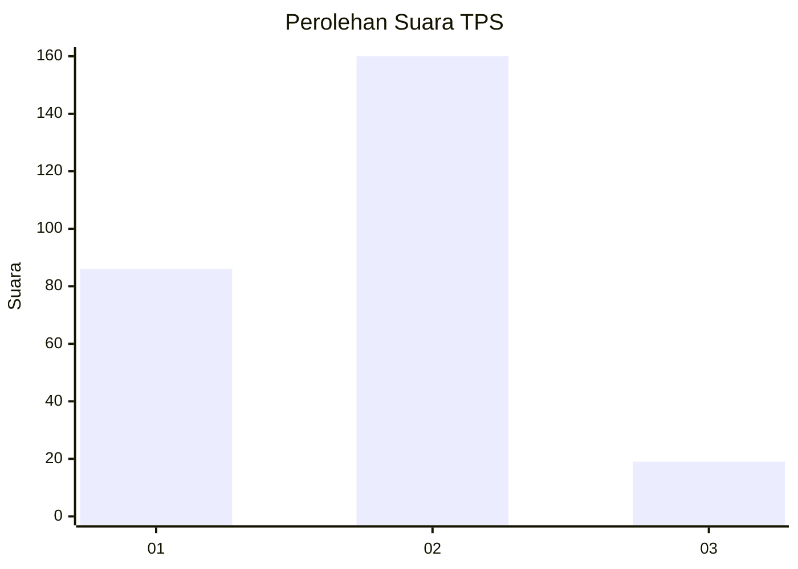
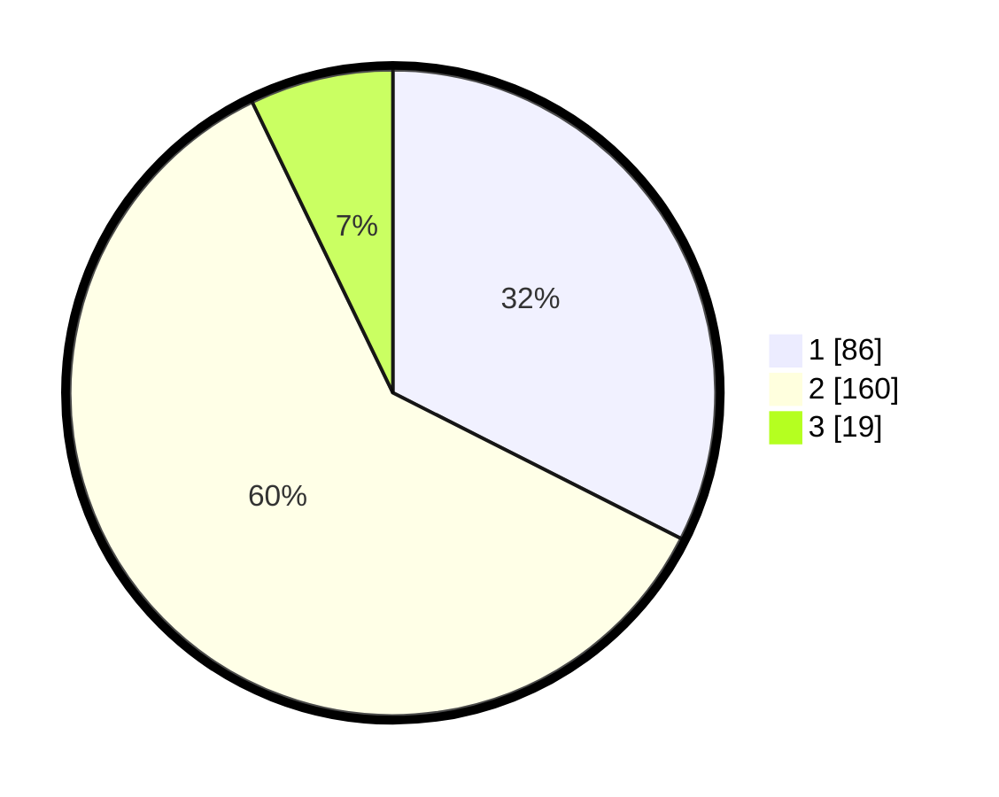

# Hasil

## Grafik

## Tabel

| No. | Nama Paslon    | Suara | Suara (raw) | Persentase |
|:--- |:-------------- | -----:| -----------:| ----------:|
| 1   | ANIES MUHAIMIN | 86    | [86][p-1]   | 32,45      |
| 2   | PRABOWO GIBRAN | 160   | [160][p-2]  | 60,38      |
| 3   | GANJAR MAHFUD  | 19    | [19][p-3]   | 7,17       |

[p-1]: https://github.com/gigit-pemilu/pemilu-2024/blob/main/pilpres/hitung-suara/sub/35-jawa-timur/sub/28-pamekasan/sub/02-pademawu/sub/2022-buddagan/sub/006-tps/sub/paslon-1.txt
[p-2]: https://github.com/gigit-pemilu/pemilu-2024/blob/main/pilpres/hitung-suara/sub/35-jawa-timur/sub/28-pamekasan/sub/02-pademawu/sub/2022-buddagan/sub/006-tps/sub/paslon-2.txt
[p-3]: https://github.com/gigit-pemilu/pemilu-2024/blob/main/pilpres/hitung-suara/sub/35-jawa-timur/sub/28-pamekasan/sub/02-pademawu/sub/2022-buddagan/sub/006-tps/sub/paslon-3.txt

## Foto C Plano

https://sirekap-obj-formc.kpu.go.id/eeb1/pemilu/ppwp/35/28/02/20/22/3528022022006-20240214-234925--f2cc1219-7051-40a3-955a-e227507cbb1a.jpg

https://sirekap-obj-formc.kpu.go.id/eeb1/pemilu/ppwp/35/28/02/20/22/3528022022006-20240214-235122--c0db06da-f177-4480-9071-c9861758013f.jpg

https://sirekap-obj-formc.kpu.go.id/eeb1/pemilu/ppwp/35/28/02/20/22/3528022022006-20240214-235304--bbe4aeee-50c2-4ea2-9182-7fbcfabb07a9.jpg

## Metadata

| Key        | Value               |
| ---------- | ------------------- |
| Time Stamp | 2024-02-27 22:00:00 |

