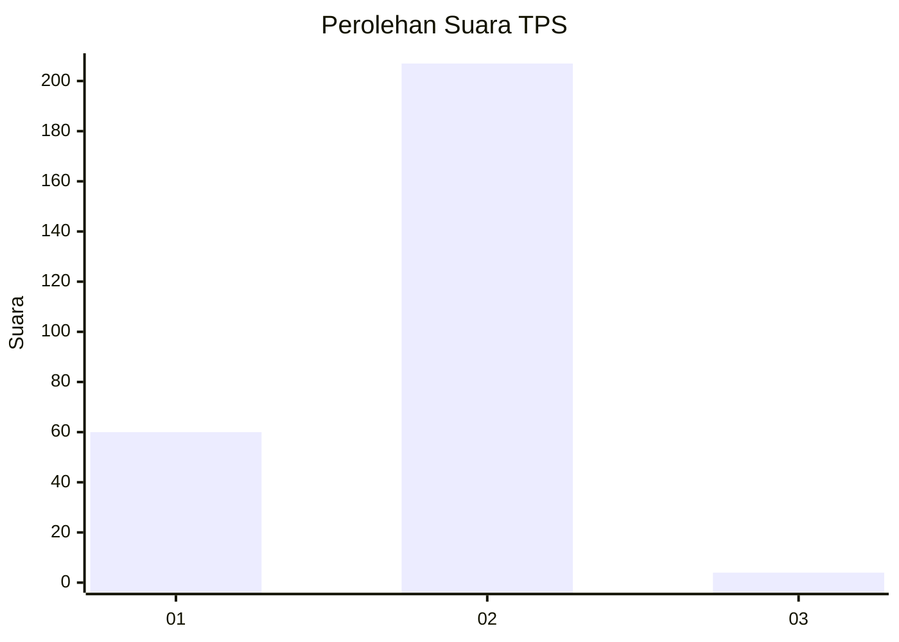
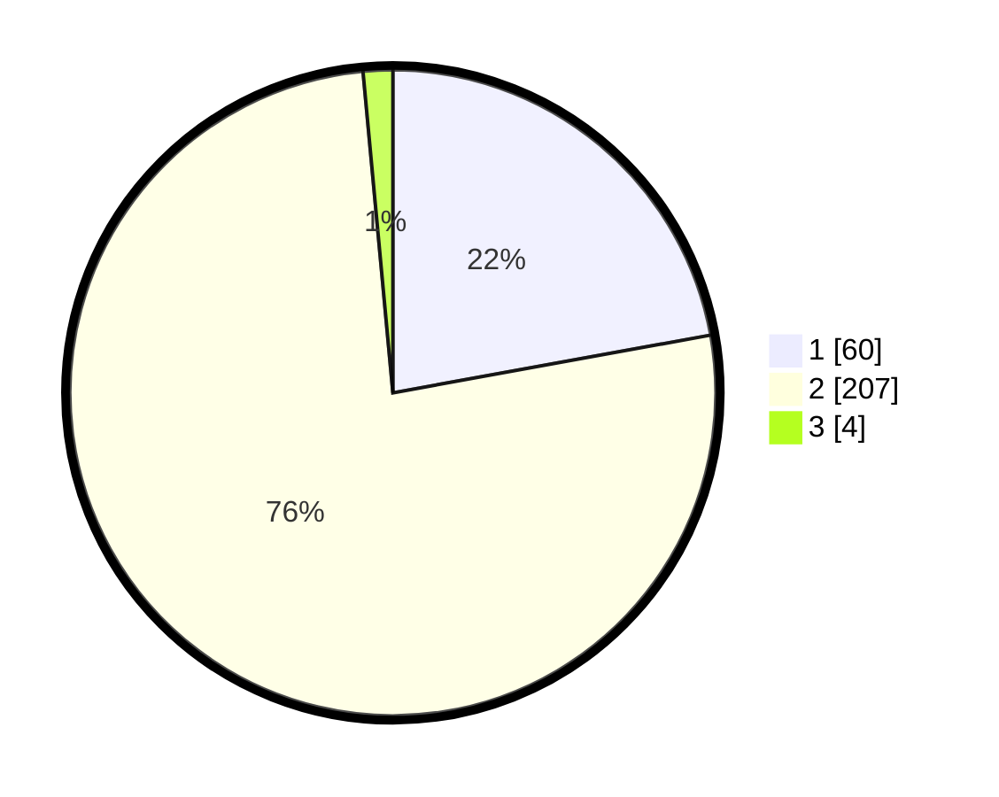

# Hasil

## Grafik

## Tabel

| No. | Nama Paslon    | Suara | Suara (raw) | Persentase |
|:--- |:-------------- | -----:| -----------:| ----------:|
| 1   | ANIES MUHAIMIN | 60    | [60][p-1]   | 22,14      |
| 2   | PRABOWO GIBRAN | 207   | [207][p-2]  | 76,38      |
| 3   | GANJAR MAHFUD  | 4     | [4][p-3]    | 1,48       |

[p-1]: https://github.com/gigit-pemilu/pemilu-2024-35-jawa-timur/blob/main/pilpres/hitung-suara/sub/35-jawa-timur/sub/28-pamekasan/sub/02-pademawu/sub/2022-buddagan/sub/008-tps/sub/paslon-1.txt
[p-2]: https://github.com/gigit-pemilu/pemilu-2024-35-jawa-timur/blob/main/pilpres/hitung-suara/sub/35-jawa-timur/sub/28-pamekasan/sub/02-pademawu/sub/2022-buddagan/sub/008-tps/sub/paslon-2.txt
[p-3]: https://github.com/gigit-pemilu/pemilu-2024-35-jawa-timur/blob/main/pilpres/hitung-suara/sub/35-jawa-timur/sub/28-pamekasan/sub/02-pademawu/sub/2022-buddagan/sub/008-tps/sub/paslon-3.txt

## Foto C Plano

https://sirekap-obj-formc.kpu.go.id/fa0f/pemilu/ppwp/35/28/02/20/22/3528022022008-20240214-215051--f1be4fd4-13c7-47f6-bfc0-eeb2d7ff06d5.jpg

https://sirekap-obj-formc.kpu.go.id/fa0f/pemilu/ppwp/35/28/02/20/22/3528022022008-20240214-215455--a5e68bac-b675-4e9c-b9e3-2476e4ec3b61.jpg

https://sirekap-obj-formc.kpu.go.id/fa0f/pemilu/ppwp/35/28/02/20/22/3528022022008-20240214-215701--4ac501de-6d7f-41b2-a40c-21dca4317d34.jpg

## Metadata

| Key        | Value               |
| ---------- | ------------------- |
| Time Stamp | 2024-02-15 21:01:18 |

