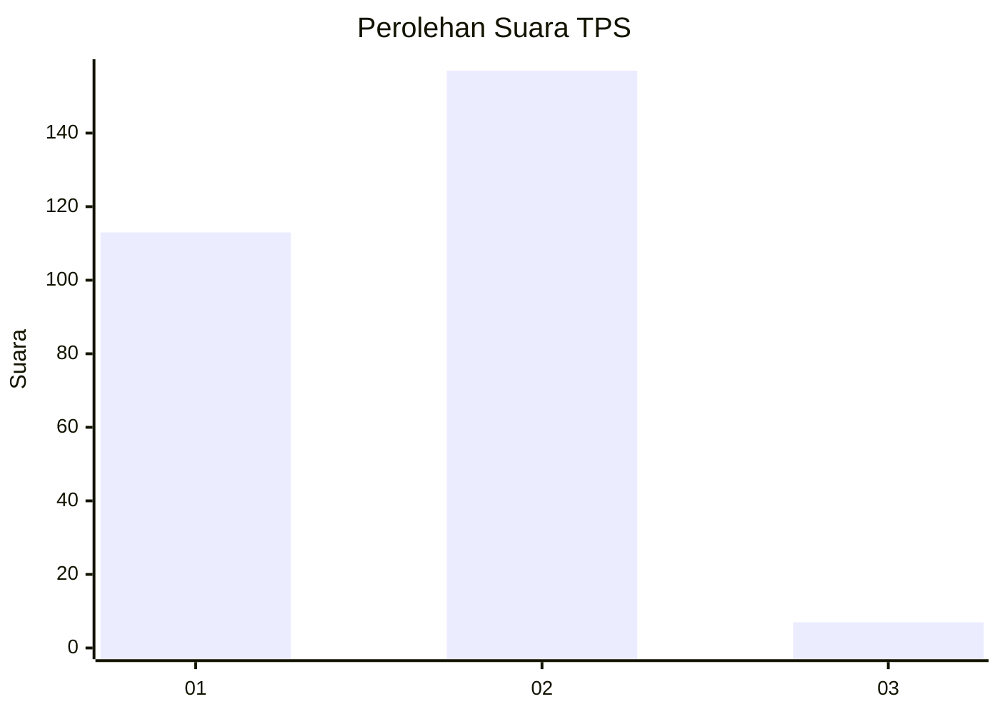
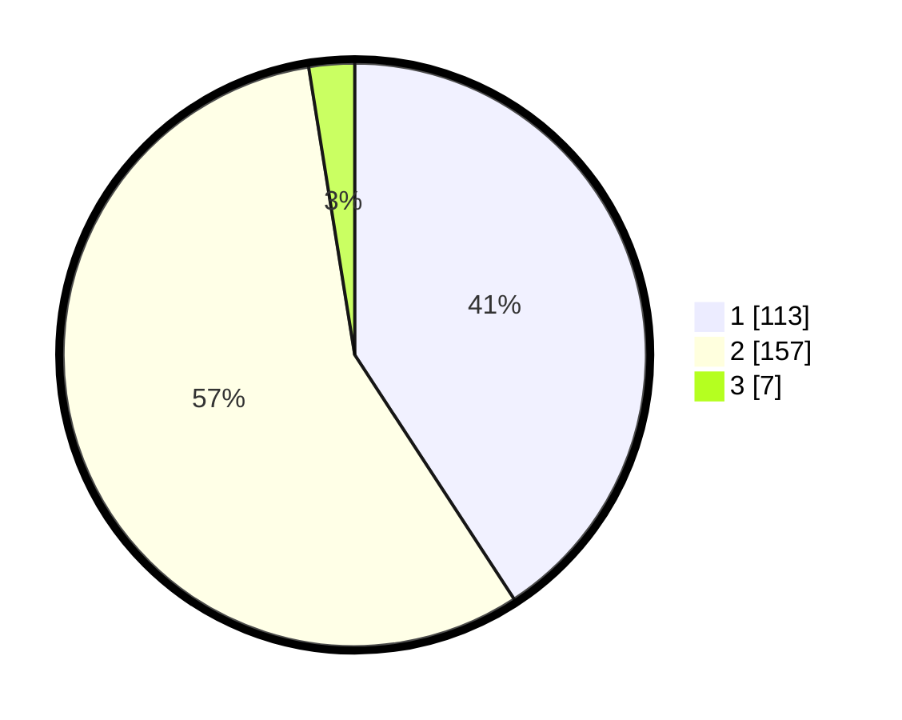

# Hasil

## Grafik

## Tabel

| No. | Nama Paslon    | Suara | Suara (raw) | Persentase |
|:--- |:-------------- | -----:| -----------:| ----------:|
| 1   | ANIES MUHAIMIN | 113   | [113][p-1]  | 40,79      |
| 2   | PRABOWO GIBRAN | 157   | [157][p-2]  | 56,68      |
| 3   | GANJAR MAHFUD  | 7     | [7][p-3]    | 2,53       |

[p-1]: https://github.com/gigit-pemilu/pemilu-2024/blob/main/pilpres/hitung-suara/sub/35-jawa-timur/sub/28-pamekasan/sub/02-pademawu/sub/2022-buddagan/sub/010-tps/sub/paslon-1.txt
[p-2]: https://github.com/gigit-pemilu/pemilu-2024/blob/main/pilpres/hitung-suara/sub/35-jawa-timur/sub/28-pamekasan/sub/02-pademawu/sub/2022-buddagan/sub/010-tps/sub/paslon-2.txt
[p-3]: https://github.com/gigit-pemilu/pemilu-2024/blob/main/pilpres/hitung-suara/sub/35-jawa-timur/sub/28-pamekasan/sub/02-pademawu/sub/2022-buddagan/sub/010-tps/sub/paslon-3.txt

## Foto C Plano

https://sirekap-obj-formc.kpu.go.id/e848/pemilu/ppwp/35/28/02/20/22/3528022022010-20240214-221210--ce660dc2-268b-4f37-b4e5-3e4b55b66539.jpg

https://sirekap-obj-formc.kpu.go.id/e848/pemilu/ppwp/35/28/02/20/22/3528022022010-20240214-221304--3fc8e264-b717-4383-aa57-858c04c01575.jpg

https://sirekap-obj-formc.kpu.go.id/e848/pemilu/ppwp/35/28/02/20/22/3528022022010-20240214-221414--14175cbc-0d1a-4716-8ff8-397e7ed95f67.jpg

## Metadata

| Key        | Value               |
| ---------- | ------------------- |
| Time Stamp | 2024-02-15 21:01:18 |

