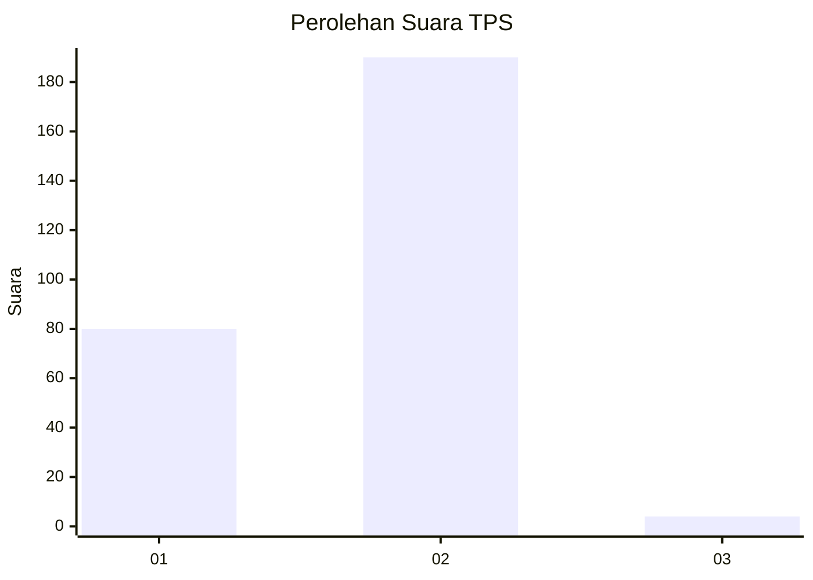
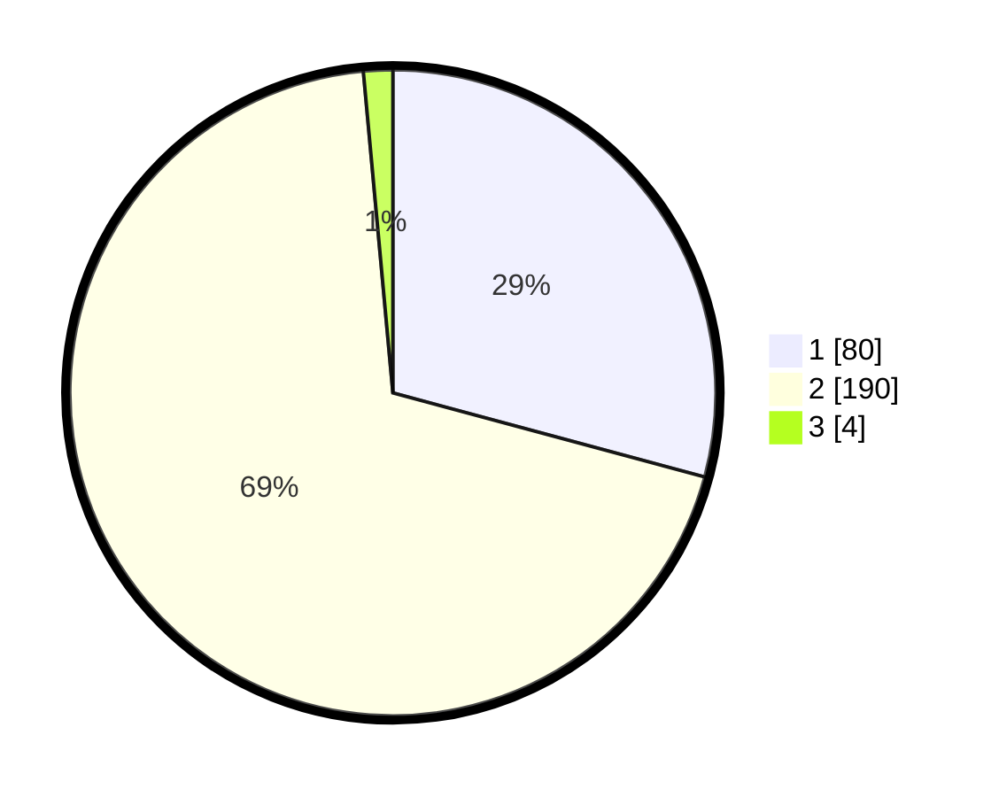

# Hasil

## Grafik

## Tabel

| No. | Nama Paslon    | Suara | Suara (raw) | Persentase |
|:--- |:-------------- | -----:| -----------:| ----------:|
| 1   | ANIES MUHAIMIN | 80    | [80][p-1]   | 29,20      |
| 2   | PRABOWO GIBRAN | 190   | [190][p-2]  | 69,34      |
| 3   | GANJAR MAHFUD  | 4     | [4][p-3]    | 1,46       |

[p-1]: https://github.com/gigit-pemilu/pemilu-2024/blob/main/pilpres/hitung-suara/sub/35-jawa-timur/sub/28-pamekasan/sub/03-galis/sub/2001-tobungan/sub/005-tps/sub/paslon-1.txt
[p-2]: https://github.com/gigit-pemilu/pemilu-2024/blob/main/pilpres/hitung-suara/sub/35-jawa-timur/sub/28-pamekasan/sub/03-galis/sub/2001-tobungan/sub/005-tps/sub/paslon-2.txt
[p-3]: https://github.com/gigit-pemilu/pemilu-2024/blob/main/pilpres/hitung-suara/sub/35-jawa-timur/sub/28-pamekasan/sub/03-galis/sub/2001-tobungan/sub/005-tps/sub/paslon-3.txt

## Foto C Plano

https://sirekap-obj-formc.kpu.go.id/7275/pemilu/ppwp/35/28/03/20/01/3528032001005-20240214-141337--3830a52d-d61b-4396-94c7-b09790e8a4a2.jpg

https://sirekap-obj-formc.kpu.go.id/7275/pemilu/ppwp/35/28/03/20/01/3528032001005-20240219-161435--67c6d2ee-edfd-44d1-af4e-8509f5da6959.jpg

https://sirekap-obj-formc.kpu.go.id/7275/pemilu/ppwp/35/28/03/20/01/3528032001005-20240219-164338--47b999b6-7c6d-4c3d-9d56-916b63e0933a.jpg

## Metadata

| Key        | Value               |
| ---------- | ------------------- |
| Time Stamp | 2024-02-19 17:00:00 |

