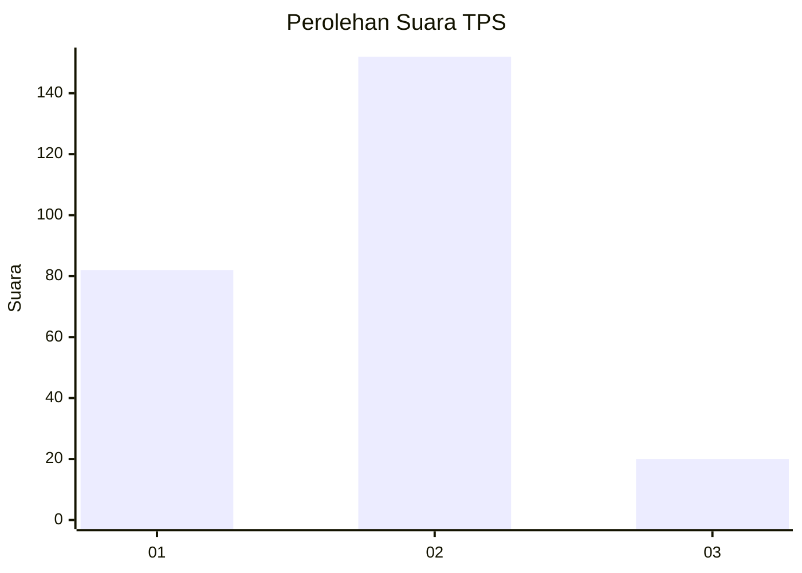
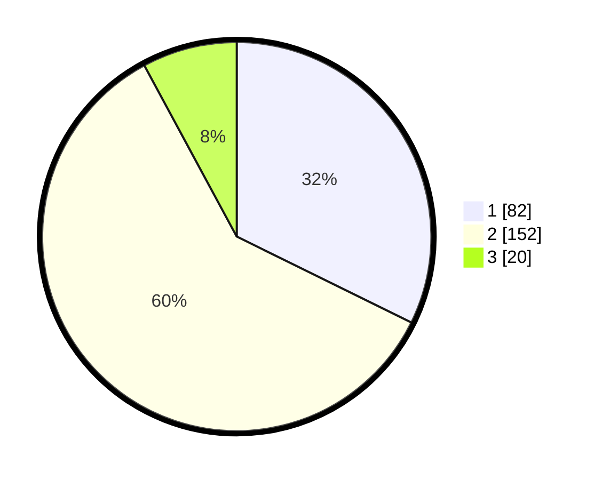

# Hasil

## Grafik

## Tabel

| No. | Nama Paslon    | Suara | Suara (raw) | Persentase |
|:--- |:-------------- | -----:| -----------:| ----------:|
| 1   | ANIES MUHAIMIN | 82    | [82][p-1]   | 32,28      |
| 2   | PRABOWO GIBRAN | 152   | [152][p-2]  | 59,84      |
| 3   | GANJAR MAHFUD  | 20    | [20][p-3]   | 7,87       |

[p-1]: https://github.com/gigit-pemilu/pemilu-2024-35-jawa-timur/blob/main/pilpres/hitung-suara/sub/35-jawa-timur/sub/28-pamekasan/sub/03-galis/sub/2002-konang/sub/007-tps/sub/paslon-1.txt
[p-2]: https://github.com/gigit-pemilu/pemilu-2024-35-jawa-timur/blob/main/pilpres/hitung-suara/sub/35-jawa-timur/sub/28-pamekasan/sub/03-galis/sub/2002-konang/sub/007-tps/sub/paslon-2.txt
[p-3]: https://github.com/gigit-pemilu/pemilu-2024-35-jawa-timur/blob/main/pilpres/hitung-suara/sub/35-jawa-timur/sub/28-pamekasan/sub/03-galis/sub/2002-konang/sub/007-tps/sub/paslon-3.txt

## Foto C Plano

https://sirekap-obj-formc.kpu.go.id/b9a2/pemilu/ppwp/35/28/03/20/02/3528032002007-20240215-004240--8681baa3-2f38-4fc7-af5f-9b335bb9f0fe.jpg

https://sirekap-obj-formc.kpu.go.id/b9a2/pemilu/ppwp/35/28/03/20/02/3528032002007-20240215-044842--d847bfdc-70de-4432-9bf1-3ccb3de4fb4d.jpg

https://sirekap-obj-formc.kpu.go.id/b9a2/pemilu/ppwp/35/28/03/20/02/3528032002007-20240215-044914--3f43a17a-8976-4677-aaaa-1b50ac882030.jpg

## Metadata

| Key        | Value               |
| ---------- | ------------------- |
| Time Stamp | 2024-02-24 22:31:28 |

