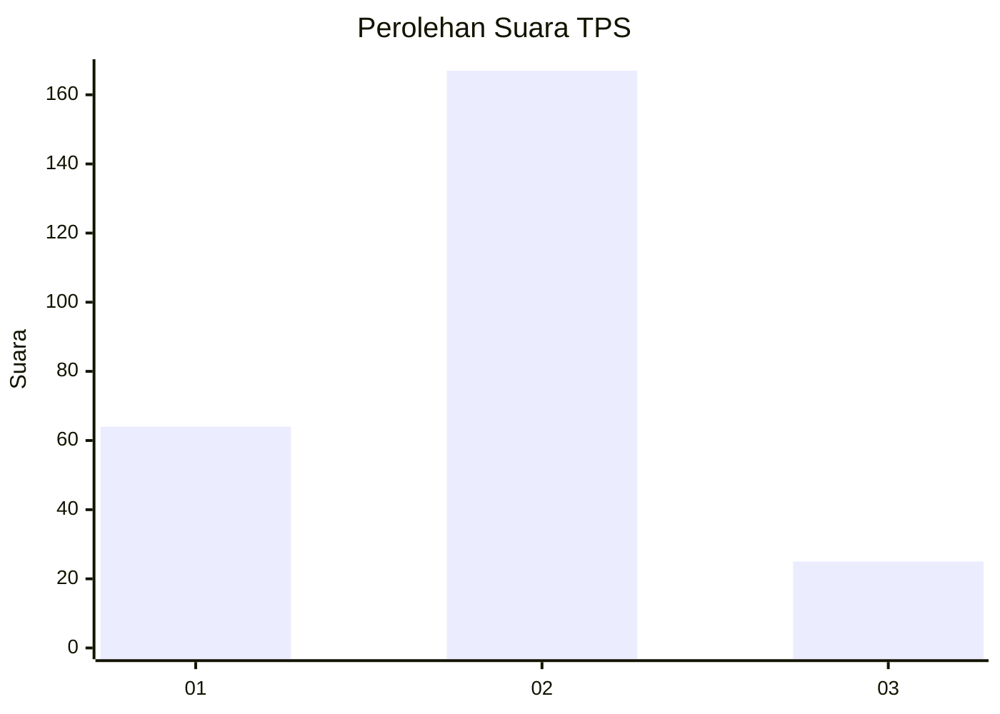

# Hasil

## Grafik

## Tabel

| No. | Nama Paslon    | Suara | Suara (raw) | Persentase |
|:--- |:-------------- | -----:| -----------:| ----------:|
| 1   | ANIES MUHAIMIN | 64    | [64][p-1]   | 25,00      |
| 2   | PRABOWO GIBRAN | 167   | [167][p-2]  | 65,23      |
| 3   | GANJAR MAHFUD  | 25    | [25][p-3]   | 9,77       |

[p-1]: https://github.com/gigit-pemilu/pemilu-2024-35-jawa-timur/blob/main/pilpres/hitung-suara/sub/35-jawa-timur/sub/28-pamekasan/sub/03-galis/sub/2002-konang/sub/011-tps/sub/paslon-1.txt
[p-2]: https://github.com/gigit-pemilu/pemilu-2024-35-jawa-timur/blob/main/pilpres/hitung-suara/sub/35-jawa-timur/sub/28-pamekasan/sub/03-galis/sub/2002-konang/sub/011-tps/sub/paslon-2.txt
[p-3]: https://github.com/gigit-pemilu/pemilu-2024-35-jawa-timur/blob/main/pilpres/hitung-suara/sub/35-jawa-timur/sub/28-pamekasan/sub/03-galis/sub/2002-konang/sub/011-tps/sub/paslon-3.txt

## Foto C Plano

https://sirekap-obj-formc.kpu.go.id/d1d4/pemilu/ppwp/35/28/03/20/02/3528032002011-20240216-131106--88e44338-489f-45f4-8afe-01f43e5b0002.jpg

https://sirekap-obj-formc.kpu.go.id/d1d4/pemilu/ppwp/35/28/03/20/02/3528032002011-20240214-230314--bc19e111-c217-427e-8360-76c5cd65c4ac.jpg

https://sirekap-obj-formc.kpu.go.id/d1d4/pemilu/ppwp/35/28/03/20/02/3528032002011-20240216-131107--545c7c8e-bd84-4394-9585-18695449669e.jpg

## Metadata

| Key        | Value               |
| ---------- | ------------------- |
| Time Stamp | 2024-02-16 13:30:32 |

