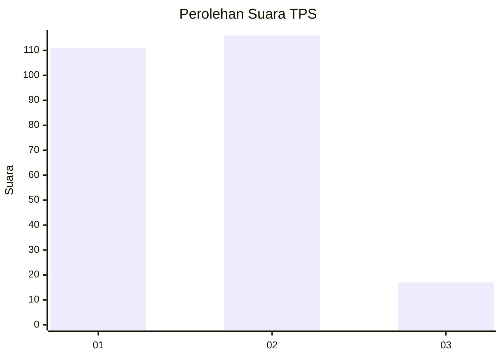
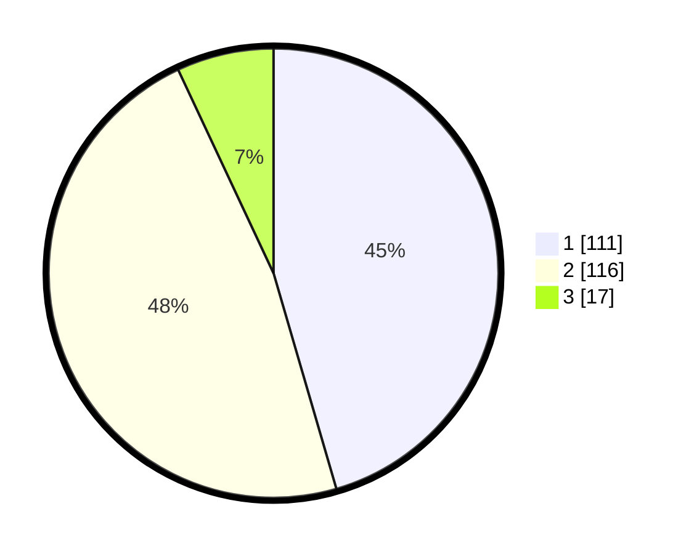

# Hasil

## Grafik

## Tabel

| No. | Nama Paslon    | Suara | Suara (raw) | Persentase |
|:--- |:-------------- | -----:| -----------:| ----------:|
| 1   | ANIES MUHAIMIN | 111   | [111][p-1]  | 45,49      |
| 2   | PRABOWO GIBRAN | 116   | [116][p-2]  | 47,54      |
| 3   | GANJAR MAHFUD  | 17    | [17][p-3]   | 6,97       |

[p-1]: https://github.com/gigit-pemilu/pemilu-2024/blob/main/pilpres/hitung-suara/sub/35-jawa-timur/sub/28-pamekasan/sub/03-galis/sub/2005-galis/sub/007-tps/sub/paslon-1.txt
[p-2]: https://github.com/gigit-pemilu/pemilu-2024/blob/main/pilpres/hitung-suara/sub/35-jawa-timur/sub/28-pamekasan/sub/03-galis/sub/2005-galis/sub/007-tps/sub/paslon-2.txt
[p-3]: https://github.com/gigit-pemilu/pemilu-2024/blob/main/pilpres/hitung-suara/sub/35-jawa-timur/sub/28-pamekasan/sub/03-galis/sub/2005-galis/sub/007-tps/sub/paslon-3.txt

## Foto C Plano

https://sirekap-obj-formc.kpu.go.id/2f70/pemilu/ppwp/35/28/03/20/05/3528032005007-20240215-053958--6c043c4f-926a-4085-aa52-b2b7318a4089.jpg

https://sirekap-obj-formc.kpu.go.id/2f70/pemilu/ppwp/35/28/03/20/05/3528032005007-20240215-050342--f838fe76-3316-4c14-9c7e-5cad57534027.jpg

https://sirekap-obj-formc.kpu.go.id/2f70/pemilu/ppwp/35/28/03/20/05/3528032005007-20240215-035141--04a85e2e-47e8-43c3-9ad3-a5db102a5888.jpg

## Metadata

| Key        | Value               |
| ---------- | ------------------- |
| Time Stamp | 2024-02-15 21:01:18 |

