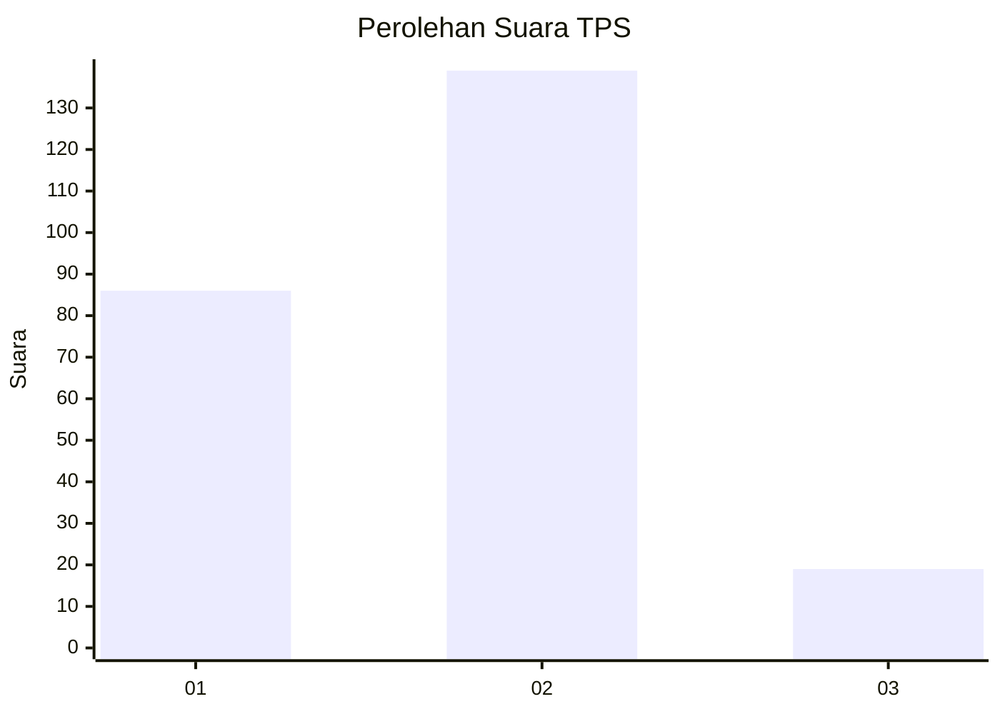
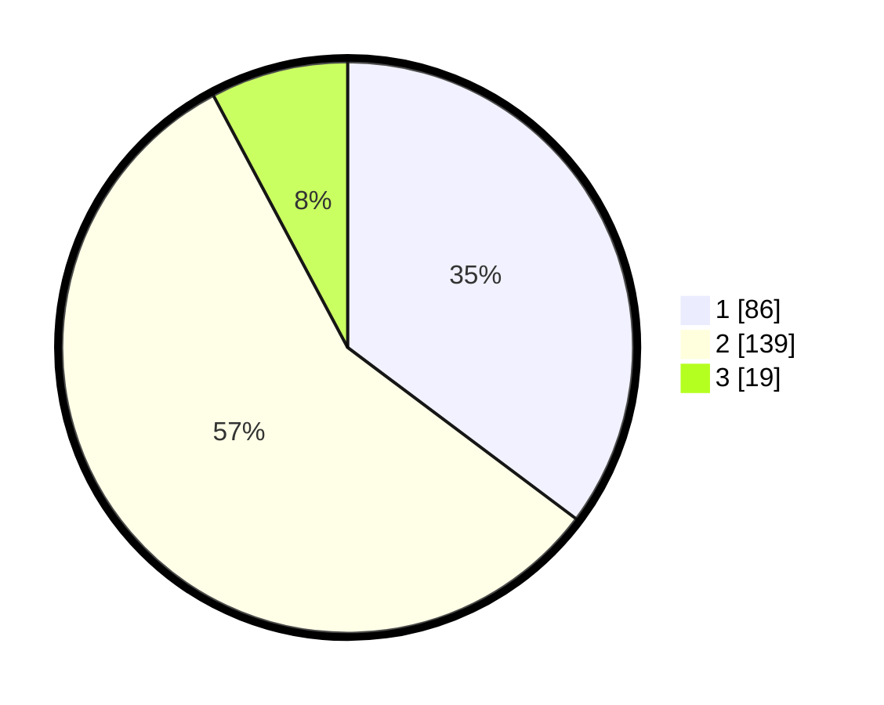

# Hasil

## Grafik

## Tabel

| No. | Nama Paslon    | Suara | Suara (raw) | Persentase |
|:--- |:-------------- | -----:| -----------:| ----------:|
| 1   | ANIES MUHAIMIN | 86    | [86][p-1]   | 35,25      |
| 2   | PRABOWO GIBRAN | 139   | [139][p-2]  | 56,97      |
| 3   | GANJAR MAHFUD  | 19    | [19][p-3]   | 7,79       |

[p-1]: https://github.com/gigit-pemilu/pemilu-2024/blob/main/pilpres/hitung-suara/sub/35-jawa-timur/sub/28-pamekasan/sub/03-galis/sub/2008-ponteh/sub/001-tps/sub/paslon-1.txt
[p-2]: https://github.com/gigit-pemilu/pemilu-2024/blob/main/pilpres/hitung-suara/sub/35-jawa-timur/sub/28-pamekasan/sub/03-galis/sub/2008-ponteh/sub/001-tps/sub/paslon-2.txt
[p-3]: https://github.com/gigit-pemilu/pemilu-2024/blob/main/pilpres/hitung-suara/sub/35-jawa-timur/sub/28-pamekasan/sub/03-galis/sub/2008-ponteh/sub/001-tps/sub/paslon-3.txt

## Foto C Plano

https://sirekap-obj-formc.kpu.go.id/12fe/pemilu/ppwp/35/28/03/20/08/3528032008001-20240214-202403--30298dc5-6c0d-4b8c-a7be-c21e6ba43dbb.jpg

https://sirekap-obj-formc.kpu.go.id/12fe/pemilu/ppwp/35/28/03/20/08/3528032008001-20240214-202528--115c07e0-6cf8-4305-9654-ce5229576bf4.jpg

https://sirekap-obj-formc.kpu.go.id/12fe/pemilu/ppwp/35/28/03/20/08/3528032008001-20240214-221000--cec945f5-7d34-4b9c-83c3-b6de8c186416.jpg

## Metadata

| Key        | Value               |
| ---------- | ------------------- |
| Time Stamp | 2024-02-15 12:00:28 |

