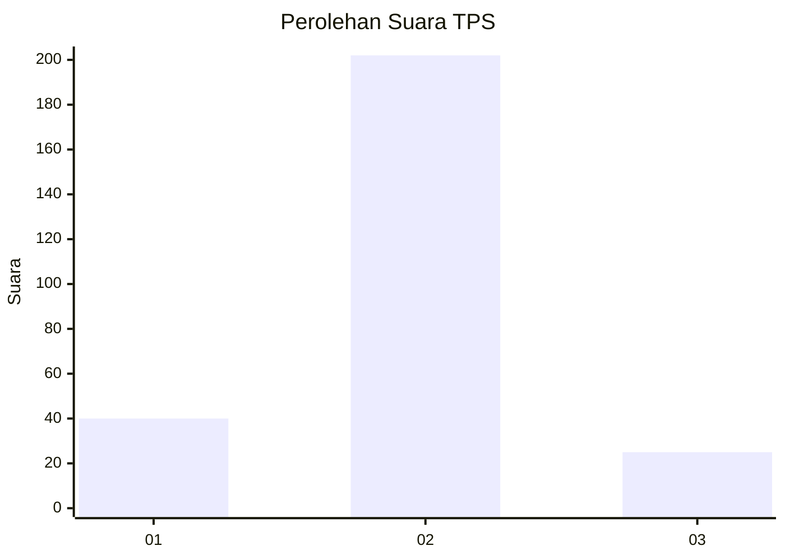
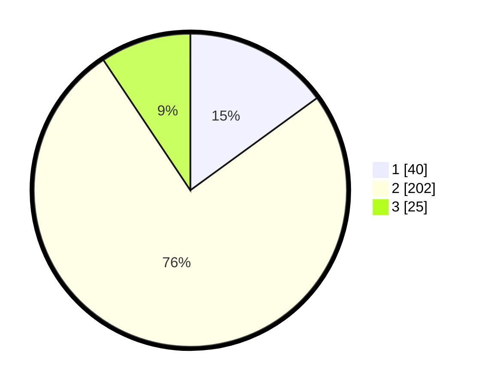

# Hasil

## Grafik

## Tabel

| No. | Nama Paslon    | Suara | Suara (raw) | Persentase |
|:--- |:-------------- | -----:| -----------:| ----------:|
| 1   | ANIES MUHAIMIN | 40    | [40][p-1]   | 14,98      |
| 2   | PRABOWO GIBRAN | 202   | [202][p-2]  | 75,66      |
| 3   | GANJAR MAHFUD  | 25    | [25][p-3]   | 9,36       |

[p-1]: https://github.com/gigit-pemilu/pemilu-2024/blob/main/pilpres/hitung-suara/sub/35-jawa-timur/sub/28-pamekasan/sub/03-galis/sub/2008-ponteh/sub/004-tps/sub/paslon-1.txt
[p-2]: https://github.com/gigit-pemilu/pemilu-2024/blob/main/pilpres/hitung-suara/sub/35-jawa-timur/sub/28-pamekasan/sub/03-galis/sub/2008-ponteh/sub/004-tps/sub/paslon-2.txt
[p-3]: https://github.com/gigit-pemilu/pemilu-2024/blob/main/pilpres/hitung-suara/sub/35-jawa-timur/sub/28-pamekasan/sub/03-galis/sub/2008-ponteh/sub/004-tps/sub/paslon-3.txt

## Foto C Plano

https://sirekap-obj-formc.kpu.go.id/0a01/pemilu/ppwp/35/28/03/20/08/3528032008004-20240214-201450--49d036e6-715d-48d9-9dc2-db7fc07e5929.jpg

https://sirekap-obj-formc.kpu.go.id/0a01/pemilu/ppwp/35/28/03/20/08/3528032008004-20240217-071808--fea62bb4-7bfa-4aa7-b982-415090b7afd1.jpg

https://sirekap-obj-formc.kpu.go.id/0a01/pemilu/ppwp/35/28/03/20/08/3528032008004-20240214-201815--aeae39c2-4811-4e4f-907c-1c091e589742.jpg

## Metadata

| Key        | Value               |
| ---------- | ------------------- |
| Time Stamp | 2024-02-25 16:00:00 |

