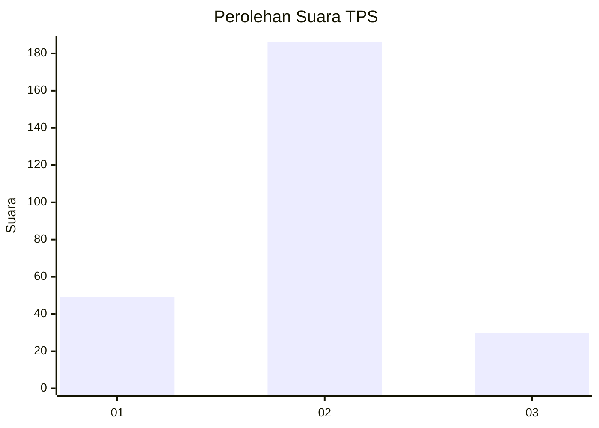
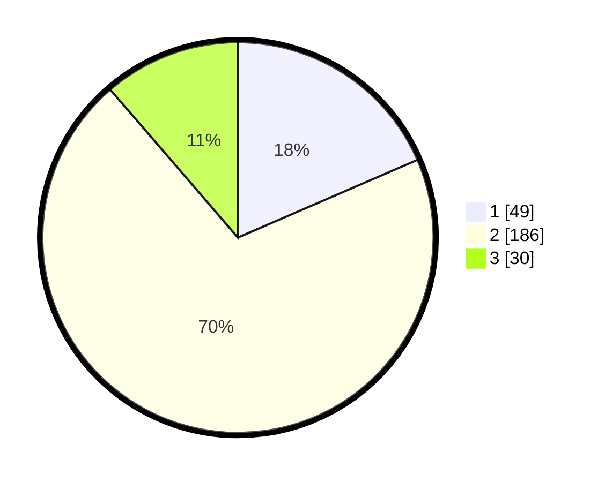

# Hasil

## Grafik

## Tabel

| No. | Nama Paslon    | Suara | Suara (raw) | Persentase |
|:--- |:-------------- | -----:| -----------:| ----------:|
| 1   | ANIES MUHAIMIN | 49    | [49][p-1]   | 18,49      |
| 2   | PRABOWO GIBRAN | 186   | [186][p-2]  | 70,19      |
| 3   | GANJAR MAHFUD  | 30    | [30][p-3]   | 11,32      |

[p-1]: https://github.com/gigit-pemilu/pemilu-2024-35-jawa-timur/blob/main/pilpres/hitung-suara/sub/35-jawa-timur/sub/28-pamekasan/sub/03-galis/sub/2009-polagan/sub/005-tps/sub/paslon-1.txt
[p-2]: https://github.com/gigit-pemilu/pemilu-2024-35-jawa-timur/blob/main/pilpres/hitung-suara/sub/35-jawa-timur/sub/28-pamekasan/sub/03-galis/sub/2009-polagan/sub/005-tps/sub/paslon-2.txt
[p-3]: https://github.com/gigit-pemilu/pemilu-2024-35-jawa-timur/blob/main/pilpres/hitung-suara/sub/35-jawa-timur/sub/28-pamekasan/sub/03-galis/sub/2009-polagan/sub/005-tps/sub/paslon-3.txt

## Foto C Plano

https://sirekap-obj-formc.kpu.go.id/7a49/pemilu/ppwp/35/28/03/20/09/3528032009005-20240219-211918--23ec2edc-61fb-4c61-ac75-9dddcf4fd996.jpg

https://sirekap-obj-formc.kpu.go.id/7a49/pemilu/ppwp/35/28/03/20/09/3528032009005-20240214-195539--20fb5161-186c-4c25-9a7c-c274ea6f05a7.jpg

https://sirekap-obj-formc.kpu.go.id/7a49/pemilu/ppwp/35/28/03/20/09/3528032009005-20240214-195622--80cd085f-ec36-4134-9639-9f9be17f657f.jpg

## Metadata

| Key        | Value               |
| ---------- | ------------------- |
| Time Stamp | 2024-02-19 22:00:00 |

