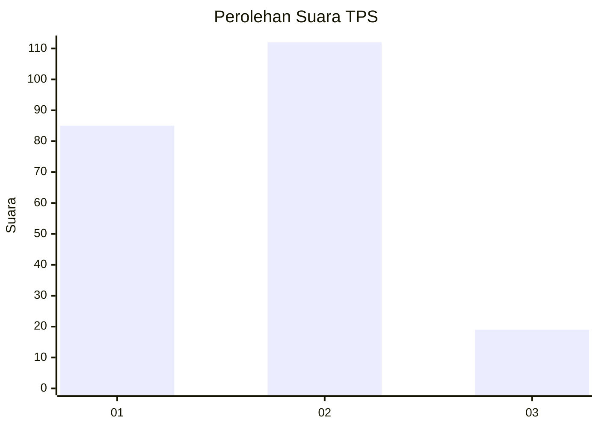
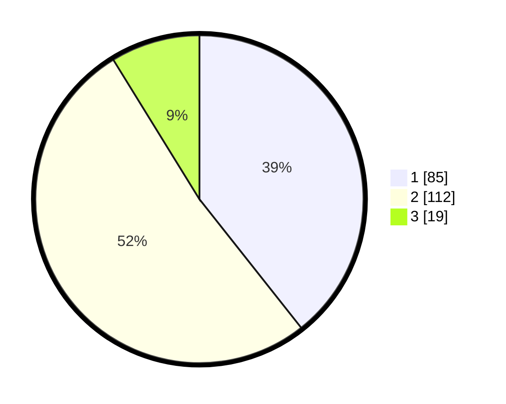

# Hasil

## Grafik

## Tabel

| No. | Nama Paslon    | Suara | Suara (raw) | Persentase |
|:--- |:-------------- | -----:| -----------:| ----------:|
| 1   | ANIES MUHAIMIN | 85    | [85][p-1]   | 39,35      |
| 2   | PRABOWO GIBRAN | 112   | [112][p-2]  | 51,85      |
| 3   | GANJAR MAHFUD  | 19    | [19][p-3]   | 8,80       |

[p-1]: https://github.com/gigit-pemilu/pemilu-2024/blob/main/pilpres/hitung-suara/sub/35-jawa-timur/sub/28-pamekasan/sub/04-pamekasan/sub/1001-kangenan/sub/005-tps/sub/paslon-1.txt
[p-2]: https://github.com/gigit-pemilu/pemilu-2024/blob/main/pilpres/hitung-suara/sub/35-jawa-timur/sub/28-pamekasan/sub/04-pamekasan/sub/1001-kangenan/sub/005-tps/sub/paslon-2.txt
[p-3]: https://github.com/gigit-pemilu/pemilu-2024/blob/main/pilpres/hitung-suara/sub/35-jawa-timur/sub/28-pamekasan/sub/04-pamekasan/sub/1001-kangenan/sub/005-tps/sub/paslon-3.txt

## Foto C Plano

https://sirekap-obj-formc.kpu.go.id/25e2/pemilu/ppwp/35/28/04/10/01/3528041001005-20240214-220953--d8535c0f-9130-4bb8-98e8-f14cf489b025.jpg

https://sirekap-obj-formc.kpu.go.id/25e2/pemilu/ppwp/35/28/04/10/01/3528041001005-20240214-221022--9d006aaf-3484-43ec-9164-16f5d680a49b.jpg

https://sirekap-obj-formc.kpu.go.id/25e2/pemilu/ppwp/35/28/04/10/01/3528041001005-20240214-221103--38a0d422-d705-4fd6-a122-acdcd80d1c2b.jpg

## Metadata

| Key        | Value               |
| ---------- | ------------------- |
| Time Stamp | 2024-02-15 16:30:25 |

