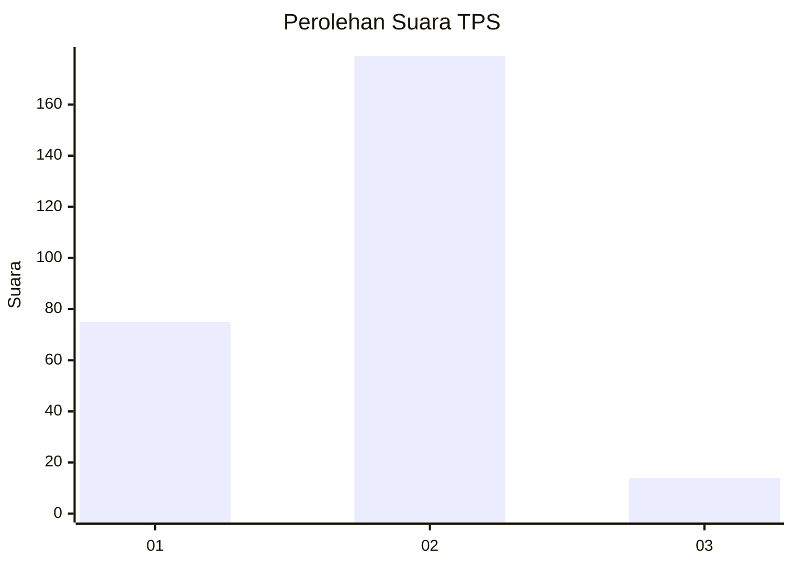
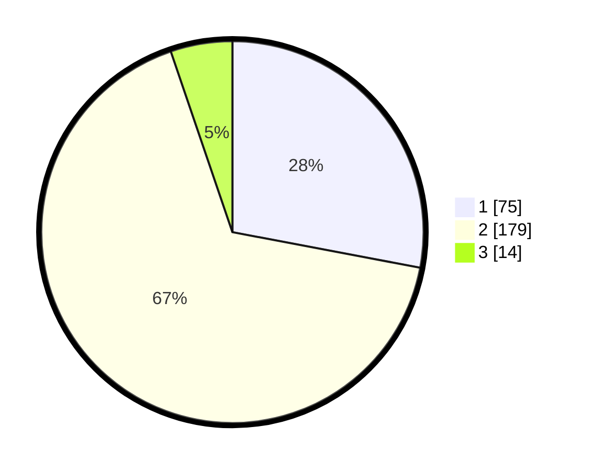

# Hasil

## Grafik

## Tabel

| No. | Nama Paslon    | Suara | Suara (raw) | Persentase |
|:--- |:-------------- | -----:| -----------:| ----------:|
| 1   | ANIES MUHAIMIN | 75    | [75][p-1]   | 27,99      |
| 2   | PRABOWO GIBRAN | 179   | [179][p-2]  | 66,79      |
| 3   | GANJAR MAHFUD  | 14    | [14][p-3]   | 5,22       |

[p-1]: https://github.com/gigit-pemilu/pemilu-2024-35-jawa-timur/blob/main/pilpres/hitung-suara/sub/35-jawa-timur/sub/28-pamekasan/sub/04-pamekasan/sub/1001-kangenan/sub/010-tps/sub/paslon-1.txt
[p-2]: https://github.com/gigit-pemilu/pemilu-2024-35-jawa-timur/blob/main/pilpres/hitung-suara/sub/35-jawa-timur/sub/28-pamekasan/sub/04-pamekasan/sub/1001-kangenan/sub/010-tps/sub/paslon-2.txt
[p-3]: https://github.com/gigit-pemilu/pemilu-2024-35-jawa-timur/blob/main/pilpres/hitung-suara/sub/35-jawa-timur/sub/28-pamekasan/sub/04-pamekasan/sub/1001-kangenan/sub/010-tps/sub/paslon-3.txt

## Foto C Plano

https://sirekap-obj-formc.kpu.go.id/9f59/pemilu/ppwp/35/28/04/10/01/3528041001010-20240214-221335--fdf68dd7-f27c-484a-94d9-1533c1c7cb48.jpg

https://sirekap-obj-formc.kpu.go.id/9f59/pemilu/ppwp/35/28/04/10/01/3528041001010-20240214-215613--b857db97-ebd6-454f-8f44-7b44203a08db.jpg

https://sirekap-obj-formc.kpu.go.id/9f59/pemilu/ppwp/35/28/04/10/01/3528041001010-20240214-221444--ca85e7a1-945c-447f-97d8-25248bb4b31c.jpg

## Metadata

| Key        | Value               |
| ---------- | ------------------- |
| Time Stamp | 2024-02-15 21:01:18 |

