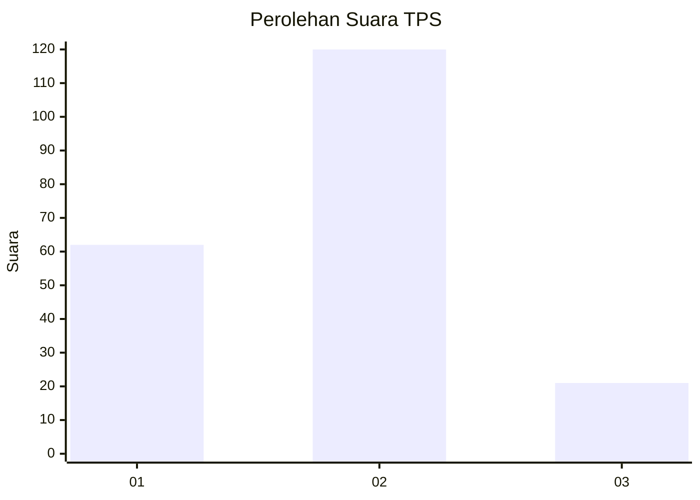
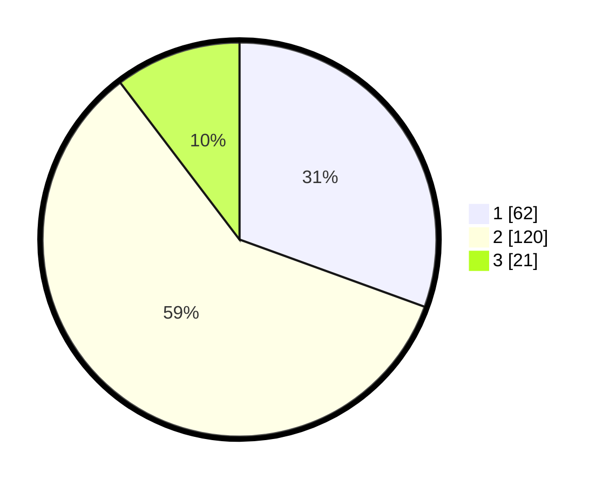

# Hasil

## Grafik

## Tabel

| No. | Nama Paslon    | Suara | Suara (raw) | Persentase |
|:--- |:-------------- | -----:| -----------:| ----------:|
| 1   | ANIES MUHAIMIN | 62    | [62][p-1]   | 30,54      |
| 2   | PRABOWO GIBRAN | 120   | [120][p-2]  | 59,11      |
| 3   | GANJAR MAHFUD  | 21    | [21][p-3]   | 10,34      |

[p-1]: https://github.com/gigit-pemilu/pemilu-2024/blob/main/pilpres/hitung-suara/sub/35-jawa-timur/sub/28-pamekasan/sub/04-pamekasan/sub/1003-patemon/sub/001-tps/sub/paslon-1.txt
[p-2]: https://github.com/gigit-pemilu/pemilu-2024/blob/main/pilpres/hitung-suara/sub/35-jawa-timur/sub/28-pamekasan/sub/04-pamekasan/sub/1003-patemon/sub/001-tps/sub/paslon-2.txt
[p-3]: https://github.com/gigit-pemilu/pemilu-2024/blob/main/pilpres/hitung-suara/sub/35-jawa-timur/sub/28-pamekasan/sub/04-pamekasan/sub/1003-patemon/sub/001-tps/sub/paslon-3.txt

## Foto C Plano

https://sirekap-obj-formc.kpu.go.id/eae5/pemilu/ppwp/35/28/04/10/03/3528041003001-20240215-002915--663049ec-d0fc-424a-b8cf-b998badda1ff.jpg

https://sirekap-obj-formc.kpu.go.id/eae5/pemilu/ppwp/35/28/04/10/03/3528041003001-20240215-003018--51719d4a-e7dc-40f9-90aa-024f4db198b4.jpg

https://sirekap-obj-formc.kpu.go.id/eae5/pemilu/ppwp/35/28/04/10/03/3528041003001-20240215-003105--695b15f5-bfcf-4634-a622-dd9f686fd42a.jpg

## Metadata

| Key        | Value               |
| ---------- | ------------------- |
| Time Stamp | 2024-02-24 22:31:28 |

