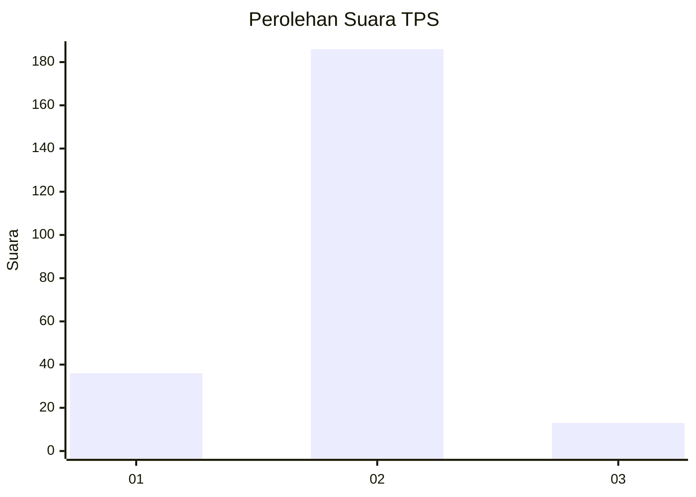
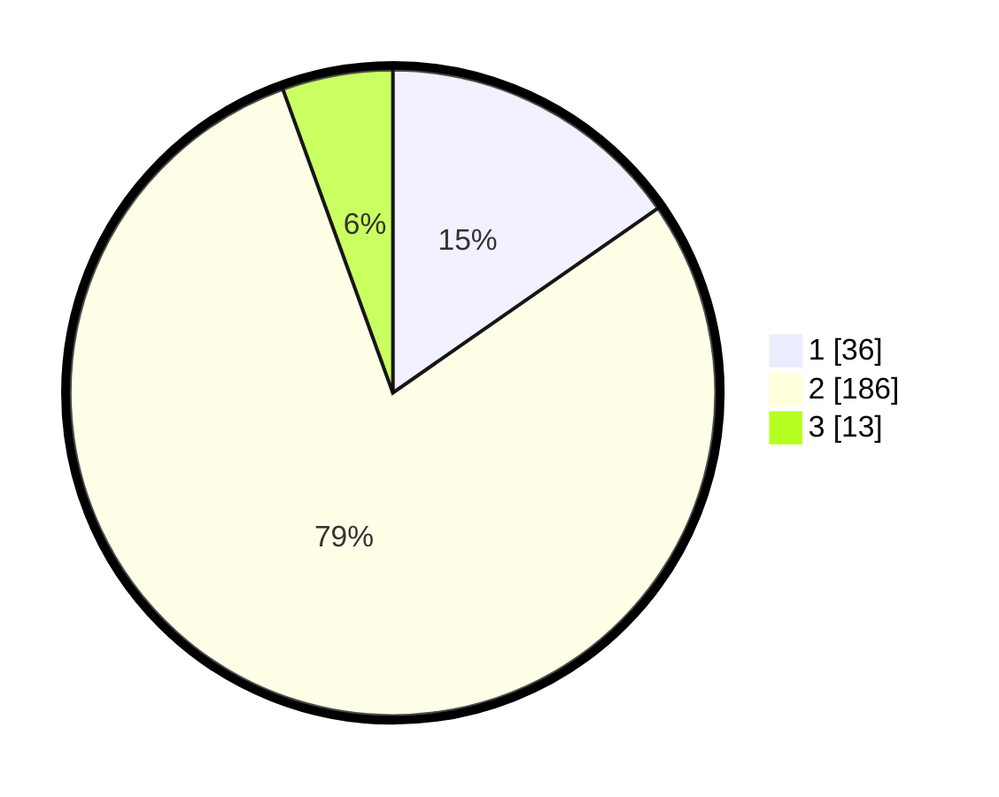

# Hasil

## Grafik

## Tabel

| No. | Nama Paslon    | Suara | Suara (raw) | Persentase |
|:--- |:-------------- | -----:| -----------:| ----------:|
| 1   | ANIES MUHAIMIN | 36    | [36][p-1]   | 15,32      |
| 2   | PRABOWO GIBRAN | 186   | [186][p-2]  | 79,15      |
| 3   | GANJAR MAHFUD  | 13    | [13][p-3]   | 5,53       |

[p-1]: https://github.com/gigit-pemilu/pemilu-2024-35-jawa-timur/blob/main/pilpres/hitung-suara/sub/35-jawa-timur/sub/28-pamekasan/sub/04-pamekasan/sub/1003-patemon/sub/002-tps/sub/paslon-1.txt
[p-2]: https://github.com/gigit-pemilu/pemilu-2024-35-jawa-timur/blob/main/pilpres/hitung-suara/sub/35-jawa-timur/sub/28-pamekasan/sub/04-pamekasan/sub/1003-patemon/sub/002-tps/sub/paslon-2.txt
[p-3]: https://github.com/gigit-pemilu/pemilu-2024-35-jawa-timur/blob/main/pilpres/hitung-suara/sub/35-jawa-timur/sub/28-pamekasan/sub/04-pamekasan/sub/1003-patemon/sub/002-tps/sub/paslon-3.txt

## Foto C Plano

https://sirekap-obj-formc.kpu.go.id/762a/pemilu/ppwp/35/28/04/10/03/3528041003002-20240214-223245--86a2152a-c952-427e-812f-d58367e38329.jpg

https://sirekap-obj-formc.kpu.go.id/762a/pemilu/ppwp/35/28/04/10/03/3528041003002-20240214-223315--a5e5232a-690f-4ed9-a18a-f8804360b526.jpg

https://sirekap-obj-formc.kpu.go.id/762a/pemilu/ppwp/35/28/04/10/03/3528041003002-20240214-223357--c241083d-2747-41b0-8aa1-91cff7785c1e.jpg

## Metadata

| Key        | Value               |
| ---------- | ------------------- |
| Time Stamp | 2024-02-15 16:30:25 |

