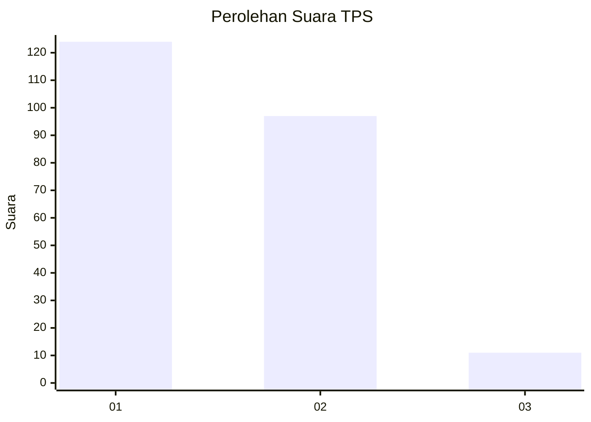
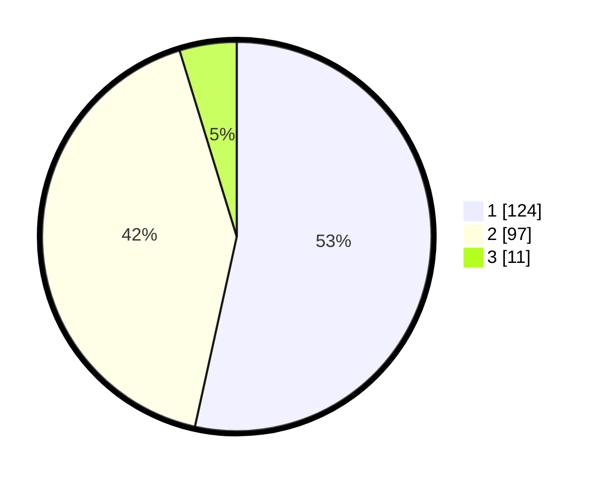

# Hasil

## Grafik

## Tabel

| No. | Nama Paslon    | Suara | Suara (raw) | Persentase |
|:--- |:-------------- | -----:| -----------:| ----------:|
| 1   | ANIES MUHAIMIN | 124   | [124][p-1]  | 53,45      |
| 2   | PRABOWO GIBRAN | 97    | [97][p-2]   | 41,81      |
| 3   | GANJAR MAHFUD  | 11    | [11][p-3]   | 4,74       |

[p-1]: https://github.com/gigit-pemilu/pemilu-2024-35-jawa-timur/blob/main/pilpres/hitung-suara/sub/35-jawa-timur/sub/28-pamekasan/sub/04-pamekasan/sub/1011-bugih/sub/002-tps/sub/paslon-1.txt
[p-2]: https://github.com/gigit-pemilu/pemilu-2024-35-jawa-timur/blob/main/pilpres/hitung-suara/sub/35-jawa-timur/sub/28-pamekasan/sub/04-pamekasan/sub/1011-bugih/sub/002-tps/sub/paslon-2.txt
[p-3]: https://github.com/gigit-pemilu/pemilu-2024-35-jawa-timur/blob/main/pilpres/hitung-suara/sub/35-jawa-timur/sub/28-pamekasan/sub/04-pamekasan/sub/1011-bugih/sub/002-tps/sub/paslon-3.txt

## Foto C Plano

https://sirekap-obj-formc.kpu.go.id/bead/pemilu/ppwp/35/28/04/10/11/3528041011002-20240215-011228--6db71cab-49d6-4a6f-a9d0-1aebd46a68b5.jpg

https://sirekap-obj-formc.kpu.go.id/bead/pemilu/ppwp/35/28/04/10/11/3528041011002-20240215-010229--886b7dba-64d4-4af1-b0bb-8b5649987090.jpg

https://sirekap-obj-formc.kpu.go.id/bead/pemilu/ppwp/35/28/04/10/11/3528041011002-20240215-011032--f74e8c03-1b8b-4226-a2cd-b8ce7e5ccba0.jpg

## Metadata

| Key        | Value               |
| ---------- | ------------------- |
| Time Stamp | 2024-02-15 21:30:27 |

