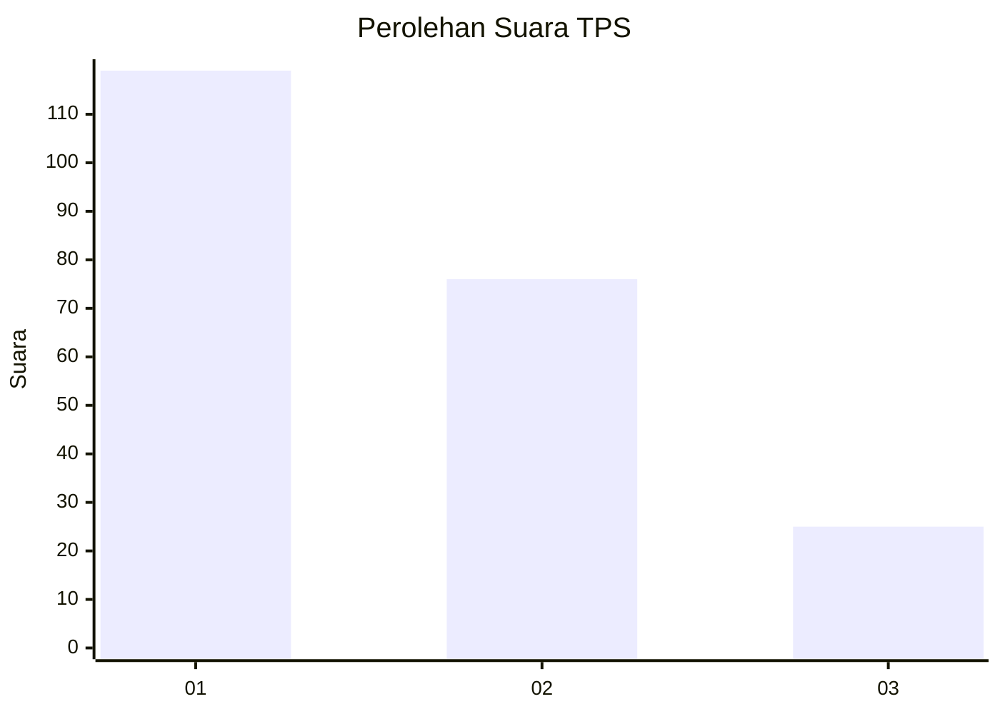
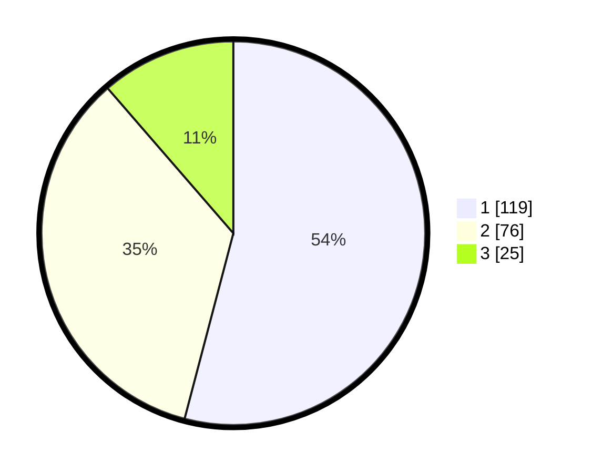

# Hasil

## Grafik

## Tabel

| No. | Nama Paslon    | Suara | Suara (raw) | Persentase |
|:--- |:-------------- | -----:| -----------:| ----------:|
| 1   | ANIES MUHAIMIN | 119   | [119][p-1]  | 54,09      |
| 2   | PRABOWO GIBRAN | 76    | [76][p-2]   | 34,55      |
| 3   | GANJAR MAHFUD  | 25    | [25][p-3]   | 11,36      |

[p-1]: https://github.com/gigit-pemilu/pemilu-2024/blob/main/pilpres/hitung-suara/sub/35-jawa-timur/sub/28-pamekasan/sub/04-pamekasan/sub/1011-bugih/sub/003-tps/sub/paslon-1.txt
[p-2]: https://github.com/gigit-pemilu/pemilu-2024/blob/main/pilpres/hitung-suara/sub/35-jawa-timur/sub/28-pamekasan/sub/04-pamekasan/sub/1011-bugih/sub/003-tps/sub/paslon-2.txt
[p-3]: https://github.com/gigit-pemilu/pemilu-2024/blob/main/pilpres/hitung-suara/sub/35-jawa-timur/sub/28-pamekasan/sub/04-pamekasan/sub/1011-bugih/sub/003-tps/sub/paslon-3.txt

## Foto C Plano

https://sirekap-obj-formc.kpu.go.id/98e5/pemilu/ppwp/35/28/04/10/11/3528041011003-20240214-215053--96a3cc5e-3e23-4f7b-a232-d8108ca475b0.jpg

https://sirekap-obj-formc.kpu.go.id/98e5/pemilu/ppwp/35/28/04/10/11/3528041011003-20240214-215102--fe410788-6410-4039-9120-12de54f673e9.jpg

https://sirekap-obj-formc.kpu.go.id/98e5/pemilu/ppwp/35/28/04/10/11/3528041011003-20240214-215110--2e198102-67a0-4624-8167-3c0182ca55df.jpg

## Metadata

| Key        | Value               |
| ---------- | ------------------- |
| Time Stamp | 2024-02-15 16:30:25 |

