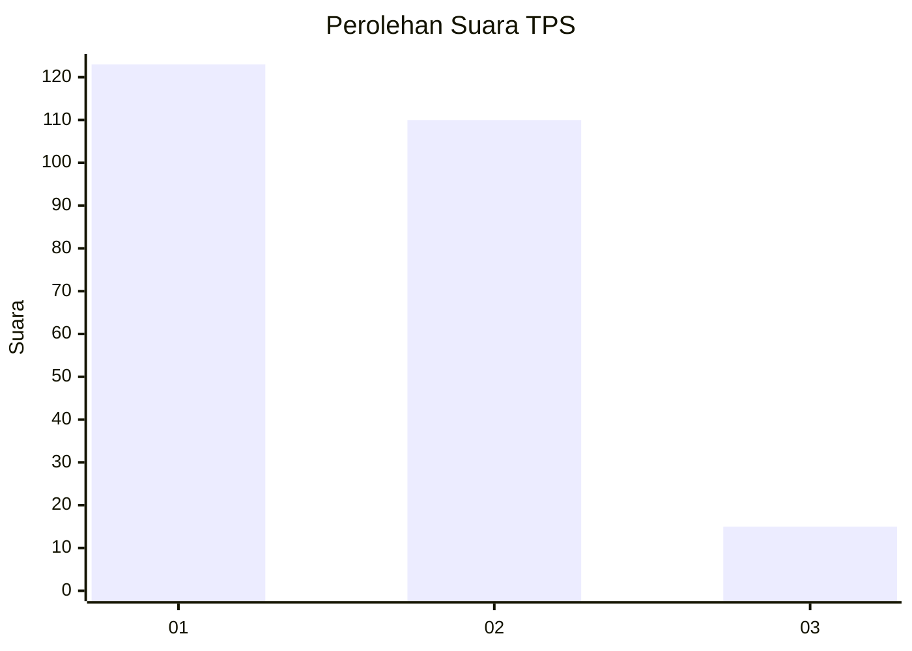
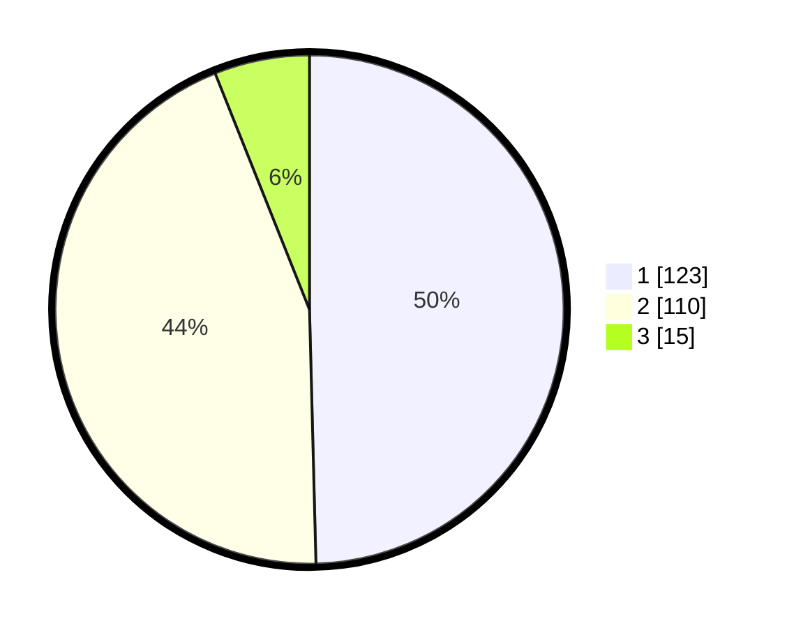

# Hasil

## Grafik

## Tabel

| No. | Nama Paslon    | Suara | Suara (raw) | Persentase |
|:--- |:-------------- | -----:| -----------:| ----------:|
| 1   | ANIES MUHAIMIN | 123   | [123][p-1]  | 49,60      |
| 2   | PRABOWO GIBRAN | 110   | [110][p-2]  | 44,35      |
| 3   | GANJAR MAHFUD  | 15    | [15][p-3]   | 6,05       |

[p-1]: https://github.com/gigit-pemilu/pemilu-2024/blob/main/pilpres/hitung-suara/sub/35-jawa-timur/sub/28-pamekasan/sub/04-pamekasan/sub/1011-bugih/sub/004-tps/sub/paslon-1.txt
[p-2]: https://github.com/gigit-pemilu/pemilu-2024/blob/main/pilpres/hitung-suara/sub/35-jawa-timur/sub/28-pamekasan/sub/04-pamekasan/sub/1011-bugih/sub/004-tps/sub/paslon-2.txt
[p-3]: https://github.com/gigit-pemilu/pemilu-2024/blob/main/pilpres/hitung-suara/sub/35-jawa-timur/sub/28-pamekasan/sub/04-pamekasan/sub/1011-bugih/sub/004-tps/sub/paslon-3.txt

## Foto C Plano

https://sirekap-obj-formc.kpu.go.id/681c/pemilu/ppwp/35/28/04/10/11/3528041011004-20240215-001031--b7e05d9f-5749-4e79-b234-c040ab448cf9.jpg

https://sirekap-obj-formc.kpu.go.id/681c/pemilu/ppwp/35/28/04/10/11/3528041011004-20240215-001355--16b5bc41-7d21-4460-b973-5a36ba185a98.jpg

https://sirekap-obj-formc.kpu.go.id/681c/pemilu/ppwp/35/28/04/10/11/3528041011004-20240215-001708--13d40b54-c8d2-46a3-bdce-83e6d6c301b1.jpg

## Metadata

| Key        | Value               |
| ---------- | ------------------- |
| Time Stamp | 2024-02-25 16:00:00 |

