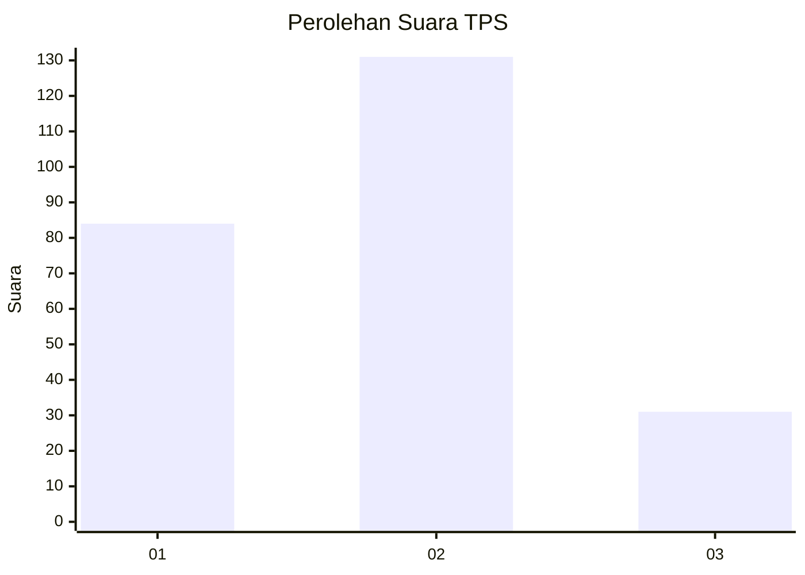
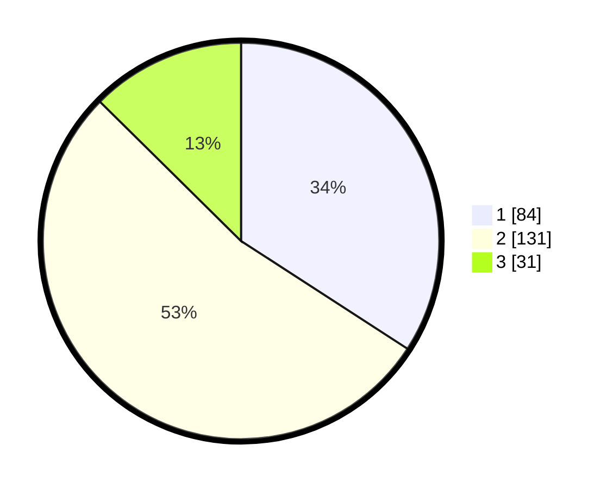

# Hasil

## Grafik

## Tabel

| No. | Nama Paslon    | Suara | Suara (raw) | Persentase |
|:--- |:-------------- | -----:| -----------:| ----------:|
| 1   | ANIES MUHAIMIN | 84    | [84][p-1]   | 34,15      |
| 2   | PRABOWO GIBRAN | 131   | [131][p-2]  | 53,25      |
| 3   | GANJAR MAHFUD  | 31    | [31][p-3]   | 12,60      |

[p-1]: https://github.com/gigit-pemilu/pemilu-2024-35-jawa-timur/blob/main/pilpres/hitung-suara/sub/35-jawa-timur/sub/28-pamekasan/sub/04-pamekasan/sub/1011-bugih/sub/011-tps/sub/paslon-1.txt
[p-2]: https://github.com/gigit-pemilu/pemilu-2024-35-jawa-timur/blob/main/pilpres/hitung-suara/sub/35-jawa-timur/sub/28-pamekasan/sub/04-pamekasan/sub/1011-bugih/sub/011-tps/sub/paslon-2.txt
[p-3]: https://github.com/gigit-pemilu/pemilu-2024-35-jawa-timur/blob/main/pilpres/hitung-suara/sub/35-jawa-timur/sub/28-pamekasan/sub/04-pamekasan/sub/1011-bugih/sub/011-tps/sub/paslon-3.txt

## Foto C Plano

https://sirekap-obj-formc.kpu.go.id/d4d3/pemilu/ppwp/35/28/04/10/11/3528041011011-20240214-235352--500f00c2-2cc9-4181-90cd-885879cc4c2a.jpg

https://sirekap-obj-formc.kpu.go.id/d4d3/pemilu/ppwp/35/28/04/10/11/3528041011011-20240214-235459--b4d7c2f4-573c-4319-9b07-cf8ccb0e6e54.jpg

https://sirekap-obj-formc.kpu.go.id/d4d3/pemilu/ppwp/35/28/04/10/11/3528041011011-20240214-235540--85b8a9ac-2d6a-48e4-8aa8-6a41fad8bb62.jpg

## Metadata

| Key        | Value               |
| ---------- | ------------------- |
| Time Stamp | 2024-02-15 16:30:25 |

