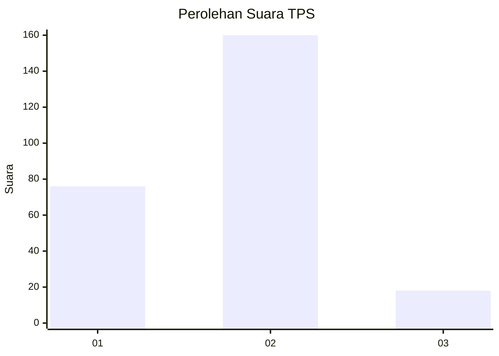
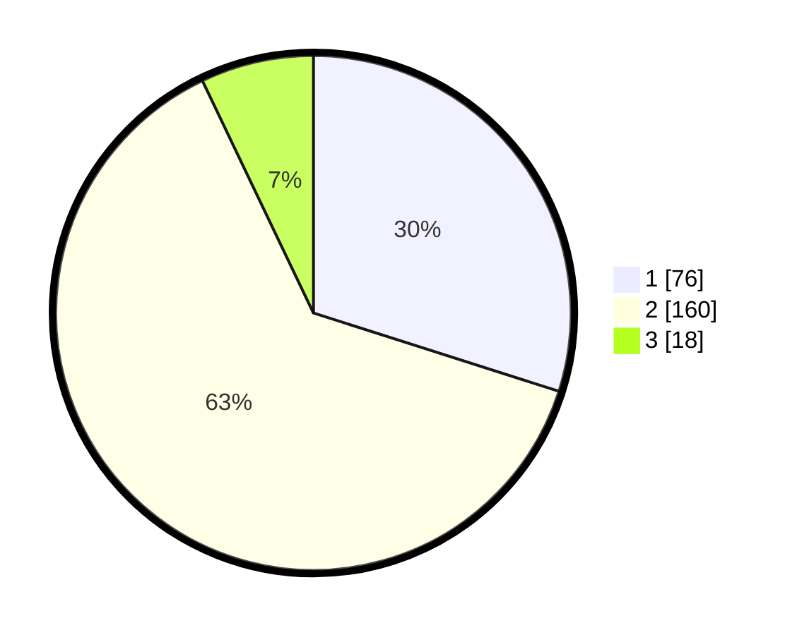

# Hasil

## Grafik

## Tabel

| No. | Nama Paslon    | Suara | Suara (raw) | Persentase |
|:--- |:-------------- | -----:| -----------:| ----------:|
| 1   | ANIES MUHAIMIN | 76    | [76][p-1]   | 29,92      |
| 2   | PRABOWO GIBRAN | 160   | [160][p-2]  | 62,99      |
| 3   | GANJAR MAHFUD  | 18    | [18][p-3]   | 7,09       |

[p-1]: https://github.com/gigit-pemilu/pemilu-2024/blob/main/pilpres/hitung-suara/sub/35-jawa-timur/sub/28-pamekasan/sub/04-pamekasan/sub/1011-bugih/sub/013-tps/sub/paslon-1.txt
[p-2]: https://github.com/gigit-pemilu/pemilu-2024/blob/main/pilpres/hitung-suara/sub/35-jawa-timur/sub/28-pamekasan/sub/04-pamekasan/sub/1011-bugih/sub/013-tps/sub/paslon-2.txt
[p-3]: https://github.com/gigit-pemilu/pemilu-2024/blob/main/pilpres/hitung-suara/sub/35-jawa-timur/sub/28-pamekasan/sub/04-pamekasan/sub/1011-bugih/sub/013-tps/sub/paslon-3.txt

## Foto C Plano

https://sirekap-obj-formc.kpu.go.id/05e0/pemilu/ppwp/35/28/04/10/11/3528041011013-20240214-212903--162eebd9-4234-4a56-9100-c72cbe1ebea6.jpg

https://sirekap-obj-formc.kpu.go.id/05e0/pemilu/ppwp/35/28/04/10/11/3528041011013-20240214-213323--1031166f-189d-46af-9854-e21450db306e.jpg

https://sirekap-obj-formc.kpu.go.id/05e0/pemilu/ppwp/35/28/04/10/11/3528041011013-20240214-213429--8db83dc7-bfc9-473a-9323-6a41bdc62fa8.jpg

## Metadata

| Key        | Value               |
| ---------- | ------------------- |
| Time Stamp | 2024-02-15 16:30:25 |

