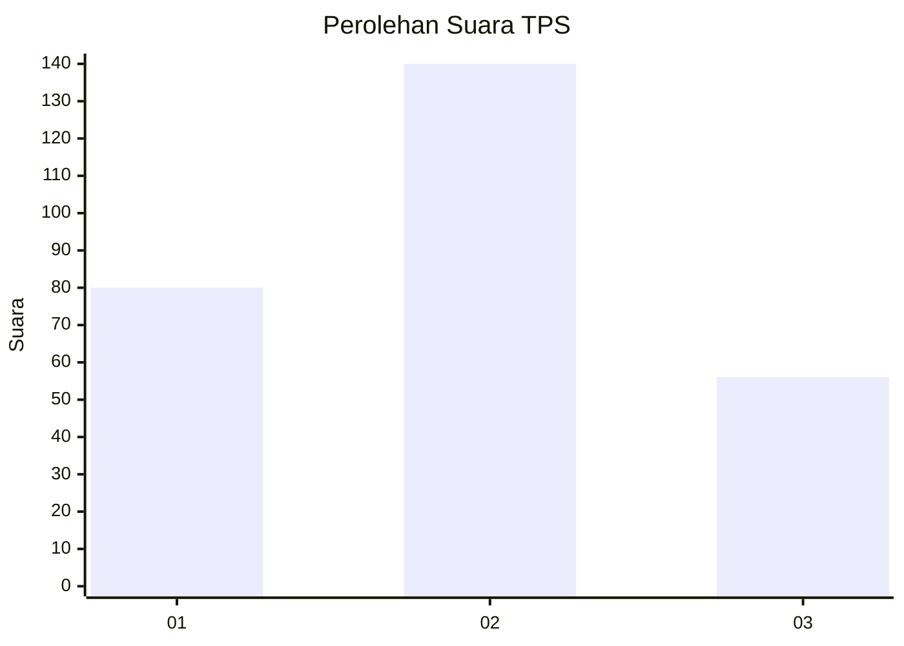
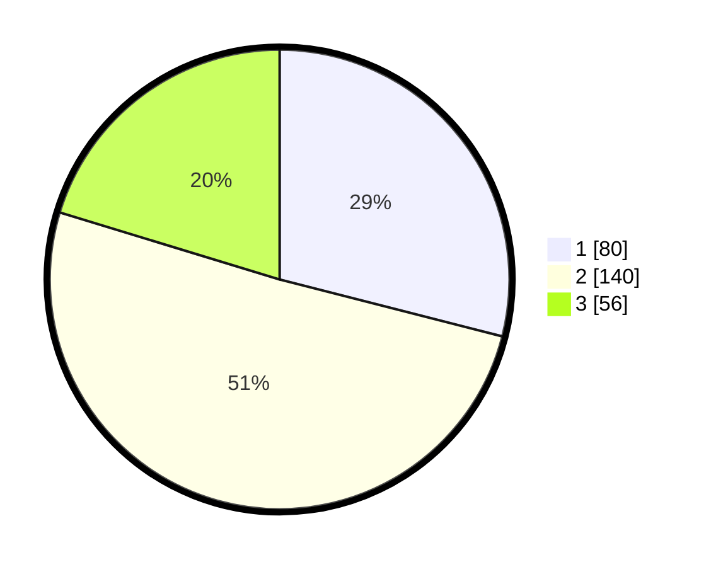

# Hasil

## Grafik

## Tabel

| No. | Nama Paslon    | Suara | Suara (raw) | Persentase |
|:--- |:-------------- | -----:| -----------:| ----------:|
| 1   | ANIES MUHAIMIN | 80    | [80][p-1]   | 28,99      |
| 2   | PRABOWO GIBRAN | 140   | [140][p-2]  | 50,72      |
| 3   | GANJAR MAHFUD  | 56    | [56][p-3]   | 20,29      |

[p-1]: https://github.com/gigit-pemilu/pemilu-2024-35-jawa-timur/blob/main/pilpres/hitung-suara/sub/35-jawa-timur/sub/28-pamekasan/sub/04-pamekasan/sub/1011-bugih/sub/018-tps/sub/paslon-1.txt
[p-2]: https://github.com/gigit-pemilu/pemilu-2024-35-jawa-timur/blob/main/pilpres/hitung-suara/sub/35-jawa-timur/sub/28-pamekasan/sub/04-pamekasan/sub/1011-bugih/sub/018-tps/sub/paslon-2.txt
[p-3]: https://github.com/gigit-pemilu/pemilu-2024-35-jawa-timur/blob/main/pilpres/hitung-suara/sub/35-jawa-timur/sub/28-pamekasan/sub/04-pamekasan/sub/1011-bugih/sub/018-tps/sub/paslon-3.txt

## Foto C Plano

https://sirekap-obj-formc.kpu.go.id/8bad/pemilu/ppwp/35/28/04/10/11/3528041011018-20240214-203648--4957dec4-6bf9-4422-afe2-889f4e302002.jpg

https://sirekap-obj-formc.kpu.go.id/8bad/pemilu/ppwp/35/28/04/10/11/3528041011018-20240214-203852--7f780dc5-c05e-4b4c-a5a7-7e78ad1d0136.jpg

https://sirekap-obj-formc.kpu.go.id/8bad/pemilu/ppwp/35/28/04/10/11/3528041011018-20240214-204055--5dbac073-ef08-47a8-8f62-466d70917a3a.jpg

## Metadata

| Key        | Value               |
| ---------- | ------------------- |
| Time Stamp | 2024-02-15 17:00:25 |

