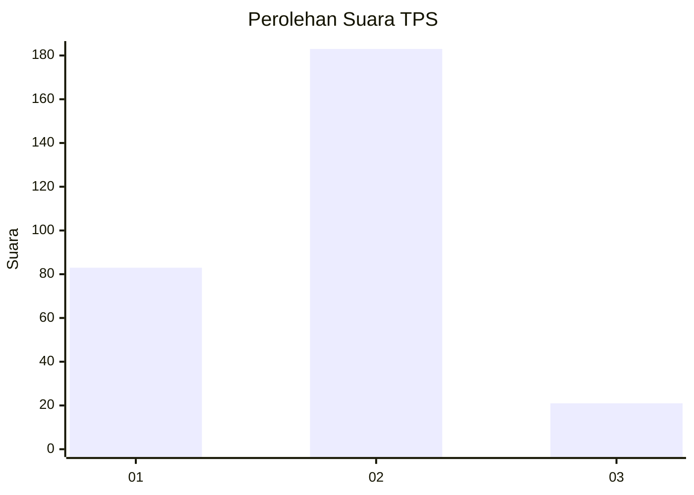
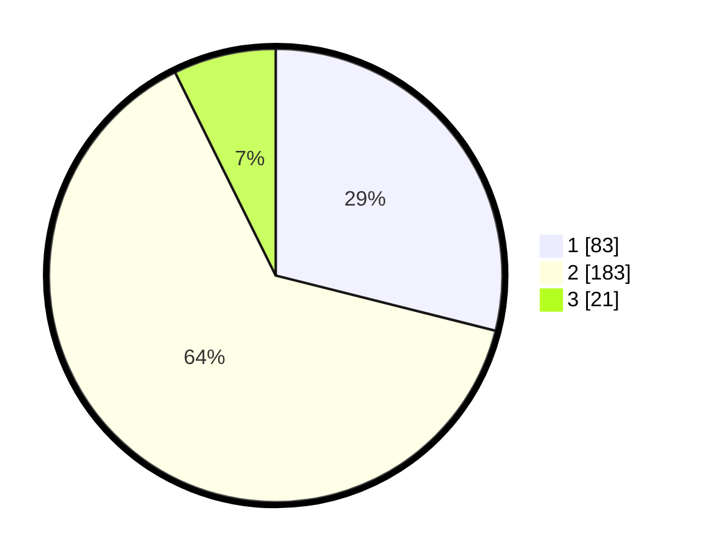

# Hasil

## Grafik

## Tabel

| No. | Nama Paslon    | Suara | Suara (raw) | Persentase |
|:--- |:-------------- | -----:| -----------:| ----------:|
| 1   | ANIES MUHAIMIN | 83    | [83][p-1]   | 28,92      |
| 2   | PRABOWO GIBRAN | 183   | [183][p-2]  | 63,76      |
| 3   | GANJAR MAHFUD  | 21    | [21][p-3]   | 7,32       |

[p-1]: https://github.com/gigit-pemilu/pemilu-2024-35-jawa-timur/blob/main/pilpres/hitung-suara/sub/35-jawa-timur/sub/28-pamekasan/sub/04-pamekasan/sub/1011-bugih/sub/019-tps/sub/paslon-1.txt
[p-2]: https://github.com/gigit-pemilu/pemilu-2024-35-jawa-timur/blob/main/pilpres/hitung-suara/sub/35-jawa-timur/sub/28-pamekasan/sub/04-pamekasan/sub/1011-bugih/sub/019-tps/sub/paslon-2.txt
[p-3]: https://github.com/gigit-pemilu/pemilu-2024-35-jawa-timur/blob/main/pilpres/hitung-suara/sub/35-jawa-timur/sub/28-pamekasan/sub/04-pamekasan/sub/1011-bugih/sub/019-tps/sub/paslon-3.txt

## Foto C Plano

https://sirekap-obj-formc.kpu.go.id/b3dd/pemilu/ppwp/35/28/04/10/11/3528041011019-20240214-203954--b2961051-d5d3-4ba5-8a61-171d5b020a3a.jpg

https://sirekap-obj-formc.kpu.go.id/b3dd/pemilu/ppwp/35/28/04/10/11/3528041011019-20240214-204116--221e42af-c788-4ac4-bfd3-c1cde2abc2b3.jpg

https://sirekap-obj-formc.kpu.go.id/b3dd/pemilu/ppwp/35/28/04/10/11/3528041011019-20240214-204235--a4e2cb5f-5e8f-4e79-9d35-6b029bc23a30.jpg

## Metadata

| Key        | Value               |
| ---------- | ------------------- |
| Time Stamp | 2024-02-26 21:00:00 |

