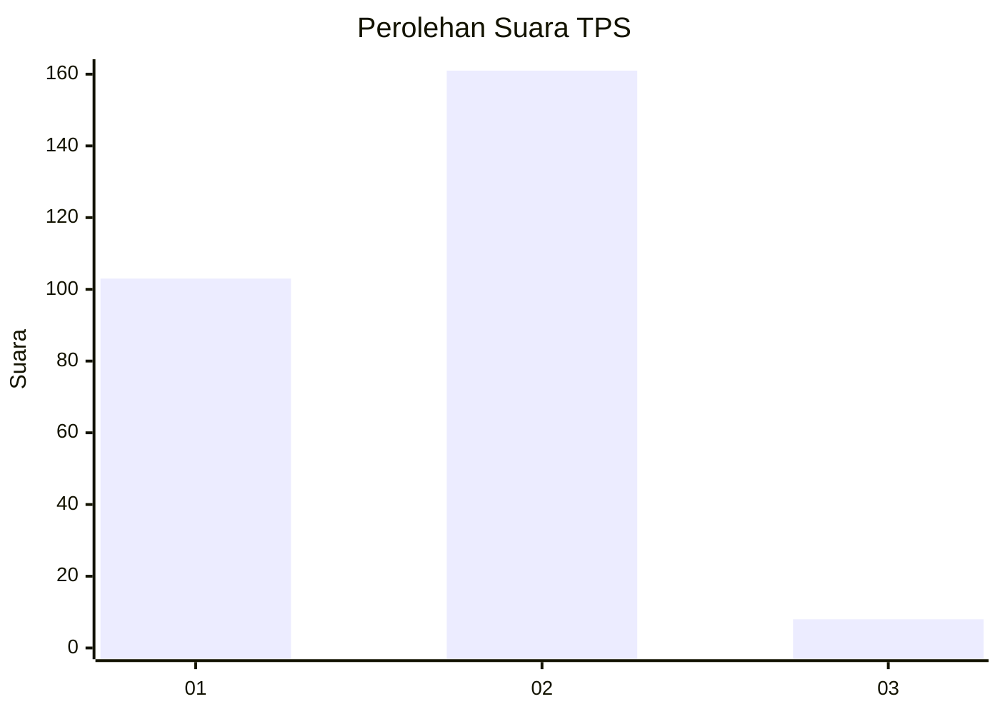
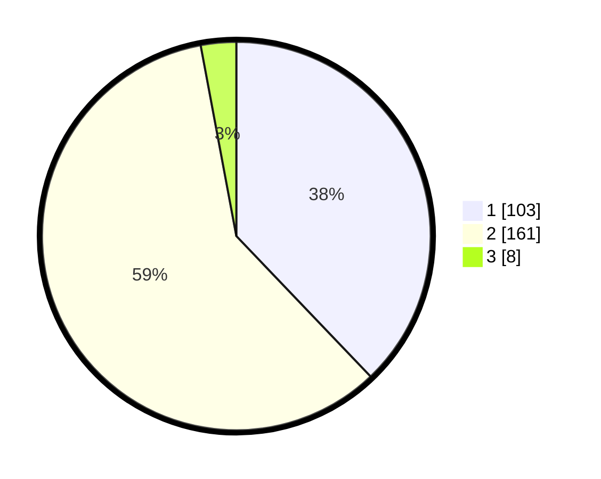

# Hasil

## Grafik

## Tabel

| No. | Nama Paslon    | Suara | Suara (raw) | Persentase |
|:--- |:-------------- | -----:| -----------:| ----------:|
| 1   | ANIES MUHAIMIN | 103   | [103][p-1]  | 37,87      |
| 2   | PRABOWO GIBRAN | 161   | [161][p-2]  | 59,19      |
| 3   | GANJAR MAHFUD  | 8     | [8][p-3]    | 2,94       |

[p-1]: https://github.com/gigit-pemilu/pemilu-2024/blob/main/pilpres/hitung-suara/sub/35-jawa-timur/sub/28-pamekasan/sub/04-pamekasan/sub/1011-bugih/sub/023-tps/sub/paslon-1.txt
[p-2]: https://github.com/gigit-pemilu/pemilu-2024/blob/main/pilpres/hitung-suara/sub/35-jawa-timur/sub/28-pamekasan/sub/04-pamekasan/sub/1011-bugih/sub/023-tps/sub/paslon-2.txt
[p-3]: https://github.com/gigit-pemilu/pemilu-2024/blob/main/pilpres/hitung-suara/sub/35-jawa-timur/sub/28-pamekasan/sub/04-pamekasan/sub/1011-bugih/sub/023-tps/sub/paslon-3.txt

## Foto C Plano

https://sirekap-obj-formc.kpu.go.id/c4de/pemilu/ppwp/35/28/04/10/11/3528041011023-20240215-005900--f6000960-4b30-4694-bbb0-95ae230b65fe.jpg

https://sirekap-obj-formc.kpu.go.id/c4de/pemilu/ppwp/35/28/04/10/11/3528041011023-20240215-010008--d20574be-17b9-414e-859e-b1bedd7eb754.jpg

https://sirekap-obj-formc.kpu.go.id/c4de/pemilu/ppwp/35/28/04/10/11/3528041011023-20240215-010059--11961c94-7478-42c0-8409-f4cd5947897d.jpg

## Metadata

| Key        | Value               |
| ---------- | ------------------- |
| Time Stamp | 2024-02-15 17:00:25 |

