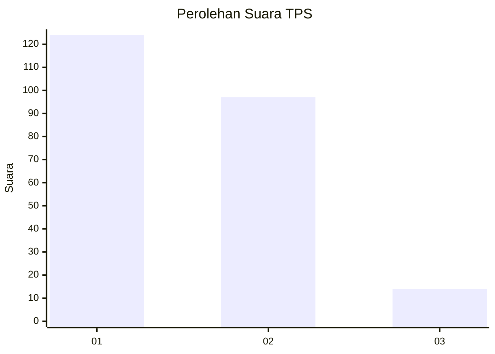
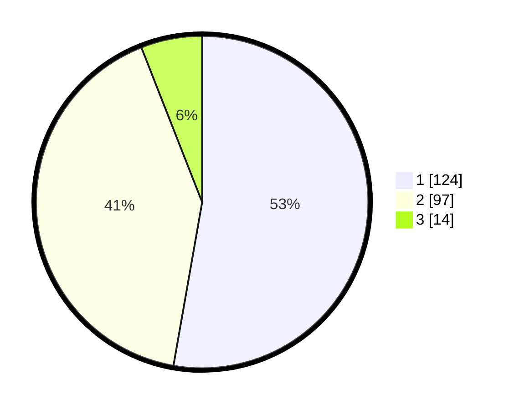

# Hasil

## Grafik

## Tabel

| No. | Nama Paslon    | Suara | Suara (raw) | Persentase |
|:--- |:-------------- | -----:| -----------:| ----------:|
| 1   | ANIES MUHAIMIN | 124   | [124][p-1]  | 52,77      |
| 2   | PRABOWO GIBRAN | 97    | [97][p-2]   | 41,28      |
| 3   | GANJAR MAHFUD  | 14    | [14][p-3]   | 5,96       |

[p-1]: https://github.com/gigit-pemilu/pemilu-2024-35-jawa-timur/blob/main/pilpres/hitung-suara/sub/35-jawa-timur/sub/28-pamekasan/sub/04-pamekasan/sub/1011-bugih/sub/025-tps/sub/paslon-1.txt
[p-2]: https://github.com/gigit-pemilu/pemilu-2024-35-jawa-timur/blob/main/pilpres/hitung-suara/sub/35-jawa-timur/sub/28-pamekasan/sub/04-pamekasan/sub/1011-bugih/sub/025-tps/sub/paslon-2.txt
[p-3]: https://github.com/gigit-pemilu/pemilu-2024-35-jawa-timur/blob/main/pilpres/hitung-suara/sub/35-jawa-timur/sub/28-pamekasan/sub/04-pamekasan/sub/1011-bugih/sub/025-tps/sub/paslon-3.txt

## Foto C Plano

https://sirekap-obj-formc.kpu.go.id/7805/pemilu/ppwp/35/28/04/10/11/3528041011025-20240215-022549--d093a32e-dd9f-489f-8bd9-fb6b86ad97f8.jpg

https://sirekap-obj-formc.kpu.go.id/7805/pemilu/ppwp/35/28/04/10/11/3528041011025-20240215-022619--6e3e08a1-24a2-42dd-bd25-0bb8153bad32.jpg

https://sirekap-obj-formc.kpu.go.id/7805/pemilu/ppwp/35/28/04/10/11/3528041011025-20240215-022653--22626f73-7eac-4096-8989-31fb6c1e2cf3.jpg

## Metadata

| Key        | Value               |
| ---------- | ------------------- |
| Time Stamp | 2024-02-15 17:00:25 |

