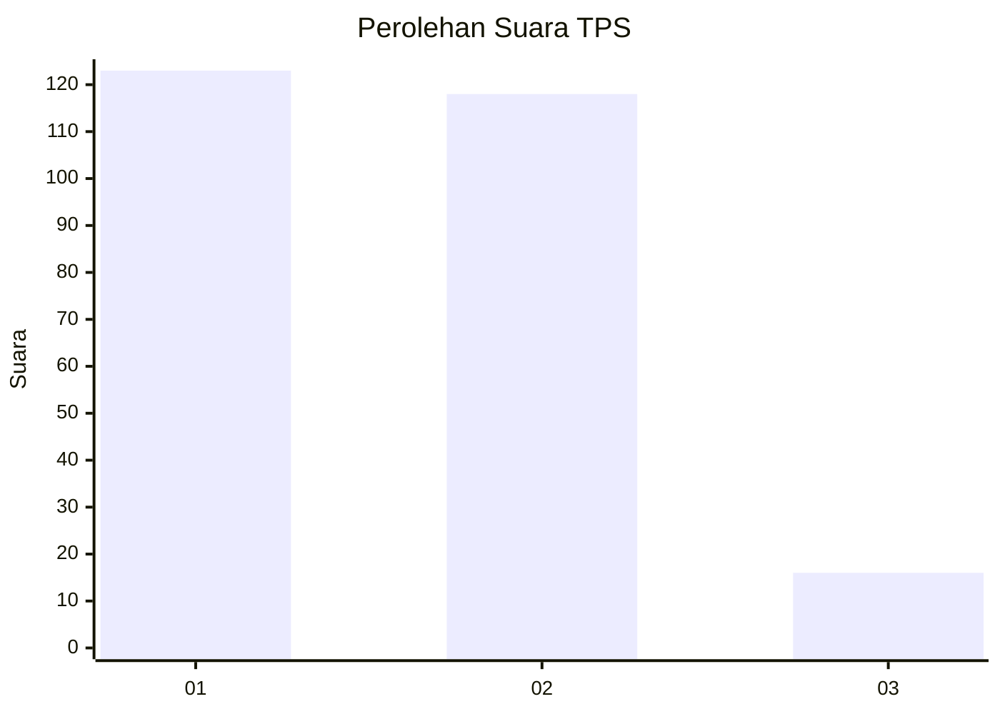
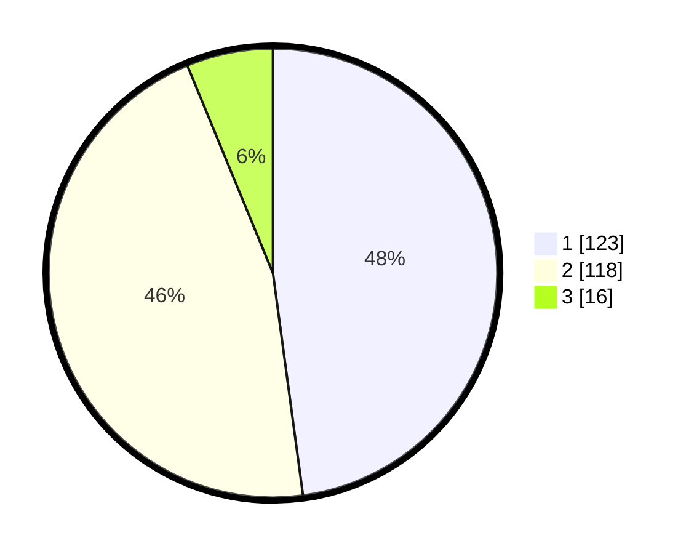

# Hasil

## Grafik

## Tabel

| No. | Nama Paslon    | Suara | Suara (raw) | Persentase |
|:--- |:-------------- | -----:| -----------:| ----------:|
| 1   | ANIES MUHAIMIN | 123   | [123][p-1]  | 47,86      |
| 2   | PRABOWO GIBRAN | 118   | [118][p-2]  | 45,91      |
| 3   | GANJAR MAHFUD  | 16    | [16][p-3]   | 6,23       |

[p-1]: https://github.com/gigit-pemilu/pemilu-2024/blob/main/pilpres/hitung-suara/sub/35-jawa-timur/sub/28-pamekasan/sub/04-pamekasan/sub/1011-bugih/sub/027-tps/sub/paslon-1.txt
[p-2]: https://github.com/gigit-pemilu/pemilu-2024/blob/main/pilpres/hitung-suara/sub/35-jawa-timur/sub/28-pamekasan/sub/04-pamekasan/sub/1011-bugih/sub/027-tps/sub/paslon-2.txt
[p-3]: https://github.com/gigit-pemilu/pemilu-2024/blob/main/pilpres/hitung-suara/sub/35-jawa-timur/sub/28-pamekasan/sub/04-pamekasan/sub/1011-bugih/sub/027-tps/sub/paslon-3.txt

## Foto C Plano

https://sirekap-obj-formc.kpu.go.id/9b10/pemilu/ppwp/35/28/04/10/11/3528041011027-20240214-194922--1cda6048-ea13-4bbc-aa88-7a43980bbd7b.jpg

https://sirekap-obj-formc.kpu.go.id/9b10/pemilu/ppwp/35/28/04/10/11/3528041011027-20240214-194957--6da62764-78a8-49d5-9458-c0f29abccf38.jpg

https://sirekap-obj-formc.kpu.go.id/9b10/pemilu/ppwp/35/28/04/10/11/3528041011027-20240214-195026--d5d9fadf-3733-4f37-a6f5-119b7e4fccc7.jpg

## Metadata

| Key        | Value               |
| ---------- | ------------------- |
| Time Stamp | 2024-02-15 17:00:25 |

