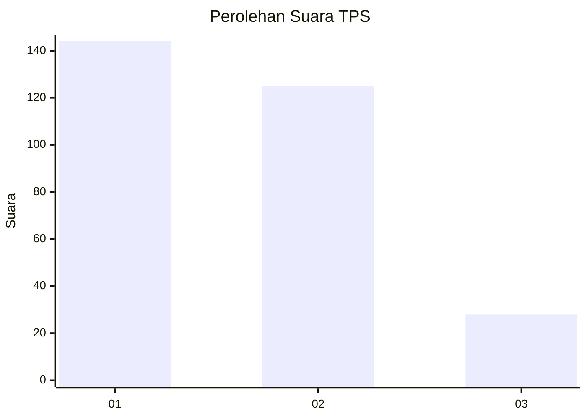
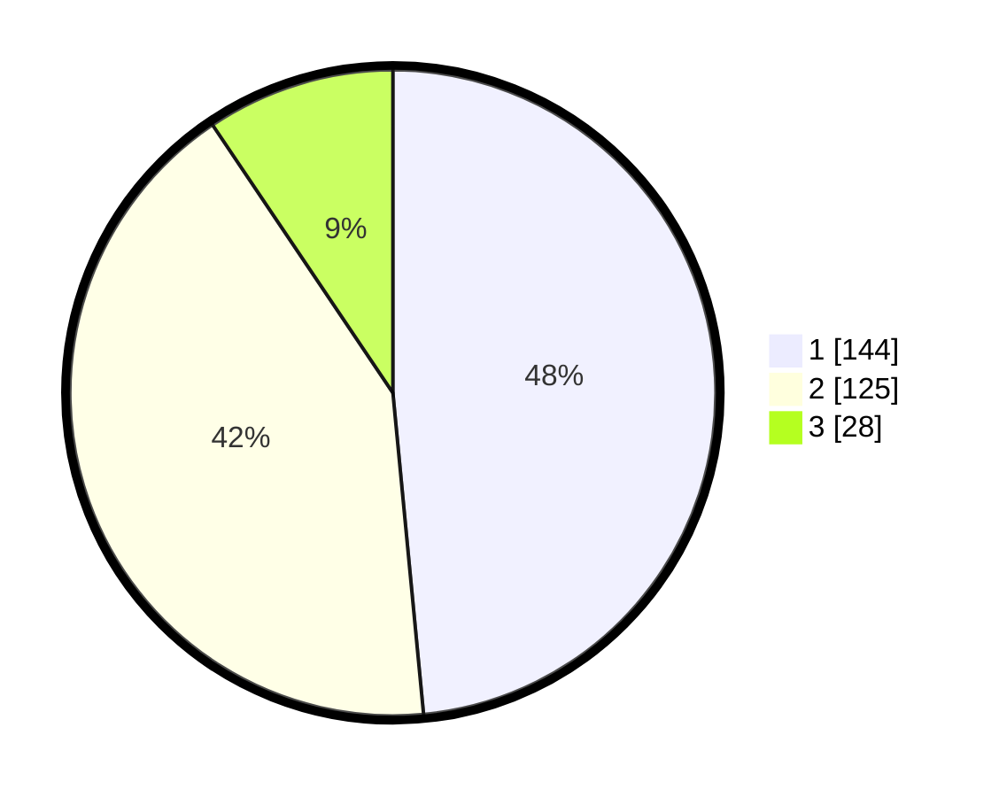

# Hasil

## Grafik

## Tabel

| No. | Nama Paslon    | Suara | Suara (raw) | Persentase |
|:--- |:-------------- | -----:| -----------:| ----------:|
| 1   | ANIES MUHAIMIN | 144   | [144][p-1]  | 48,48      |
| 2   | PRABOWO GIBRAN | 125   | [125][p-2]  | 42,09      |
| 3   | GANJAR MAHFUD  | 28    | [28][p-3]   | 9,43       |

[p-1]: https://github.com/gigit-pemilu/pemilu-2024/blob/main/pilpres/hitung-suara/sub/35-jawa-timur/sub/28-pamekasan/sub/04-pamekasan/sub/1011-bugih/sub/029-tps/sub/paslon-1.txt
[p-2]: https://github.com/gigit-pemilu/pemilu-2024/blob/main/pilpres/hitung-suara/sub/35-jawa-timur/sub/28-pamekasan/sub/04-pamekasan/sub/1011-bugih/sub/029-tps/sub/paslon-2.txt
[p-3]: https://github.com/gigit-pemilu/pemilu-2024/blob/main/pilpres/hitung-suara/sub/35-jawa-timur/sub/28-pamekasan/sub/04-pamekasan/sub/1011-bugih/sub/029-tps/sub/paslon-3.txt

## Foto C Plano

https://sirekap-obj-formc.kpu.go.id/4754/pemilu/ppwp/35/28/04/10/11/3528041011029-20240215-015417--d27f804d-a053-41f4-9fb1-7e8f5ae3986a.jpg

https://sirekap-obj-formc.kpu.go.id/4754/pemilu/ppwp/35/28/04/10/11/3528041011029-20240215-015156--c541de14-2109-4c22-868e-bf71cba027a9.jpg

https://sirekap-obj-formc.kpu.go.id/4754/pemilu/ppwp/35/28/04/10/11/3528041011029-20240215-014635--0d70fadb-a421-4293-aa61-45a86001502e.jpg

## Metadata

| Key        | Value               |
| ---------- | ------------------- |
| Time Stamp | 2024-02-15 17:00:25 |

