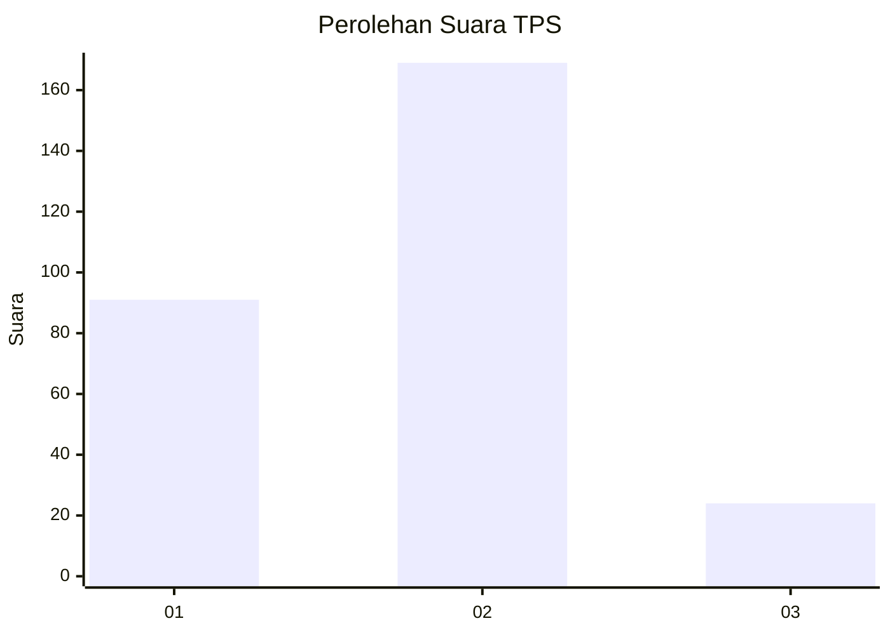
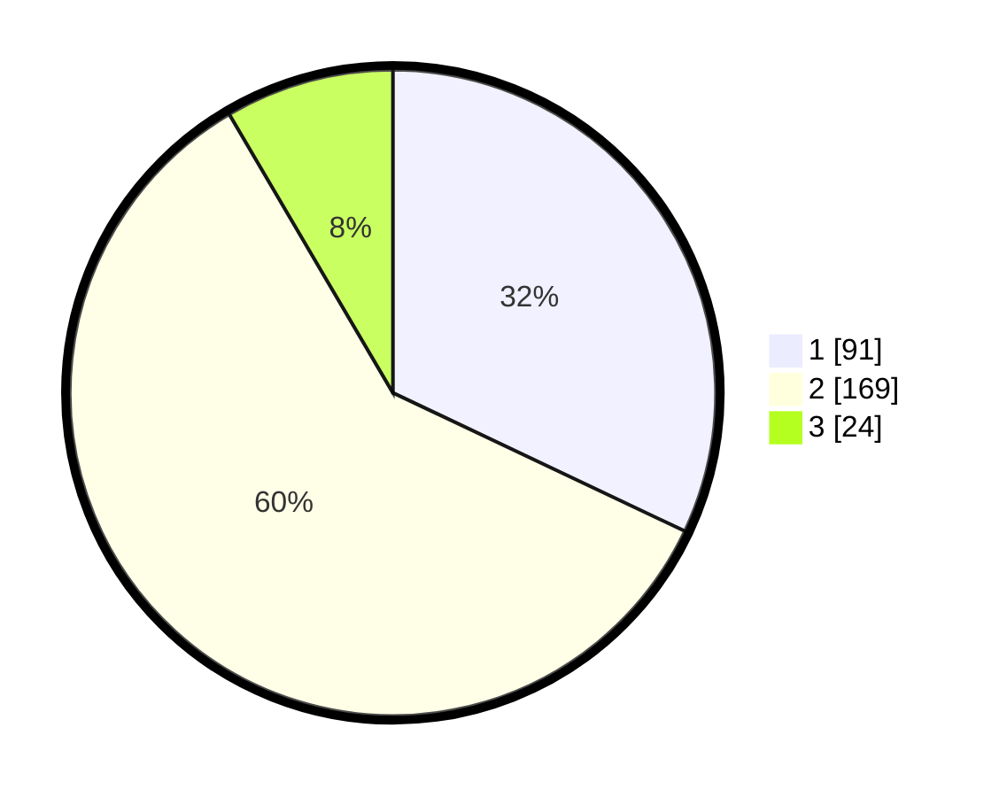

# Hasil

## Grafik

## Tabel

| No. | Nama Paslon    | Suara | Suara (raw) | Persentase |
|:--- |:-------------- | -----:| -----------:| ----------:|
| 1   | ANIES MUHAIMIN | 91    | [91][p-1]   | 32,04      |
| 2   | PRABOWO GIBRAN | 169   | [169][p-2]  | 59,51      |
| 3   | GANJAR MAHFUD  | 24    | [24][p-3]   | 8,45       |

[p-1]: https://github.com/gigit-pemilu/pemilu-2024-35-jawa-timur/blob/main/pilpres/hitung-suara/sub/35-jawa-timur/sub/28-pamekasan/sub/04-pamekasan/sub/1011-bugih/sub/031-tps/sub/paslon-1.txt
[p-2]: https://github.com/gigit-pemilu/pemilu-2024-35-jawa-timur/blob/main/pilpres/hitung-suara/sub/35-jawa-timur/sub/28-pamekasan/sub/04-pamekasan/sub/1011-bugih/sub/031-tps/sub/paslon-2.txt
[p-3]: https://github.com/gigit-pemilu/pemilu-2024-35-jawa-timur/blob/main/pilpres/hitung-suara/sub/35-jawa-timur/sub/28-pamekasan/sub/04-pamekasan/sub/1011-bugih/sub/031-tps/sub/paslon-3.txt

## Foto C Plano

https://sirekap-obj-formc.kpu.go.id/e8ae/pemilu/ppwp/35/28/04/10/11/3528041011031-20240214-222929--0c41cf69-2535-4cfb-b610-44412ca6632c.jpg

https://sirekap-obj-formc.kpu.go.id/e8ae/pemilu/ppwp/35/28/04/10/11/3528041011031-20240214-223148--a184cbe0-7794-4f81-b389-516951b27929.jpg

https://sirekap-obj-formc.kpu.go.id/e8ae/pemilu/ppwp/35/28/04/10/11/3528041011031-20240214-223349--babd1f47-1dcc-4b17-a4ed-1f0512513ae7.jpg

## Metadata

| Key        | Value               |
| ---------- | ------------------- |
| Time Stamp | 2024-02-15 17:00:25 |

