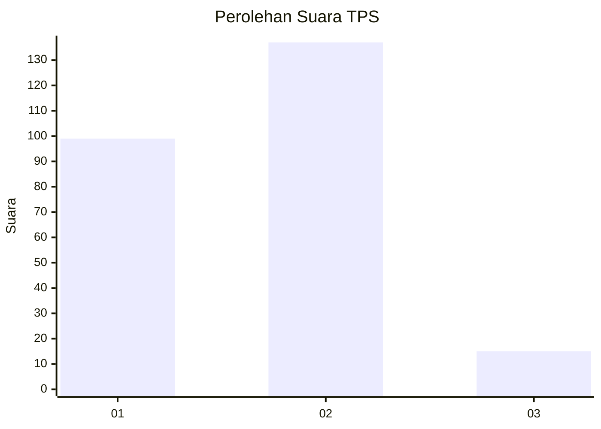
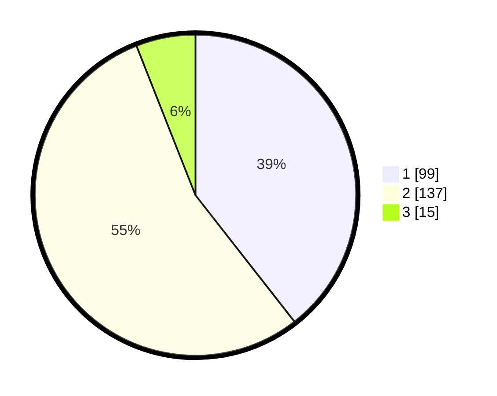

# Hasil

## Grafik

## Tabel

| No. | Nama Paslon    | Suara | Suara (raw) | Persentase |
|:--- |:-------------- | -----:| -----------:| ----------:|
| 1   | ANIES MUHAIMIN | 99    | [99][p-1]   | 39,44      |
| 2   | PRABOWO GIBRAN | 137   | [137][p-2]  | 54,58      |
| 3   | GANJAR MAHFUD  | 15    | [15][p-3]   | 5,98       |

[p-1]: https://github.com/gigit-pemilu/pemilu-2024/blob/main/pilpres/hitung-suara/sub/35-jawa-timur/sub/28-pamekasan/sub/04-pamekasan/sub/1012-jungcangcang/sub/003-tps/sub/paslon-1.txt
[p-2]: https://github.com/gigit-pemilu/pemilu-2024/blob/main/pilpres/hitung-suara/sub/35-jawa-timur/sub/28-pamekasan/sub/04-pamekasan/sub/1012-jungcangcang/sub/003-tps/sub/paslon-2.txt
[p-3]: https://github.com/gigit-pemilu/pemilu-2024/blob/main/pilpres/hitung-suara/sub/35-jawa-timur/sub/28-pamekasan/sub/04-pamekasan/sub/1012-jungcangcang/sub/003-tps/sub/paslon-3.txt

## Foto C Plano

https://sirekap-obj-formc.kpu.go.id/232e/pemilu/ppwp/35/28/04/10/12/3528041012003-20240214-224356--6c53b8bd-df5b-4cd5-8050-bc27b5390b04.jpg

https://sirekap-obj-formc.kpu.go.id/232e/pemilu/ppwp/35/28/04/10/12/3528041012003-20240214-224616--0e882720-1338-4b94-84f1-43067bccc15d.jpg

https://sirekap-obj-formc.kpu.go.id/232e/pemilu/ppwp/35/28/04/10/12/3528041012003-20240214-224725--fe8ec9fc-3bf2-4ba8-afb6-b05815211643.jpg

## Metadata

| Key        | Value               |
| ---------- | ------------------- |
| Time Stamp | 2024-02-15 21:30:27 |

