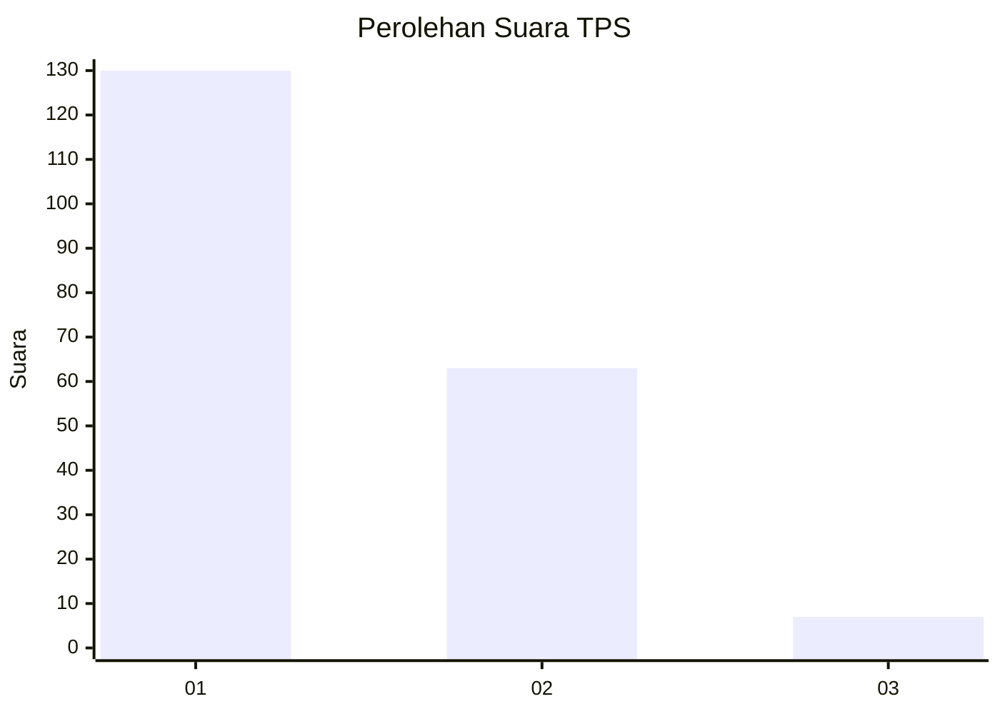
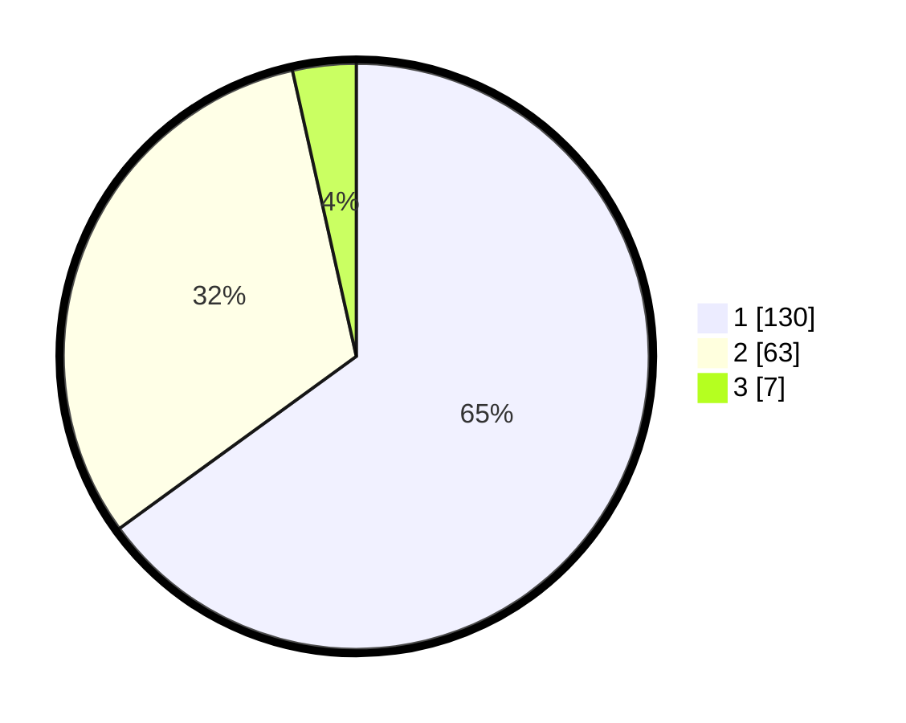

# Hasil

## Grafik

## Tabel

| No. | Nama Paslon    | Suara | Suara (raw) | Persentase |
|:--- |:-------------- | -----:| -----------:| ----------:|
| 1   | ANIES MUHAIMIN | 130   | [130][p-1]  | 65,00      |
| 2   | PRABOWO GIBRAN | 63    | [63][p-2]   | 31,50      |
| 3   | GANJAR MAHFUD  | 7     | [7][p-3]    | 3,50       |

[p-1]: https://github.com/gigit-pemilu/pemilu-2024-35-jawa-timur/blob/main/pilpres/hitung-suara/sub/35-jawa-timur/sub/28-pamekasan/sub/04-pamekasan/sub/1012-jungcangcang/sub/004-tps/sub/paslon-1.txt
[p-2]: https://github.com/gigit-pemilu/pemilu-2024-35-jawa-timur/blob/main/pilpres/hitung-suara/sub/35-jawa-timur/sub/28-pamekasan/sub/04-pamekasan/sub/1012-jungcangcang/sub/004-tps/sub/paslon-2.txt
[p-3]: https://github.com/gigit-pemilu/pemilu-2024-35-jawa-timur/blob/main/pilpres/hitung-suara/sub/35-jawa-timur/sub/28-pamekasan/sub/04-pamekasan/sub/1012-jungcangcang/sub/004-tps/sub/paslon-3.txt

## Foto C Plano

https://sirekap-obj-formc.kpu.go.id/58af/pemilu/ppwp/35/28/04/10/12/3528041012004-20240214-214056--02f21a4d-d7b3-4101-a938-eceef93c27f8.jpg

https://sirekap-obj-formc.kpu.go.id/58af/pemilu/ppwp/35/28/04/10/12/3528041012004-20240214-214329--60c86cc5-5ad2-42c8-b461-a441eb1d4fbb.jpg

https://sirekap-obj-formc.kpu.go.id/58af/pemilu/ppwp/35/28/04/10/12/3528041012004-20240214-214737--62e919eb-ae74-401d-90d4-73dec4a0c8eb.jpg

## Metadata

| Key        | Value               |
| ---------- | ------------------- |
| Time Stamp | 2024-02-15 17:00:25 |

