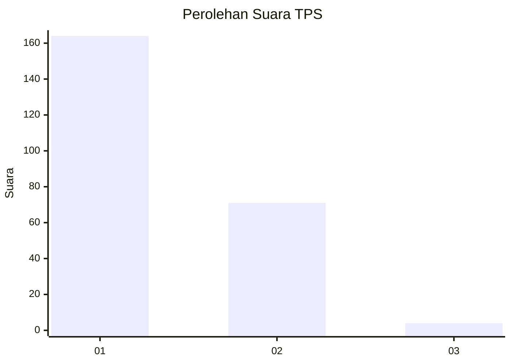
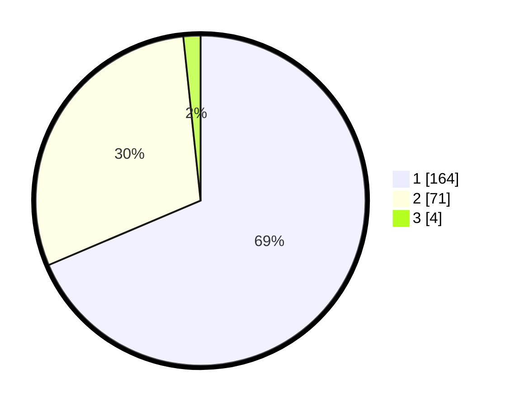

# Hasil

## Grafik

## Tabel

| No. | Nama Paslon    | Suara | Suara (raw) | Persentase |
|:--- |:-------------- | -----:| -----------:| ----------:|
| 1   | ANIES MUHAIMIN | 164   | [164][p-1]  | 68,62      |
| 2   | PRABOWO GIBRAN | 71    | [71][p-2]   | 29,71      |
| 3   | GANJAR MAHFUD  | 4     | [4][p-3]    | 1,67       |

[p-1]: https://github.com/gigit-pemilu/pemilu-2024-35-jawa-timur/blob/main/pilpres/hitung-suara/sub/35-jawa-timur/sub/28-pamekasan/sub/04-pamekasan/sub/1012-jungcangcang/sub/017-tps/sub/paslon-1.txt
[p-2]: https://github.com/gigit-pemilu/pemilu-2024-35-jawa-timur/blob/main/pilpres/hitung-suara/sub/35-jawa-timur/sub/28-pamekasan/sub/04-pamekasan/sub/1012-jungcangcang/sub/017-tps/sub/paslon-2.txt
[p-3]: https://github.com/gigit-pemilu/pemilu-2024-35-jawa-timur/blob/main/pilpres/hitung-suara/sub/35-jawa-timur/sub/28-pamekasan/sub/04-pamekasan/sub/1012-jungcangcang/sub/017-tps/sub/paslon-3.txt

## Foto C Plano

https://sirekap-obj-formc.kpu.go.id/b0e0/pemilu/ppwp/35/28/04/10/12/3528041012017-20240215-023838--da9d77b8-5e92-44cc-8f34-9eb45ccfcebf.jpg

https://sirekap-obj-formc.kpu.go.id/b0e0/pemilu/ppwp/35/28/04/10/12/3528041012017-20240215-023950--075d5d19-de3a-445b-9dee-202d83afd2aa.jpg

https://sirekap-obj-formc.kpu.go.id/b0e0/pemilu/ppwp/35/28/04/10/12/3528041012017-20240215-025320--803c6d37-2f32-484b-9dbe-1d6295d9c43c.jpg

## Metadata

| Key        | Value               |
| ---------- | ------------------- |
| Time Stamp | 2024-02-24 22:31:28 |

