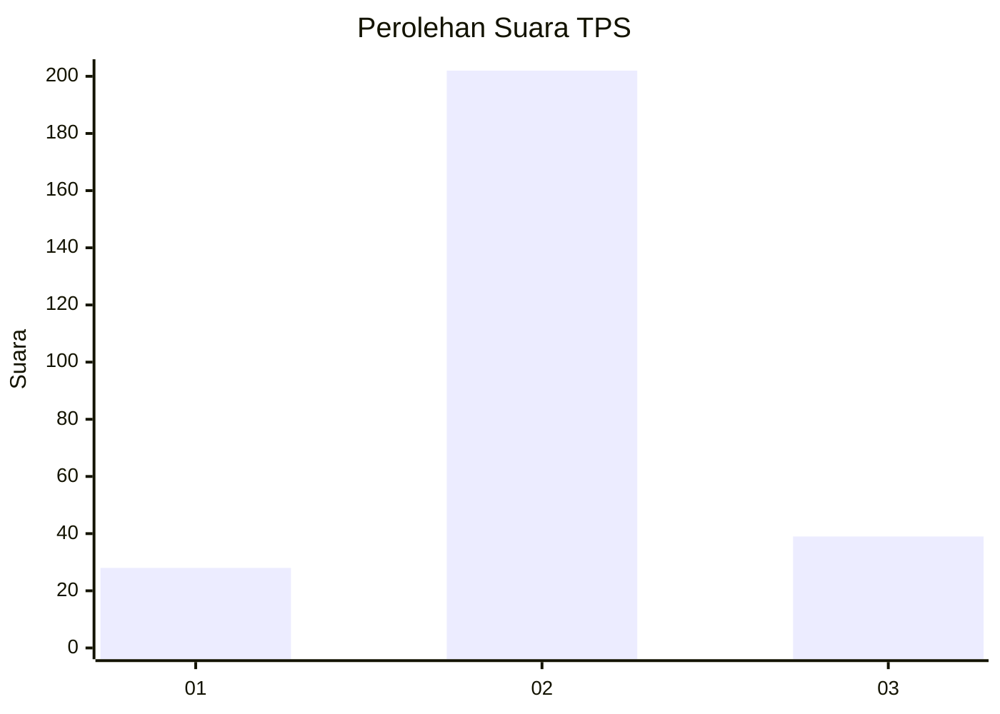

# Hasil

## Grafik

## Tabel

| No. | Nama Paslon    | Suara | Suara (raw) | Persentase |
|:--- |:-------------- | -----:| -----------:| ----------:|
| 1   | ANIES MUHAIMIN | 28    | [28][p-1]   | 10,41      |
| 2   | PRABOWO GIBRAN | 202   | [202][p-2]  | 75,09      |
| 3   | GANJAR MAHFUD  | 39    | [39][p-3]   | 14,50      |

[p-1]: https://github.com/gigit-pemilu/pemilu-2024-35-jawa-timur/blob/main/pilpres/hitung-suara/sub/35-jawa-timur/sub/28-pamekasan/sub/04-pamekasan/sub/1012-jungcangcang/sub/901-tps/sub/paslon-1.txt
[p-2]: https://github.com/gigit-pemilu/pemilu-2024-35-jawa-timur/blob/main/pilpres/hitung-suara/sub/35-jawa-timur/sub/28-pamekasan/sub/04-pamekasan/sub/1012-jungcangcang/sub/901-tps/sub/paslon-2.txt
[p-3]: https://github.com/gigit-pemilu/pemilu-2024-35-jawa-timur/blob/main/pilpres/hitung-suara/sub/35-jawa-timur/sub/28-pamekasan/sub/04-pamekasan/sub/1012-jungcangcang/sub/901-tps/sub/paslon-3.txt

## Foto C Plano

https://sirekap-obj-formc.kpu.go.id/51db/pemilu/ppwp/35/28/04/10/12/3528041012901-20240215-011951--534847bf-ffc7-4ffc-9350-29595f48cef7.jpg

https://sirekap-obj-formc.kpu.go.id/51db/pemilu/ppwp/35/28/04/10/12/3528041012901-20240215-012113--bad91493-696a-4bb4-8a3a-0bd3c25b9d8b.jpg

https://sirekap-obj-formc.kpu.go.id/51db/pemilu/ppwp/35/28/04/10/12/3528041012901-20240215-012209--c894ac00-6b45-4a82-958f-99fcc5babcf8.jpg

## Metadata

| Key        | Value               |
| ---------- | ------------------- |
| Time Stamp | 2024-02-24 22:31:28 |

