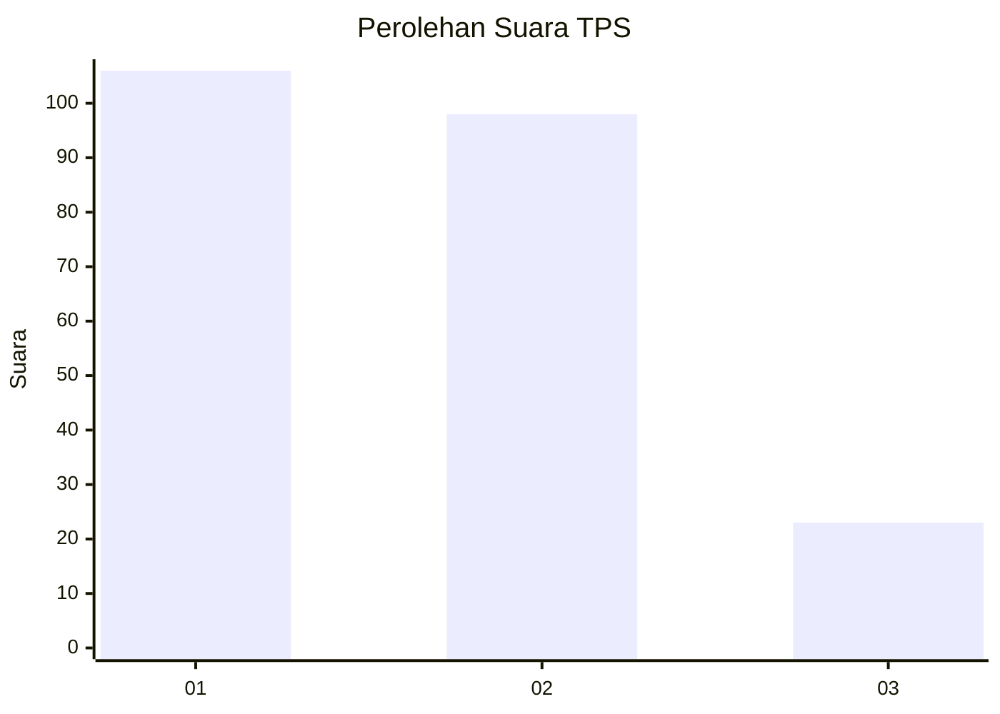
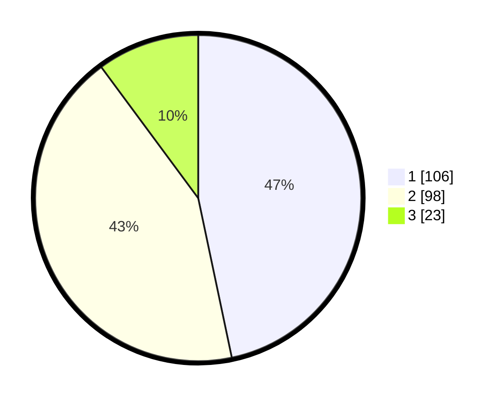

# Hasil

## Grafik

## Tabel

| No. | Nama Paslon    | Suara | Suara (raw) | Persentase |
|:--- |:-------------- | -----:| -----------:| ----------:|
| 1   | ANIES MUHAIMIN | 106   | [106][p-1]  | 46,70      |
| 2   | PRABOWO GIBRAN | 98    | [98][p-2]   | 43,17      |
| 3   | GANJAR MAHFUD  | 23    | [23][p-3]   | 10,13      |

[p-1]: https://github.com/gigit-pemilu/pemilu-2024/blob/main/pilpres/hitung-suara/sub/35-jawa-timur/sub/28-pamekasan/sub/04-pamekasan/sub/1015-gladak-anyar/sub/010-tps/sub/paslon-1.txt
[p-2]: https://github.com/gigit-pemilu/pemilu-2024/blob/main/pilpres/hitung-suara/sub/35-jawa-timur/sub/28-pamekasan/sub/04-pamekasan/sub/1015-gladak-anyar/sub/010-tps/sub/paslon-2.txt
[p-3]: https://github.com/gigit-pemilu/pemilu-2024/blob/main/pilpres/hitung-suara/sub/35-jawa-timur/sub/28-pamekasan/sub/04-pamekasan/sub/1015-gladak-anyar/sub/010-tps/sub/paslon-3.txt

## Foto C Plano

https://sirekap-obj-formc.kpu.go.id/2173/pemilu/ppwp/35/28/04/10/15/3528041015010-20240215-003350--80ab17ca-75da-43e1-87a5-6babe2368a9f.jpg

https://sirekap-obj-formc.kpu.go.id/2173/pemilu/ppwp/35/28/04/10/15/3528041015010-20240215-003442--d7387439-27c2-4268-b05a-f9dbea8e7572.jpg

https://sirekap-obj-formc.kpu.go.id/2173/pemilu/ppwp/35/28/04/10/15/3528041015010-20240215-003555--c75ad394-a120-4040-96ad-b65c2d67b233.jpg

## Metadata

| Key        | Value               |
| ---------- | ------------------- |
| Time Stamp | 2024-02-15 17:30:25 |

