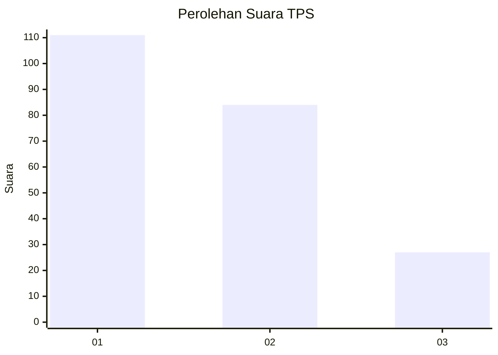
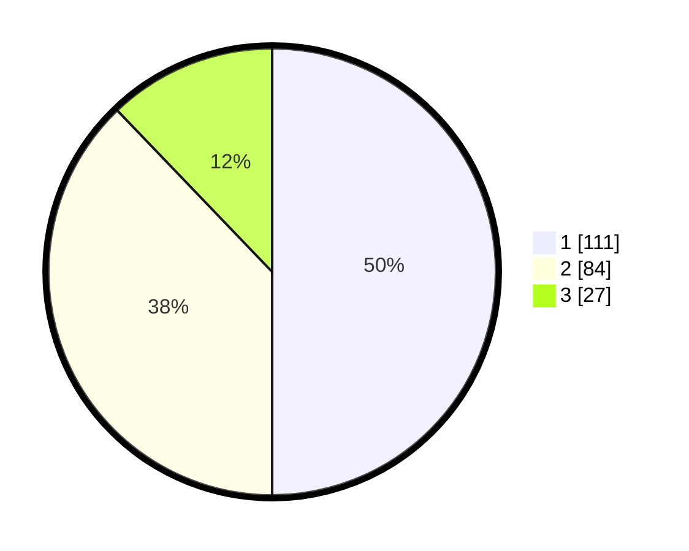

# Hasil

## Grafik

## Tabel

| No. | Nama Paslon    | Suara | Suara (raw) | Persentase |
|:--- |:-------------- | -----:| -----------:| ----------:|
| 1   | ANIES MUHAIMIN | 111   | [111][p-1]  | 50,00      |
| 2   | PRABOWO GIBRAN | 84    | [84][p-2]   | 37,84      |
| 3   | GANJAR MAHFUD  | 27    | [27][p-3]   | 12,16      |

[p-1]: https://github.com/gigit-pemilu/pemilu-2024/blob/main/pilpres/hitung-suara/sub/35-jawa-timur/sub/28-pamekasan/sub/04-pamekasan/sub/1015-gladak-anyar/sub/021-tps/sub/paslon-1.txt
[p-2]: https://github.com/gigit-pemilu/pemilu-2024/blob/main/pilpres/hitung-suara/sub/35-jawa-timur/sub/28-pamekasan/sub/04-pamekasan/sub/1015-gladak-anyar/sub/021-tps/sub/paslon-2.txt
[p-3]: https://github.com/gigit-pemilu/pemilu-2024/blob/main/pilpres/hitung-suara/sub/35-jawa-timur/sub/28-pamekasan/sub/04-pamekasan/sub/1015-gladak-anyar/sub/021-tps/sub/paslon-3.txt

## Foto C Plano

https://sirekap-obj-formc.kpu.go.id/245e/pemilu/ppwp/35/28/04/10/15/3528041015021-20240214-191135--504c8076-48b3-4e45-bbaa-bb4f17c33da8.jpg

https://sirekap-obj-formc.kpu.go.id/245e/pemilu/ppwp/35/28/04/10/15/3528041015021-20240214-160113--b2d416ca-81da-43d0-96e1-5fc8079f679c.jpg

https://sirekap-obj-formc.kpu.go.id/245e/pemilu/ppwp/35/28/04/10/15/3528041015021-20240214-202607--d5b081e3-ad6a-46c5-8ff4-29a71930bfff.jpg

## Metadata

| Key        | Value               |
| ---------- | ------------------- |
| Time Stamp | 2024-02-15 19:00:26 |

