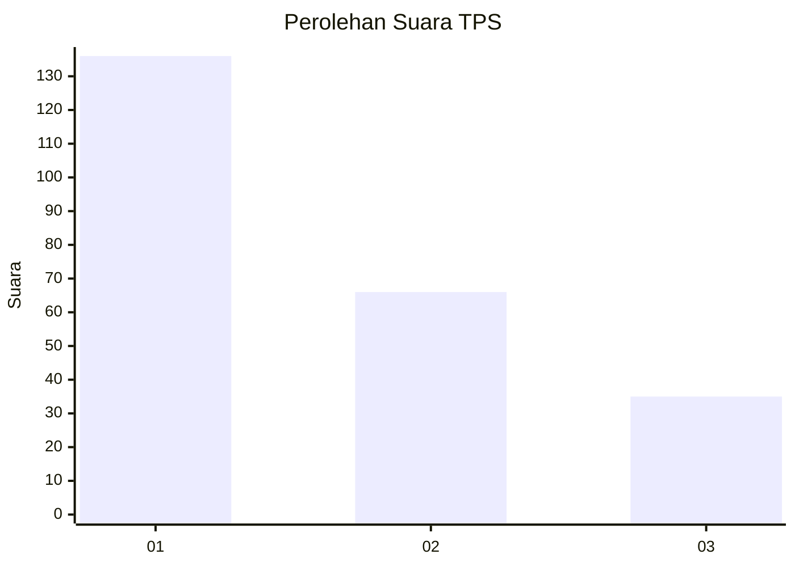
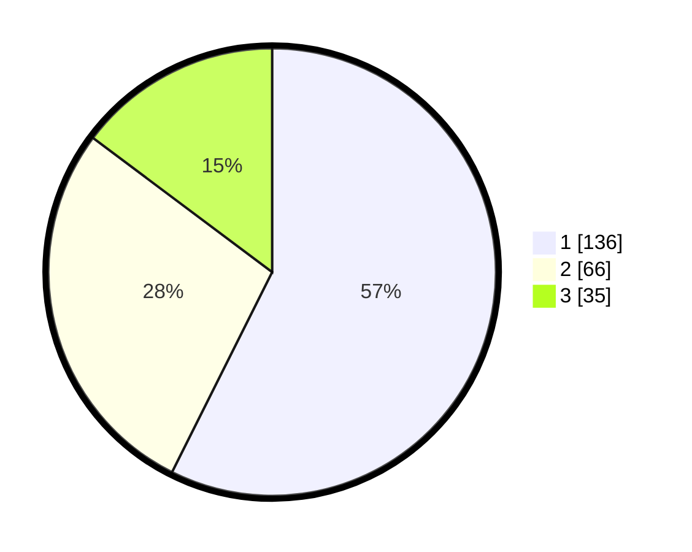

# Hasil

## Grafik

## Tabel

| No. | Nama Paslon    | Suara | Suara (raw) | Persentase |
|:--- |:-------------- | -----:| -----------:| ----------:|
| 1   | ANIES MUHAIMIN | 136   | [136][p-1]  | 57,38      |
| 2   | PRABOWO GIBRAN | 66    | [66][p-2]   | 27,85      |
| 3   | GANJAR MAHFUD  | 35    | [35][p-3]   | 14,77      |

[p-1]: https://github.com/gigit-pemilu/pemilu-2024-35-jawa-timur/blob/main/pilpres/hitung-suara/sub/35-jawa-timur/sub/28-pamekasan/sub/04-pamekasan/sub/1015-gladak-anyar/sub/029-tps/sub/paslon-1.txt
[p-2]: https://github.com/gigit-pemilu/pemilu-2024-35-jawa-timur/blob/main/pilpres/hitung-suara/sub/35-jawa-timur/sub/28-pamekasan/sub/04-pamekasan/sub/1015-gladak-anyar/sub/029-tps/sub/paslon-2.txt
[p-3]: https://github.com/gigit-pemilu/pemilu-2024-35-jawa-timur/blob/main/pilpres/hitung-suara/sub/35-jawa-timur/sub/28-pamekasan/sub/04-pamekasan/sub/1015-gladak-anyar/sub/029-tps/sub/paslon-3.txt

## Foto C Plano

https://sirekap-obj-formc.kpu.go.id/b060/pemilu/ppwp/35/28/04/10/15/3528041015029-20240214-224456--a28db58b-be42-497e-81af-fcad07e6863b.jpg

https://sirekap-obj-formc.kpu.go.id/b060/pemilu/ppwp/35/28/04/10/15/3528041015029-20240214-224609--e16a34ed-9311-4c34-834e-8ea57021c908.jpg

https://sirekap-obj-formc.kpu.go.id/b060/pemilu/ppwp/35/28/04/10/15/3528041015029-20240214-224646--2f6c1c4c-e27b-4f4f-8162-697740220039.jpg

## Metadata

| Key        | Value               |
| ---------- | ------------------- |
| Time Stamp | 2024-02-24 22:31:28 |

