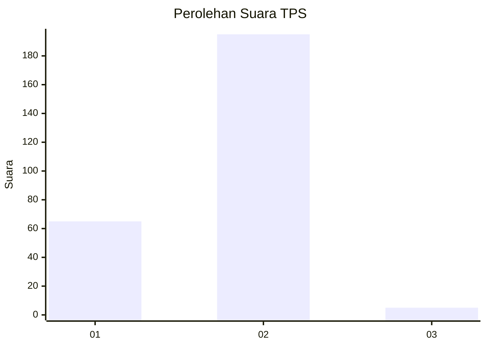
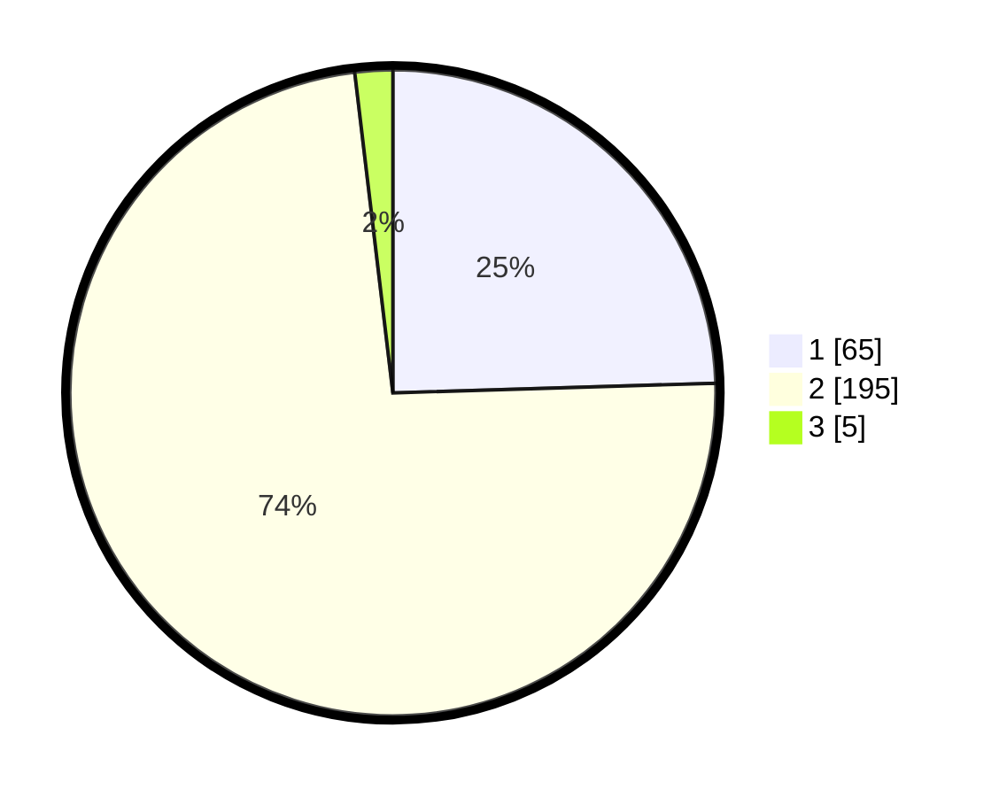

# Hasil

## Grafik

## Tabel

| No. | Nama Paslon    | Suara | Suara (raw) | Persentase |
|:--- |:-------------- | -----:| -----------:| ----------:|
| 1   | ANIES MUHAIMIN | 65    | [65][p-1]   | 24,53      |
| 2   | PRABOWO GIBRAN | 195   | [195][p-2]  | 73,58      |
| 3   | GANJAR MAHFUD  | 5     | [5][p-3]    | 1,89       |

[p-1]: https://github.com/gigit-pemilu/pemilu-2024/blob/main/pilpres/hitung-suara/sub/35-jawa-timur/sub/28-pamekasan/sub/04-pamekasan/sub/1016-kolpajung/sub/005-tps/sub/paslon-1.txt
[p-2]: https://github.com/gigit-pemilu/pemilu-2024/blob/main/pilpres/hitung-suara/sub/35-jawa-timur/sub/28-pamekasan/sub/04-pamekasan/sub/1016-kolpajung/sub/005-tps/sub/paslon-2.txt
[p-3]: https://github.com/gigit-pemilu/pemilu-2024/blob/main/pilpres/hitung-suara/sub/35-jawa-timur/sub/28-pamekasan/sub/04-pamekasan/sub/1016-kolpajung/sub/005-tps/sub/paslon-3.txt

## Foto C Plano

https://sirekap-obj-formc.kpu.go.id/c45a/pemilu/ppwp/35/28/04/10/16/3528041016005-20240215-124737--fcc4b1ba-244a-4e7d-911d-67af3ae772b5.jpg

https://sirekap-obj-formc.kpu.go.id/c45a/pemilu/ppwp/35/28/04/10/16/3528041016005-20240215-124948--3f1868bc-0e83-452f-a97a-eb6ab52207cb.jpg

https://sirekap-obj-formc.kpu.go.id/c45a/pemilu/ppwp/35/28/04/10/16/3528041016005-20240215-125053--61fc683b-78ea-4268-9fa5-aa9df5faac63.jpg

## Metadata

| Key        | Value               |
| ---------- | ------------------- |
| Time Stamp | 2024-02-25 15:00:00 |

