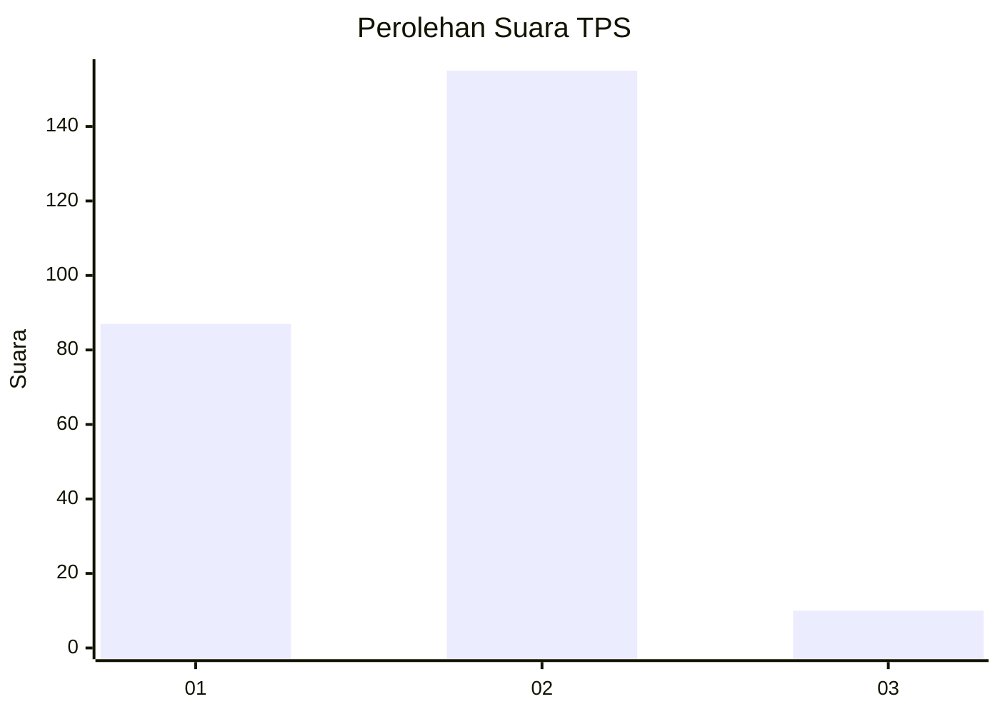
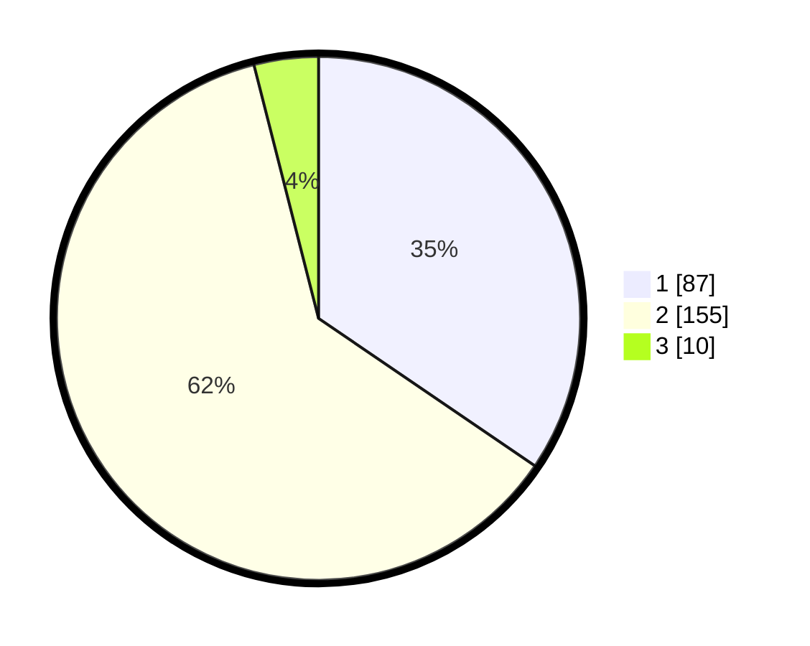

# Hasil

## Grafik

## Tabel

| No. | Nama Paslon    | Suara | Suara (raw) | Persentase |
|:--- |:-------------- | -----:| -----------:| ----------:|
| 1   | ANIES MUHAIMIN | 87    | [87][p-1]   | 34,52      |
| 2   | PRABOWO GIBRAN | 155   | [155][p-2]  | 61,51      |
| 3   | GANJAR MAHFUD  | 10    | [10][p-3]   | 3,97       |

[p-1]: https://github.com/gigit-pemilu/pemilu-2024-35-jawa-timur/blob/main/pilpres/hitung-suara/sub/35-jawa-timur/sub/28-pamekasan/sub/04-pamekasan/sub/1016-kolpajung/sub/006-tps/sub/paslon-1.txt
[p-2]: https://github.com/gigit-pemilu/pemilu-2024-35-jawa-timur/blob/main/pilpres/hitung-suara/sub/35-jawa-timur/sub/28-pamekasan/sub/04-pamekasan/sub/1016-kolpajung/sub/006-tps/sub/paslon-2.txt
[p-3]: https://github.com/gigit-pemilu/pemilu-2024-35-jawa-timur/blob/main/pilpres/hitung-suara/sub/35-jawa-timur/sub/28-pamekasan/sub/04-pamekasan/sub/1016-kolpajung/sub/006-tps/sub/paslon-3.txt

## Foto C Plano

https://sirekap-obj-formc.kpu.go.id/5e50/pemilu/ppwp/35/28/04/10/16/3528041016006-20240215-012234--c0821106-8467-454b-9a36-08ee32bd7b23.jpg

https://sirekap-obj-formc.kpu.go.id/5e50/pemilu/ppwp/35/28/04/10/16/3528041016006-20240215-012328--78a98d89-f39d-4667-9a96-998cc39fe2c3.jpg

https://sirekap-obj-formc.kpu.go.id/5e50/pemilu/ppwp/35/28/04/10/16/3528041016006-20240214-225536--8e7d5d0d-cf04-4ac1-89db-ba2782ddf2eb.jpg

## Metadata

| Key        | Value               |
| ---------- | ------------------- |
| Time Stamp | 2024-02-15 17:30:25 |

