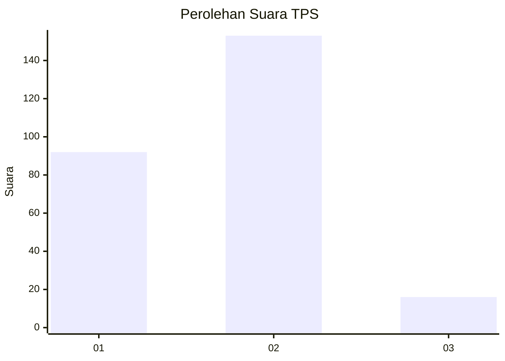
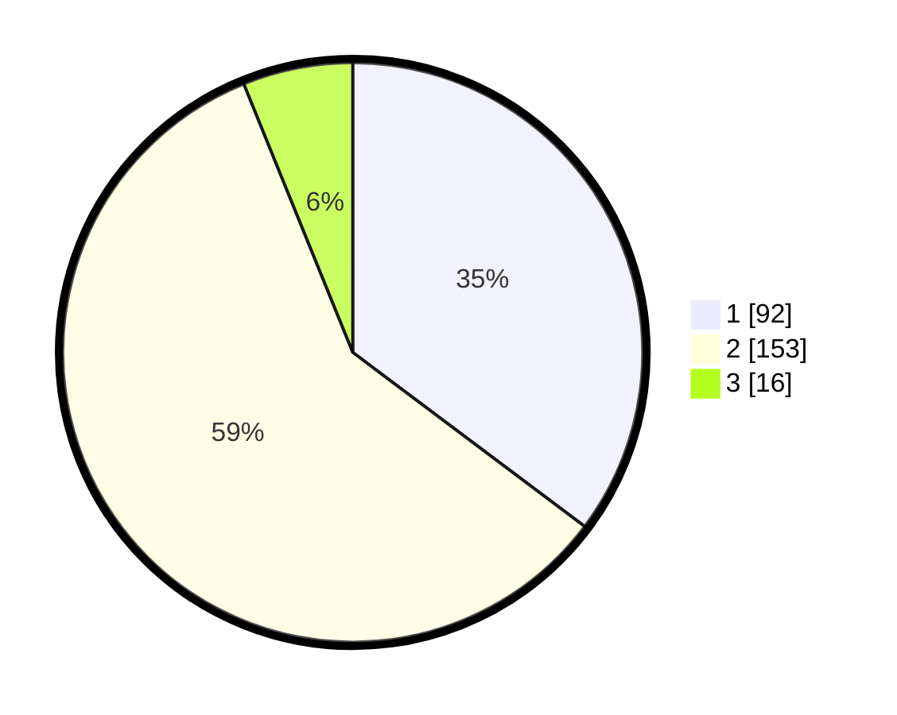

# Hasil

## Grafik

## Tabel

| No. | Nama Paslon    | Suara | Suara (raw) | Persentase |
|:--- |:-------------- | -----:| -----------:| ----------:|
| 1   | ANIES MUHAIMIN | 92    | [92][p-1]   | 35,25      |
| 2   | PRABOWO GIBRAN | 153   | [153][p-2]  | 58,62      |
| 3   | GANJAR MAHFUD  | 16    | [16][p-3]   | 6,13       |

[p-1]: https://github.com/gigit-pemilu/pemilu-2024-35-jawa-timur/blob/main/pilpres/hitung-suara/sub/35-jawa-timur/sub/28-pamekasan/sub/04-pamekasan/sub/1016-kolpajung/sub/008-tps/sub/paslon-1.txt
[p-2]: https://github.com/gigit-pemilu/pemilu-2024-35-jawa-timur/blob/main/pilpres/hitung-suara/sub/35-jawa-timur/sub/28-pamekasan/sub/04-pamekasan/sub/1016-kolpajung/sub/008-tps/sub/paslon-2.txt
[p-3]: https://github.com/gigit-pemilu/pemilu-2024-35-jawa-timur/blob/main/pilpres/hitung-suara/sub/35-jawa-timur/sub/28-pamekasan/sub/04-pamekasan/sub/1016-kolpajung/sub/008-tps/sub/paslon-3.txt

## Foto C Plano

https://sirekap-obj-formc.kpu.go.id/c10a/pemilu/ppwp/35/28/04/10/16/3528041016008-20240215-045257--846ee663-c409-4a5a-b5d9-fac33543e7de.jpg

https://sirekap-obj-formc.kpu.go.id/c10a/pemilu/ppwp/35/28/04/10/16/3528041016008-20240215-045459--3e00de11-4cc6-463f-b7cf-d72e69abe5f9.jpg

https://sirekap-obj-formc.kpu.go.id/c10a/pemilu/ppwp/35/28/04/10/16/3528041016008-20240215-045352--0fe23cde-4ae4-44b6-9231-867cb211439c.jpg

## Metadata

| Key        | Value               |
| ---------- | ------------------- |
| Time Stamp | 2024-02-25 21:00:00 |

