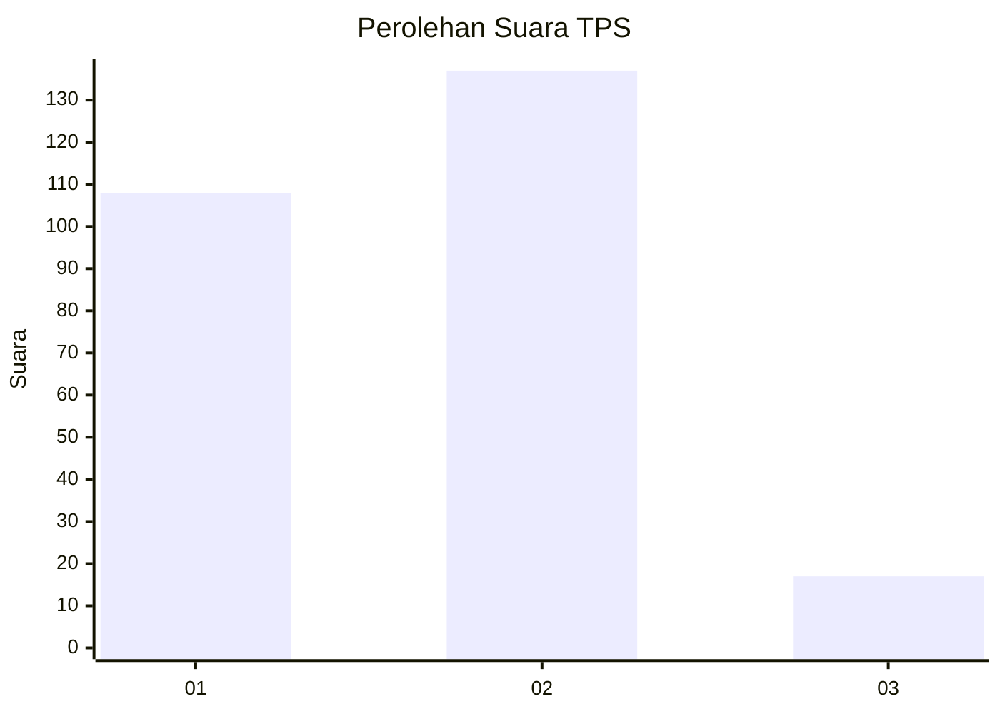

# Hasil

## Grafik

## Tabel

| No. | Nama Paslon    | Suara | Suara (raw) | Persentase |
|:--- |:-------------- | -----:| -----------:| ----------:|
| 1   | ANIES MUHAIMIN | 108   | [108][p-1]  | 41,22      |
| 2   | PRABOWO GIBRAN | 137   | [137][p-2]  | 52,29      |
| 3   | GANJAR MAHFUD  | 17    | [17][p-3]   | 6,49       |

[p-1]: https://github.com/gigit-pemilu/pemilu-2024/blob/main/pilpres/hitung-suara/sub/35-jawa-timur/sub/28-pamekasan/sub/04-pamekasan/sub/1016-kolpajung/sub/009-tps/sub/paslon-1.txt
[p-2]: https://github.com/gigit-pemilu/pemilu-2024/blob/main/pilpres/hitung-suara/sub/35-jawa-timur/sub/28-pamekasan/sub/04-pamekasan/sub/1016-kolpajung/sub/009-tps/sub/paslon-2.txt
[p-3]: https://github.com/gigit-pemilu/pemilu-2024/blob/main/pilpres/hitung-suara/sub/35-jawa-timur/sub/28-pamekasan/sub/04-pamekasan/sub/1016-kolpajung/sub/009-tps/sub/paslon-3.txt

## Foto C Plano

https://sirekap-obj-formc.kpu.go.id/8f8e/pemilu/ppwp/35/28/04/10/16/3528041016009-20240214-234127--0ebfd1dd-5b20-455d-8c02-44d7cd67110e.jpg

https://sirekap-obj-formc.kpu.go.id/8f8e/pemilu/ppwp/35/28/04/10/16/3528041016009-20240217-191224--e416e211-b1a0-4c39-97d0-02f6c84337de.jpg

https://sirekap-obj-formc.kpu.go.id/8f8e/pemilu/ppwp/35/28/04/10/16/3528041016009-20240215-062712--cd902a27-5553-4fea-af69-7d1e036fce6b.jpg

## Metadata

| Key        | Value               |
| ---------- | ------------------- |
| Time Stamp | 2024-02-25 15:00:00 |

