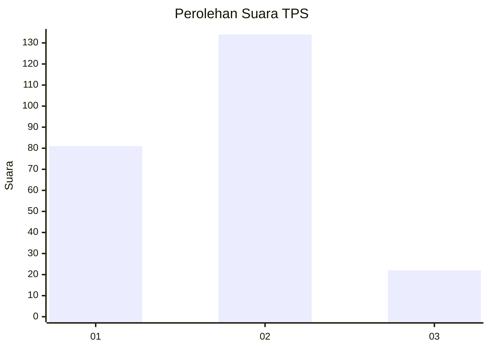
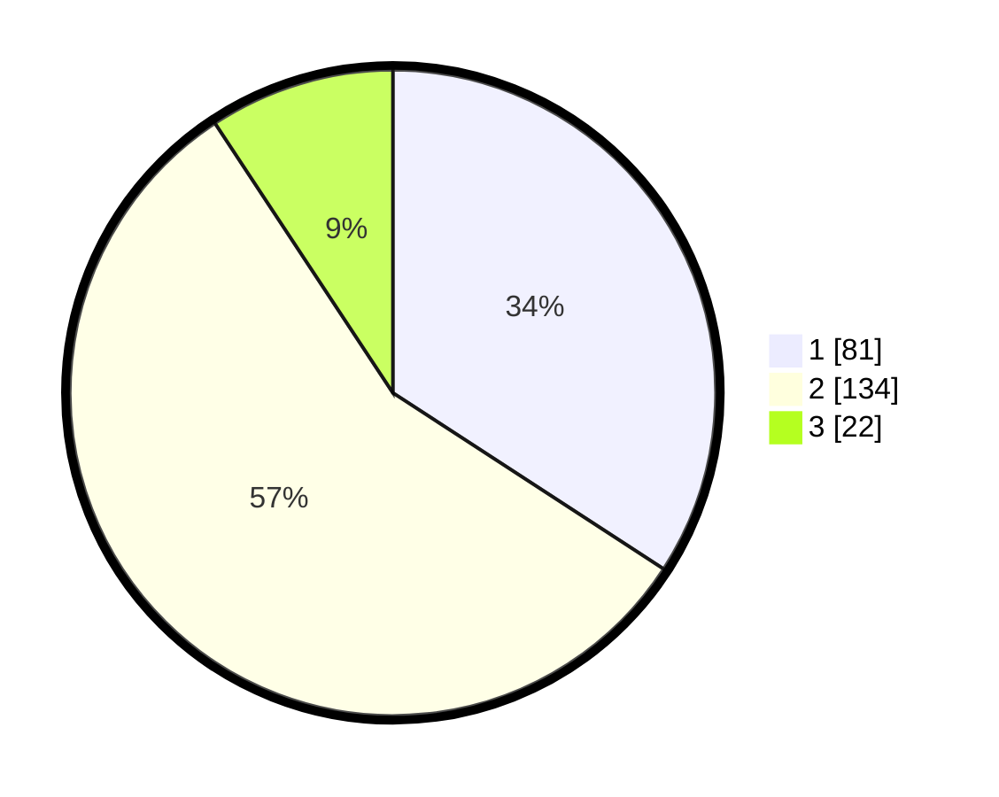

# Hasil

## Grafik

## Tabel

| No. | Nama Paslon    | Suara | Suara (raw) | Persentase |
|:--- |:-------------- | -----:| -----------:| ----------:|
| 1   | ANIES MUHAIMIN | 81    | [81][p-1]   | 34,18      |
| 2   | PRABOWO GIBRAN | 134   | [134][p-2]  | 56,54      |
| 3   | GANJAR MAHFUD  | 22    | [22][p-3]   | 9,28       |

[p-1]: https://github.com/gigit-pemilu/pemilu-2024/blob/main/pilpres/hitung-suara/sub/35-jawa-timur/sub/28-pamekasan/sub/04-pamekasan/sub/1016-kolpajung/sub/011-tps/sub/paslon-1.txt
[p-2]: https://github.com/gigit-pemilu/pemilu-2024/blob/main/pilpres/hitung-suara/sub/35-jawa-timur/sub/28-pamekasan/sub/04-pamekasan/sub/1016-kolpajung/sub/011-tps/sub/paslon-2.txt
[p-3]: https://github.com/gigit-pemilu/pemilu-2024/blob/main/pilpres/hitung-suara/sub/35-jawa-timur/sub/28-pamekasan/sub/04-pamekasan/sub/1016-kolpajung/sub/011-tps/sub/paslon-3.txt

## Foto C Plano

https://sirekap-obj-formc.kpu.go.id/5459/pemilu/ppwp/35/28/04/10/16/3528041016011-20240214-211559--3ce80291-7e16-4bf8-bd30-4584e1c263dd.jpg

https://sirekap-obj-formc.kpu.go.id/5459/pemilu/ppwp/35/28/04/10/16/3528041016011-20240214-212036--71d5e74a-3599-48af-a062-05d240795cde.jpg

https://sirekap-obj-formc.kpu.go.id/5459/pemilu/ppwp/35/28/04/10/16/3528041016011-20240214-212205--a89ed167-37c2-4d93-ac21-9466be2e26a9.jpg

## Metadata

| Key        | Value               |
| ---------- | ------------------- |
| Time Stamp | 2024-02-15 17:30:25 |

