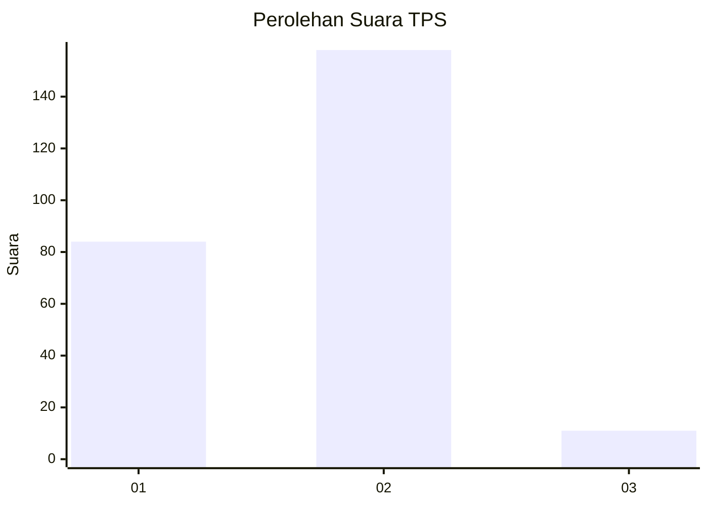
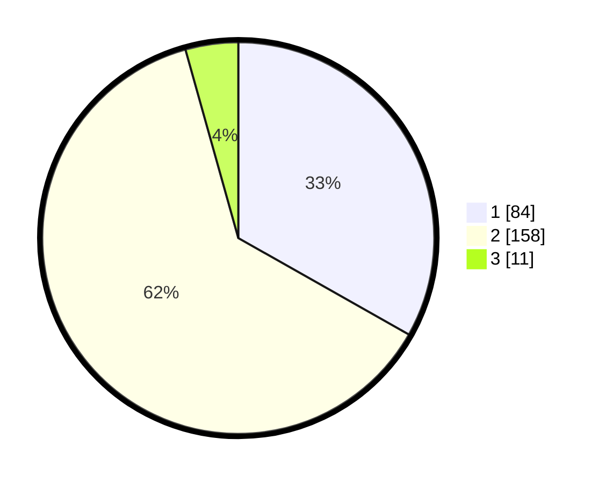

# Hasil

## Grafik

## Tabel

| No. | Nama Paslon    | Suara | Suara (raw) | Persentase |
|:--- |:-------------- | -----:| -----------:| ----------:|
| 1   | ANIES MUHAIMIN | 84    | [84][p-1]   | 33,20      |
| 2   | PRABOWO GIBRAN | 158   | [158][p-2]  | 62,45      |
| 3   | GANJAR MAHFUD  | 11    | [11][p-3]   | 4,35       |

[p-1]: https://github.com/gigit-pemilu/pemilu-2024-35-jawa-timur/blob/main/pilpres/hitung-suara/sub/35-jawa-timur/sub/28-pamekasan/sub/04-pamekasan/sub/1016-kolpajung/sub/012-tps/sub/paslon-1.txt
[p-2]: https://github.com/gigit-pemilu/pemilu-2024-35-jawa-timur/blob/main/pilpres/hitung-suara/sub/35-jawa-timur/sub/28-pamekasan/sub/04-pamekasan/sub/1016-kolpajung/sub/012-tps/sub/paslon-2.txt
[p-3]: https://github.com/gigit-pemilu/pemilu-2024-35-jawa-timur/blob/main/pilpres/hitung-suara/sub/35-jawa-timur/sub/28-pamekasan/sub/04-pamekasan/sub/1016-kolpajung/sub/012-tps/sub/paslon-3.txt

## Foto C Plano

https://sirekap-obj-formc.kpu.go.id/3657/pemilu/ppwp/35/28/04/10/16/3528041016012-20240215-002529--50aeaeb4-28f3-43e8-8448-b29d6de89da8.jpg

https://sirekap-obj-formc.kpu.go.id/3657/pemilu/ppwp/35/28/04/10/16/3528041016012-20240215-002537--f52a15db-e409-4cee-94e1-ca6cf2680f14.jpg

https://sirekap-obj-formc.kpu.go.id/3657/pemilu/ppwp/35/28/04/10/16/3528041016012-20240215-002547--513d0b0f-0c77-49f4-8e35-23d8cd66954d.jpg

## Metadata

| Key        | Value               |
| ---------- | ------------------- |
| Time Stamp | 2024-02-15 21:30:27 |

