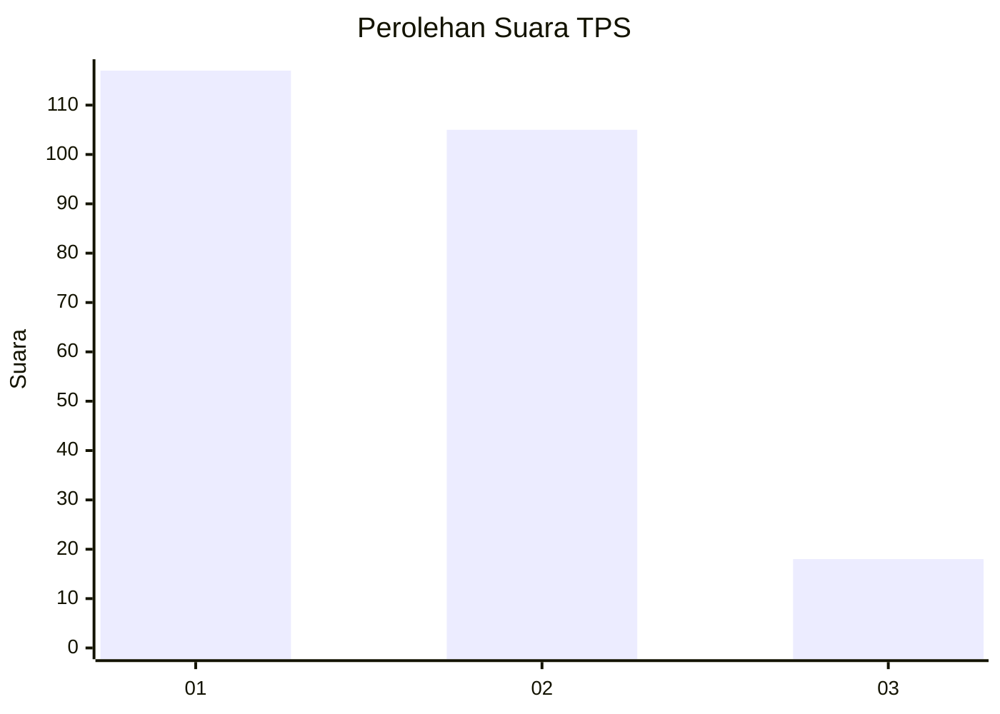
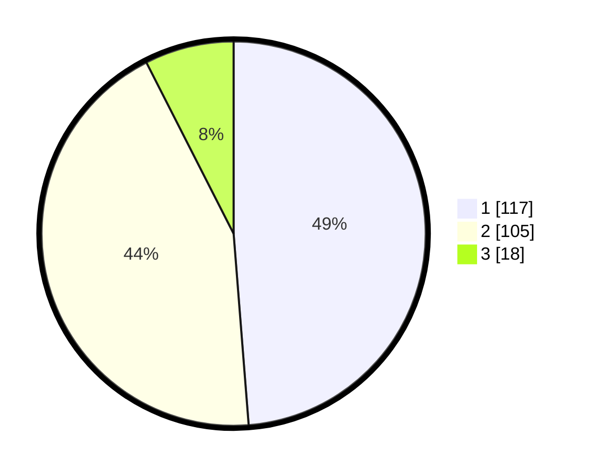

# Hasil

## Grafik

## Tabel

| No. | Nama Paslon    | Suara | Suara (raw) | Persentase |
|:--- |:-------------- | -----:| -----------:| ----------:|
| 1   | ANIES MUHAIMIN | 117   | [117][p-1]  | 48,75      |
| 2   | PRABOWO GIBRAN | 105   | [105][p-2]  | 43,75      |
| 3   | GANJAR MAHFUD  | 18    | [18][p-3]   | 7,50       |

[p-1]: https://github.com/gigit-pemilu/pemilu-2024/blob/main/pilpres/hitung-suara/sub/35-jawa-timur/sub/28-pamekasan/sub/04-pamekasan/sub/1017-kowel/sub/004-tps/sub/paslon-1.txt
[p-2]: https://github.com/gigit-pemilu/pemilu-2024/blob/main/pilpres/hitung-suara/sub/35-jawa-timur/sub/28-pamekasan/sub/04-pamekasan/sub/1017-kowel/sub/004-tps/sub/paslon-2.txt
[p-3]: https://github.com/gigit-pemilu/pemilu-2024/blob/main/pilpres/hitung-suara/sub/35-jawa-timur/sub/28-pamekasan/sub/04-pamekasan/sub/1017-kowel/sub/004-tps/sub/paslon-3.txt

## Foto C Plano

https://sirekap-obj-formc.kpu.go.id/ce69/pemilu/ppwp/35/28/04/10/17/3528041017004-20240215-084859--25d607d2-0713-409e-93da-52a4d0a16b5f.jpg

https://sirekap-obj-formc.kpu.go.id/ce69/pemilu/ppwp/35/28/04/10/17/3528041017004-20240215-000333--20fcc4ff-dfe7-4b48-8d02-e15eacad60dd.jpg

https://sirekap-obj-formc.kpu.go.id/ce69/pemilu/ppwp/35/28/04/10/17/3528041017004-20240215-000419--d0ce545b-2172-49ec-8836-2a0397b3ccdd.jpg

## Metadata

| Key        | Value               |
| ---------- | ------------------- |
| Time Stamp | 2024-02-15 18:00:26 |

