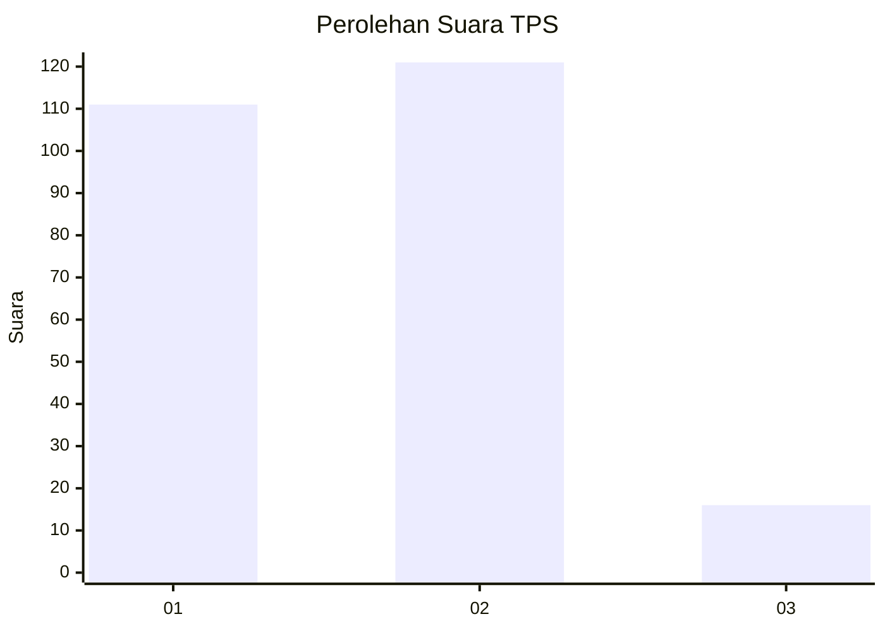
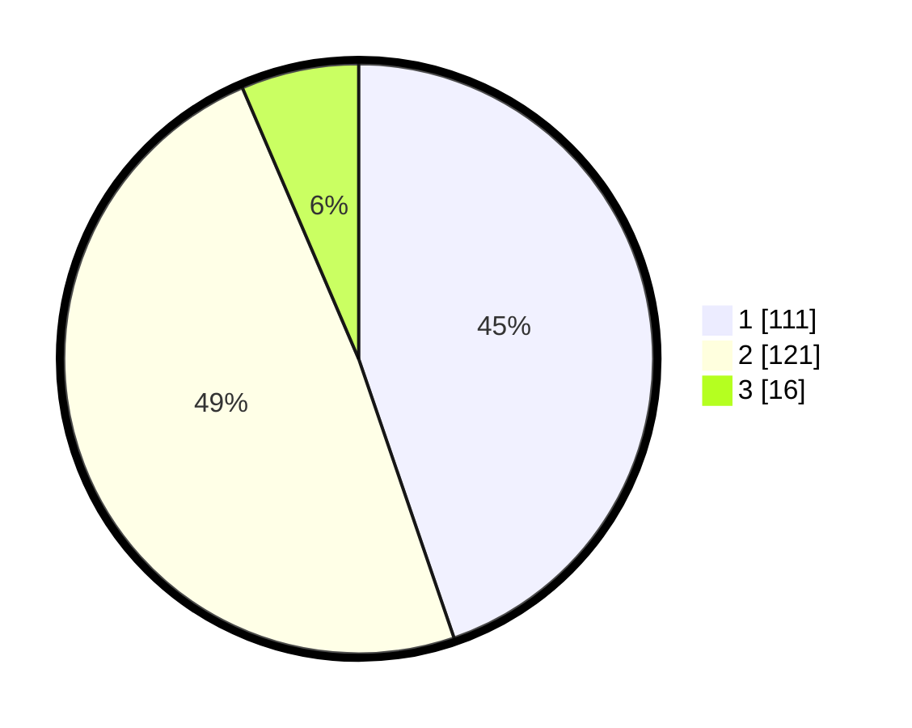

# Hasil

## Grafik

## Tabel

| No. | Nama Paslon    | Suara | Suara (raw) | Persentase |
|:--- |:-------------- | -----:| -----------:| ----------:|
| 1   | ANIES MUHAIMIN | 111   | [111][p-1]  | 44,76      |
| 2   | PRABOWO GIBRAN | 121   | [121][p-2]  | 48,79      |
| 3   | GANJAR MAHFUD  | 16    | [16][p-3]   | 6,45       |

[p-1]: https://github.com/gigit-pemilu/pemilu-2024-35-jawa-timur/blob/main/pilpres/hitung-suara/sub/35-jawa-timur/sub/28-pamekasan/sub/04-pamekasan/sub/1017-kowel/sub/012-tps/sub/paslon-1.txt
[p-2]: https://github.com/gigit-pemilu/pemilu-2024-35-jawa-timur/blob/main/pilpres/hitung-suara/sub/35-jawa-timur/sub/28-pamekasan/sub/04-pamekasan/sub/1017-kowel/sub/012-tps/sub/paslon-2.txt
[p-3]: https://github.com/gigit-pemilu/pemilu-2024-35-jawa-timur/blob/main/pilpres/hitung-suara/sub/35-jawa-timur/sub/28-pamekasan/sub/04-pamekasan/sub/1017-kowel/sub/012-tps/sub/paslon-3.txt

## Foto C Plano

https://sirekap-obj-formc.kpu.go.id/dc0a/pemilu/ppwp/35/28/04/10/17/3528041017012-20240215-081727--8f932581-b994-42e9-a99d-62cf7226c510.jpg

https://sirekap-obj-formc.kpu.go.id/dc0a/pemilu/ppwp/35/28/04/10/17/3528041017012-20240215-081900--fbb425a3-da9d-4d9f-94ab-f9a68a83d061.jpg

https://sirekap-obj-formc.kpu.go.id/dc0a/pemilu/ppwp/35/28/04/10/17/3528041017012-20240215-082141--247f1680-b3d8-4f87-922a-ad02b906979b.jpg

## Metadata

| Key        | Value               |
| ---------- | ------------------- |
| Time Stamp | 2024-02-15 18:00:26 |

