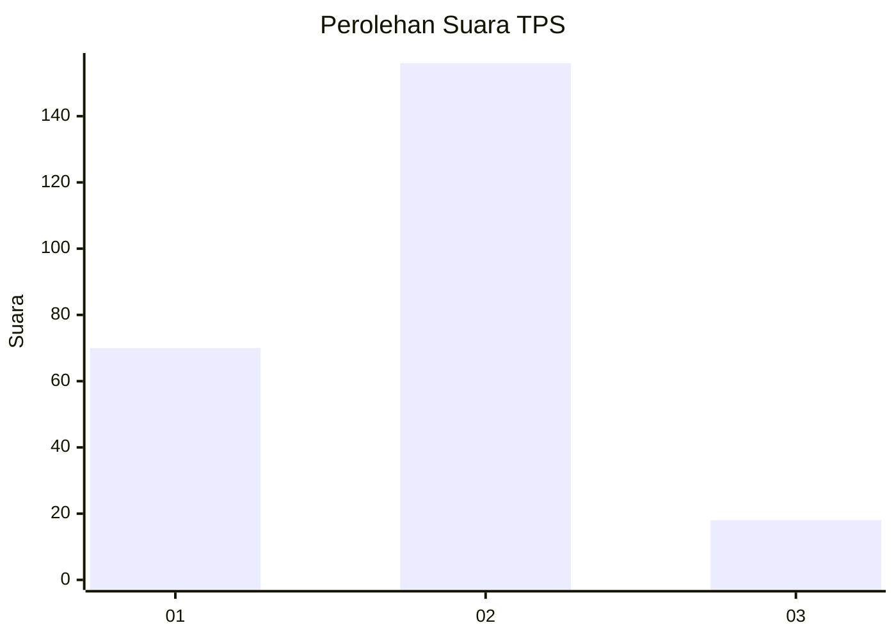
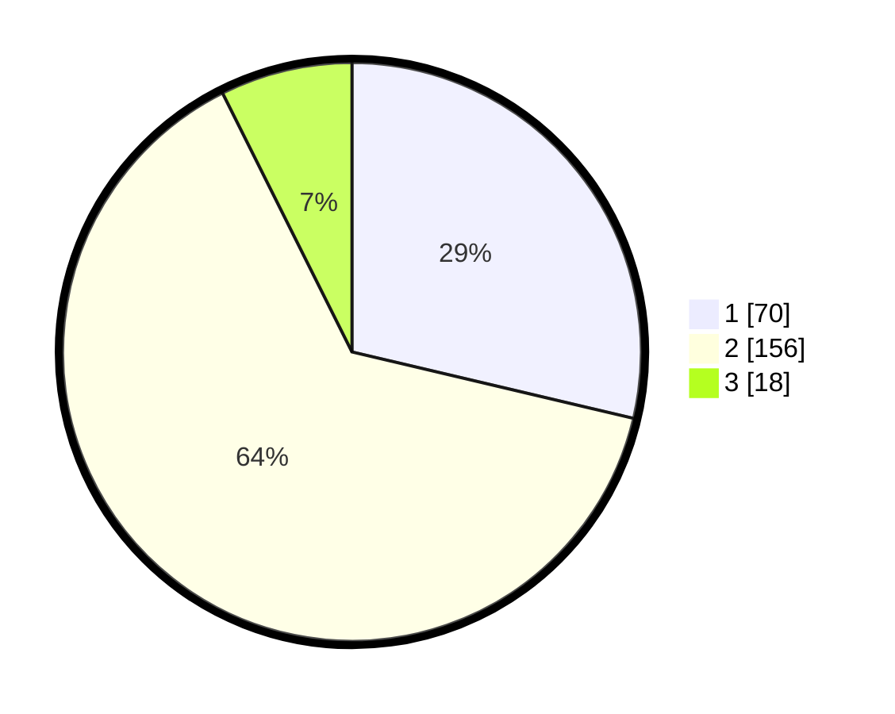

# Hasil

## Grafik

## Tabel

| No. | Nama Paslon    | Suara | Suara (raw) | Persentase |
|:--- |:-------------- | -----:| -----------:| ----------:|
| 1   | ANIES MUHAIMIN | 70    | [70][p-1]   | 28,69      |
| 2   | PRABOWO GIBRAN | 156   | [156][p-2]  | 63,93      |
| 3   | GANJAR MAHFUD  | 18    | [18][p-3]   | 7,38       |

[p-1]: https://github.com/gigit-pemilu/pemilu-2024/blob/main/pilpres/hitung-suara/sub/35-jawa-timur/sub/28-pamekasan/sub/04-pamekasan/sub/2002-panempan/sub/002-tps/sub/paslon-1.txt
[p-2]: https://github.com/gigit-pemilu/pemilu-2024/blob/main/pilpres/hitung-suara/sub/35-jawa-timur/sub/28-pamekasan/sub/04-pamekasan/sub/2002-panempan/sub/002-tps/sub/paslon-2.txt
[p-3]: https://github.com/gigit-pemilu/pemilu-2024/blob/main/pilpres/hitung-suara/sub/35-jawa-timur/sub/28-pamekasan/sub/04-pamekasan/sub/2002-panempan/sub/002-tps/sub/paslon-3.txt

## Foto C Plano

https://sirekap-obj-formc.kpu.go.id/d2da/pemilu/ppwp/35/28/04/20/02/3528042002002-20240215-015846--c1e067a6-bd23-4bb5-80f3-44a5ac42f0f3.jpg

https://sirekap-obj-formc.kpu.go.id/d2da/pemilu/ppwp/35/28/04/20/02/3528042002002-20240215-015941--36c91d68-ea50-4f57-9aa7-246a3787cff2.jpg

https://sirekap-obj-formc.kpu.go.id/d2da/pemilu/ppwp/35/28/04/20/02/3528042002002-20240215-020042--a25ff9ac-39b7-4a28-be23-9d3bb8008b78.jpg

## Metadata

| Key        | Value               |
| ---------- | ------------------- |
| Time Stamp | 2024-02-15 19:00:26 |

