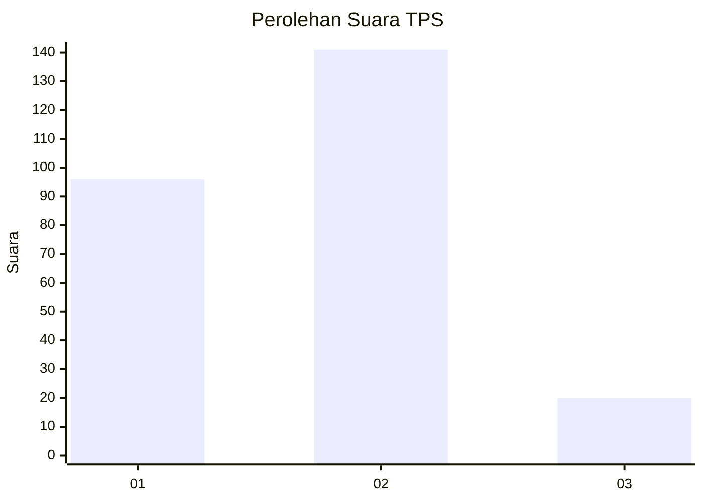

# Hasil

## Grafik

## Tabel

| No. | Nama Paslon    | Suara | Suara (raw) | Persentase |
|:--- |:-------------- | -----:| -----------:| ----------:|
| 1   | ANIES MUHAIMIN | 96    | [96][p-1]   | 37,35      |
| 2   | PRABOWO GIBRAN | 141   | [141][p-2]  | 54,86      |
| 3   | GANJAR MAHFUD  | 20    | [20][p-3]   | 7,78       |

[p-1]: https://github.com/gigit-pemilu/pemilu-2024-35-jawa-timur/blob/main/pilpres/hitung-suara/sub/35-jawa-timur/sub/28-pamekasan/sub/04-pamekasan/sub/2004-laden/sub/008-tps/sub/paslon-1.txt
[p-2]: https://github.com/gigit-pemilu/pemilu-2024-35-jawa-timur/blob/main/pilpres/hitung-suara/sub/35-jawa-timur/sub/28-pamekasan/sub/04-pamekasan/sub/2004-laden/sub/008-tps/sub/paslon-2.txt
[p-3]: https://github.com/gigit-pemilu/pemilu-2024-35-jawa-timur/blob/main/pilpres/hitung-suara/sub/35-jawa-timur/sub/28-pamekasan/sub/04-pamekasan/sub/2004-laden/sub/008-tps/sub/paslon-3.txt

## Foto C Plano

https://sirekap-obj-formc.kpu.go.id/a53e/pemilu/ppwp/35/28/04/20/04/3528042004008-20240215-014647--7400de2f-9c2d-4271-8b51-31503616cfb6.jpg

https://sirekap-obj-formc.kpu.go.id/a53e/pemilu/ppwp/35/28/04/20/04/3528042004008-20240215-013124--c2ed23f0-000b-4a1e-82d6-826e435289fe.jpg

https://sirekap-obj-formc.kpu.go.id/a53e/pemilu/ppwp/35/28/04/20/04/3528042004008-20240215-015755--44b4d3f9-b56d-4d99-b8f1-a71ad8959949.jpg

## Metadata

| Key        | Value               |
| ---------- | ------------------- |
| Time Stamp | 2024-02-25 17:00:00 |

