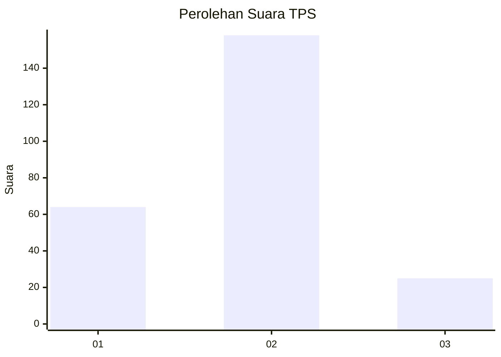
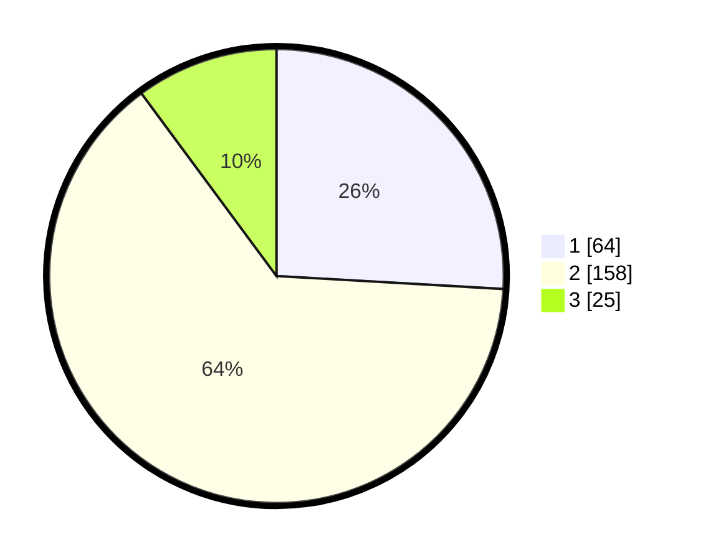

# Hasil

## Grafik

## Tabel

| No. | Nama Paslon    | Suara | Suara (raw) | Persentase |
|:--- |:-------------- | -----:| -----------:| ----------:|
| 1   | ANIES MUHAIMIN | 64    | [64][p-1]   | 25,91      |
| 2   | PRABOWO GIBRAN | 158   | [158][p-2]  | 63,97      |
| 3   | GANJAR MAHFUD  | 25    | [25][p-3]   | 10,12      |

[p-1]: https://github.com/gigit-pemilu/pemilu-2024/blob/main/pilpres/hitung-suara/sub/35-jawa-timur/sub/28-pamekasan/sub/04-pamekasan/sub/2005-jalmak/sub/004-tps/sub/paslon-1.txt
[p-2]: https://github.com/gigit-pemilu/pemilu-2024/blob/main/pilpres/hitung-suara/sub/35-jawa-timur/sub/28-pamekasan/sub/04-pamekasan/sub/2005-jalmak/sub/004-tps/sub/paslon-2.txt
[p-3]: https://github.com/gigit-pemilu/pemilu-2024/blob/main/pilpres/hitung-suara/sub/35-jawa-timur/sub/28-pamekasan/sub/04-pamekasan/sub/2005-jalmak/sub/004-tps/sub/paslon-3.txt

## Foto C Plano

https://sirekap-obj-formc.kpu.go.id/0e40/pemilu/ppwp/35/28/04/20/05/3528042005004-20240214-214803--2f30fddf-8edf-45a7-8e39-df6a25337f8d.jpg

https://sirekap-obj-formc.kpu.go.id/0e40/pemilu/ppwp/35/28/04/20/05/3528042005004-20240214-214855--197788f1-fb9f-4955-b2a6-75c50d60deed.jpg

https://sirekap-obj-formc.kpu.go.id/0e40/pemilu/ppwp/35/28/04/20/05/3528042005004-20240214-214929--b92f0460-5976-49e4-bb1e-a2b45a54b151.jpg

## Metadata

| Key        | Value               |
| ---------- | ------------------- |
| Time Stamp | 2024-02-15 18:00:26 |

