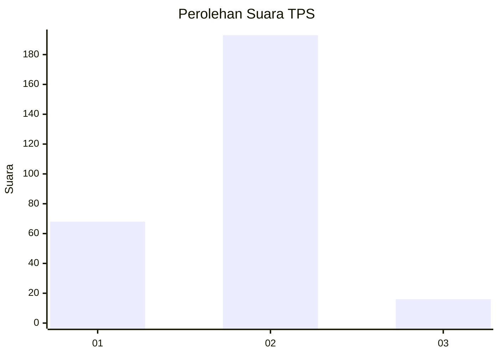

# Hasil

## Grafik

## Tabel

| No. | Nama Paslon    | Suara | Suara (raw) | Persentase |
|:--- |:-------------- | -----:| -----------:| ----------:|
| 1   | ANIES MUHAIMIN | 68    | [68][p-1]   | 24,55      |
| 2   | PRABOWO GIBRAN | 193   | [193][p-2]  | 69,68      |
| 3   | GANJAR MAHFUD  | 16    | [16][p-3]   | 5,78       |

[p-1]: https://github.com/gigit-pemilu/pemilu-2024/blob/main/pilpres/hitung-suara/sub/35-jawa-timur/sub/28-pamekasan/sub/04-pamekasan/sub/2006-teja-barat/sub/002-tps/sub/paslon-1.txt
[p-2]: https://github.com/gigit-pemilu/pemilu-2024/blob/main/pilpres/hitung-suara/sub/35-jawa-timur/sub/28-pamekasan/sub/04-pamekasan/sub/2006-teja-barat/sub/002-tps/sub/paslon-2.txt
[p-3]: https://github.com/gigit-pemilu/pemilu-2024/blob/main/pilpres/hitung-suara/sub/35-jawa-timur/sub/28-pamekasan/sub/04-pamekasan/sub/2006-teja-barat/sub/002-tps/sub/paslon-3.txt

## Foto C Plano

https://sirekap-obj-formc.kpu.go.id/db69/pemilu/ppwp/35/28/04/20/06/3528042006002-20240214-230115--806f0654-13a6-45cb-adb7-45d272cceeee.jpg

https://sirekap-obj-formc.kpu.go.id/db69/pemilu/ppwp/35/28/04/20/06/3528042006002-20240214-230303--fe76a7fb-ace8-409f-b703-2bb37a64eda7.jpg

https://sirekap-obj-formc.kpu.go.id/db69/pemilu/ppwp/35/28/04/20/06/3528042006002-20240214-230558--5553e65b-7fa8-496e-b919-33e486d97edd.jpg

## Metadata

| Key        | Value               |
| ---------- | ------------------- |
| Time Stamp | 2024-02-15 18:00:26 |

