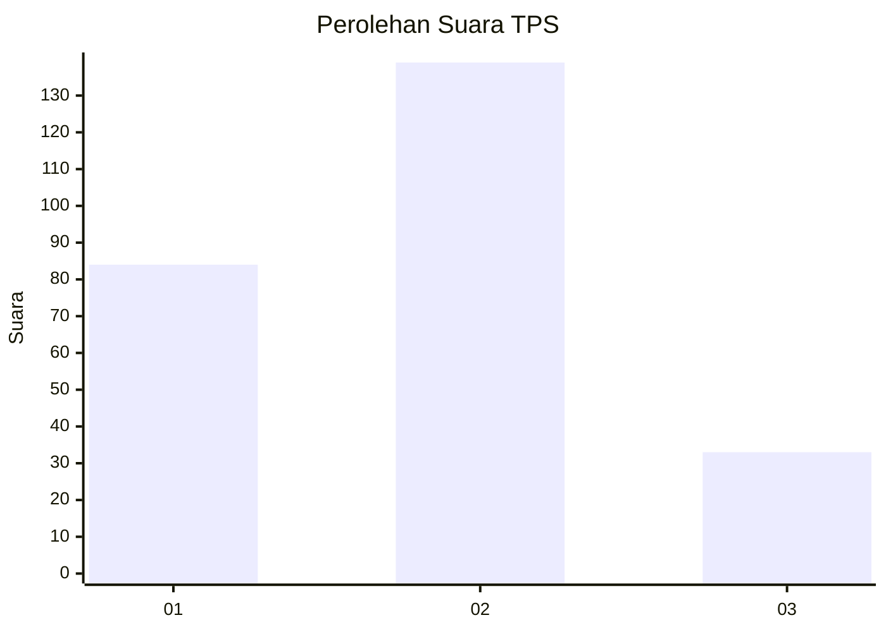
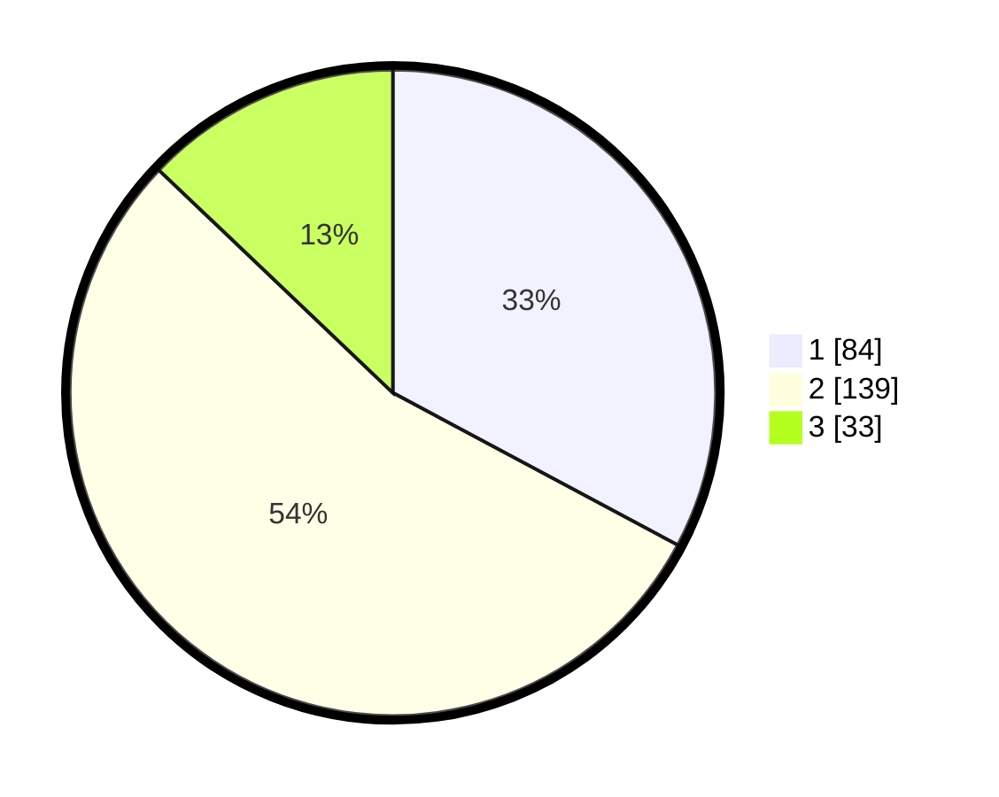

# Hasil

## Grafik

## Tabel

| No. | Nama Paslon    | Suara | Suara (raw) | Persentase |
|:--- |:-------------- | -----:| -----------:| ----------:|
| 1   | ANIES MUHAIMIN | 84    | [84][p-1]   | 32,81      |
| 2   | PRABOWO GIBRAN | 139   | [139][p-2]  | 54,30      |
| 3   | GANJAR MAHFUD  | 33    | [33][p-3]   | 12,89      |

[p-1]: https://github.com/gigit-pemilu/pemilu-2024/blob/main/pilpres/hitung-suara/sub/35-jawa-timur/sub/28-pamekasan/sub/04-pamekasan/sub/2008-bettet/sub/004-tps/sub/paslon-1.txt
[p-2]: https://github.com/gigit-pemilu/pemilu-2024/blob/main/pilpres/hitung-suara/sub/35-jawa-timur/sub/28-pamekasan/sub/04-pamekasan/sub/2008-bettet/sub/004-tps/sub/paslon-2.txt
[p-3]: https://github.com/gigit-pemilu/pemilu-2024/blob/main/pilpres/hitung-suara/sub/35-jawa-timur/sub/28-pamekasan/sub/04-pamekasan/sub/2008-bettet/sub/004-tps/sub/paslon-3.txt

## Foto C Plano

https://sirekap-obj-formc.kpu.go.id/3064/pemilu/ppwp/35/28/04/20/08/3528042008004-20240214-220941--d385af61-c2d4-49d3-a6b0-bbc80e729ab2.jpg

https://sirekap-obj-formc.kpu.go.id/3064/pemilu/ppwp/35/28/04/20/08/3528042008004-20240214-221150--d8c74f48-a419-449c-a370-742d8bcb40d2.jpg

https://sirekap-obj-formc.kpu.go.id/3064/pemilu/ppwp/35/28/04/20/08/3528042008004-20240214-221358--d2aeeaa2-0677-4466-af7a-5c52c6eea25a.jpg

## Metadata

| Key        | Value               |
| ---------- | ------------------- |
| Time Stamp | 2024-02-25 15:00:00 |

