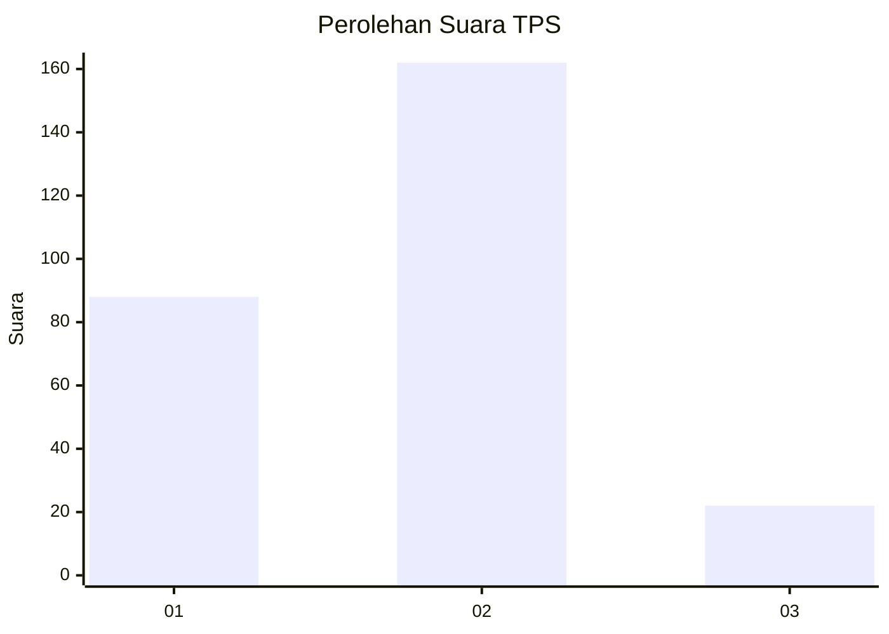
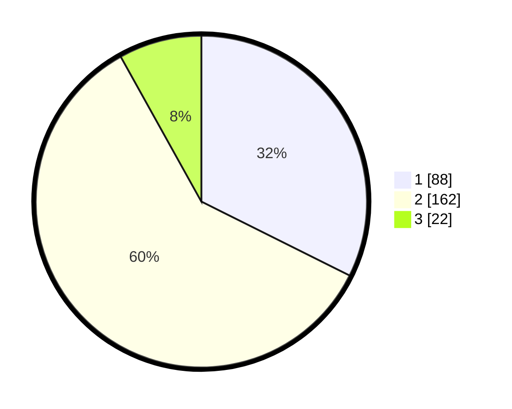

# Hasil

## Grafik

## Tabel

| No. | Nama Paslon    | Suara | Suara (raw) | Persentase |
|:--- |:-------------- | -----:| -----------:| ----------:|
| 1   | ANIES MUHAIMIN | 88    | [88][p-1]   | 32,35      |
| 2   | PRABOWO GIBRAN | 162   | [162][p-2]  | 59,56      |
| 3   | GANJAR MAHFUD  | 22    | [22][p-3]   | 8,09       |

[p-1]: https://github.com/gigit-pemilu/pemilu-2024/blob/main/pilpres/hitung-suara/sub/35-jawa-timur/sub/28-pamekasan/sub/04-pamekasan/sub/2009-nyalabu-laok/sub/005-tps/sub/paslon-1.txt
[p-2]: https://github.com/gigit-pemilu/pemilu-2024/blob/main/pilpres/hitung-suara/sub/35-jawa-timur/sub/28-pamekasan/sub/04-pamekasan/sub/2009-nyalabu-laok/sub/005-tps/sub/paslon-2.txt
[p-3]: https://github.com/gigit-pemilu/pemilu-2024/blob/main/pilpres/hitung-suara/sub/35-jawa-timur/sub/28-pamekasan/sub/04-pamekasan/sub/2009-nyalabu-laok/sub/005-tps/sub/paslon-3.txt

## Foto C Plano

https://sirekap-obj-formc.kpu.go.id/f310/pemilu/ppwp/35/28/04/20/09/3528042009005-20240214-232048--49b201c7-8f22-46a0-a622-d3cc9fd24e6c.jpg

https://sirekap-obj-formc.kpu.go.id/f310/pemilu/ppwp/35/28/04/20/09/3528042009005-20240214-232245--c253929b-3fc1-4720-90cd-cb860ae36551.jpg

https://sirekap-obj-formc.kpu.go.id/f310/pemilu/ppwp/35/28/04/20/09/3528042009005-20240214-232534--4dd951d6-47cd-4496-9408-9db5f23b6e58.jpg

## Metadata

| Key        | Value               |
| ---------- | ------------------- |
| Time Stamp | 2024-02-15 21:30:27 |

