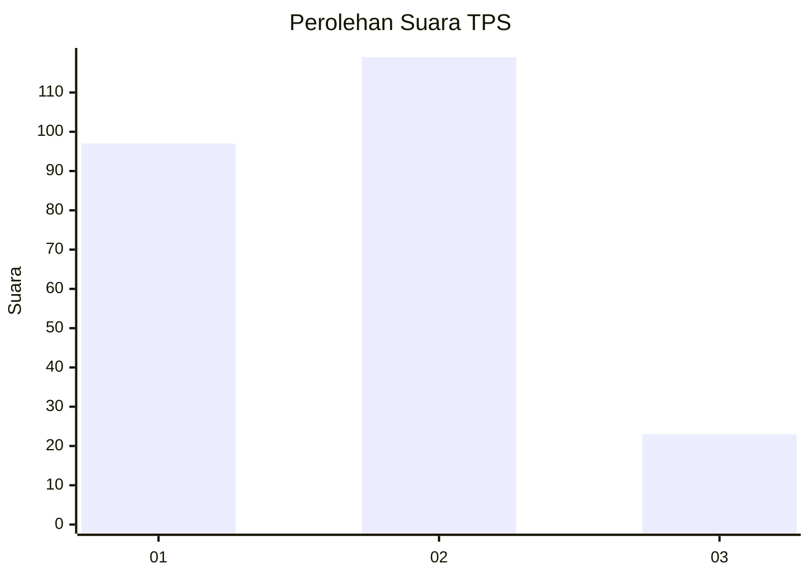
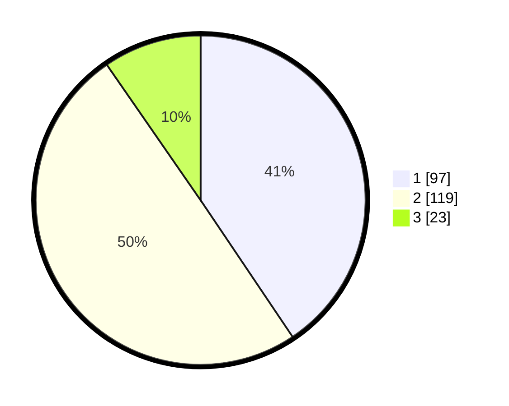

# Hasil

## Grafik

## Tabel

| No. | Nama Paslon    | Suara | Suara (raw) | Persentase |
|:--- |:-------------- | -----:| -----------:| ----------:|
| 1   | ANIES MUHAIMIN | 97    | [97][p-1]   | 40,59      |
| 2   | PRABOWO GIBRAN | 119   | [119][p-2]  | 49,79      |
| 3   | GANJAR MAHFUD  | 23    | [23][p-3]   | 9,62       |

[p-1]: https://github.com/gigit-pemilu/pemilu-2024/blob/main/pilpres/hitung-suara/sub/35-jawa-timur/sub/28-pamekasan/sub/04-pamekasan/sub/2010-nyalabu-daya/sub/002-tps/sub/paslon-1.txt
[p-2]: https://github.com/gigit-pemilu/pemilu-2024/blob/main/pilpres/hitung-suara/sub/35-jawa-timur/sub/28-pamekasan/sub/04-pamekasan/sub/2010-nyalabu-daya/sub/002-tps/sub/paslon-2.txt
[p-3]: https://github.com/gigit-pemilu/pemilu-2024/blob/main/pilpres/hitung-suara/sub/35-jawa-timur/sub/28-pamekasan/sub/04-pamekasan/sub/2010-nyalabu-daya/sub/002-tps/sub/paslon-3.txt

## Foto C Plano

https://sirekap-obj-formc.kpu.go.id/3f75/pemilu/ppwp/35/28/04/20/10/3528042010002-20240214-205915--8ca1323b-c152-4ab3-bafa-b8951d6b6a33.jpg

https://sirekap-obj-formc.kpu.go.id/3f75/pemilu/ppwp/35/28/04/20/10/3528042010002-20240215-020750--e30e7e50-55e1-4007-a587-6774e5611b5d.jpg

https://sirekap-obj-formc.kpu.go.id/3f75/pemilu/ppwp/35/28/04/20/10/3528042010002-20240214-210308--713cd0ae-9788-4ff2-95c5-fdedc3e6d2d2.jpg

## Metadata

| Key        | Value               |
| ---------- | ------------------- |
| Time Stamp | 2024-02-25 00:00:00 |

