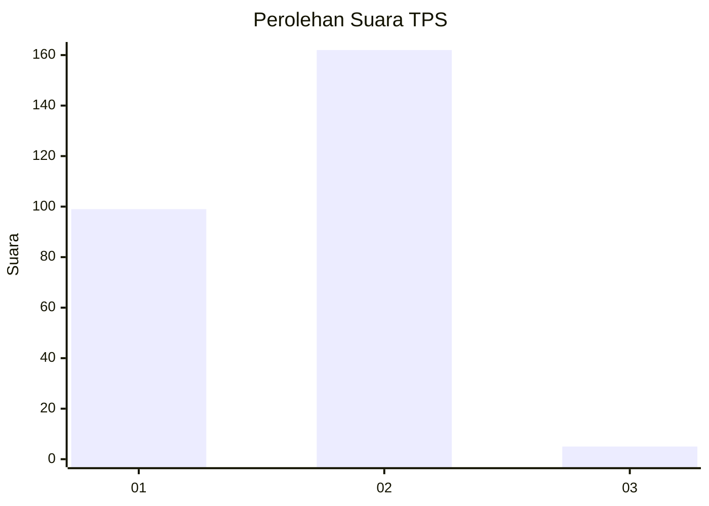
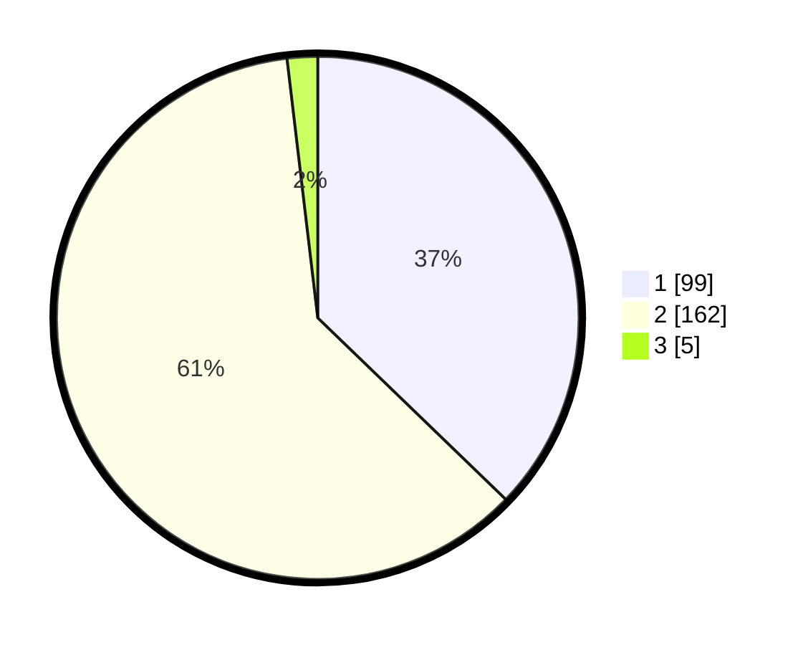

# Hasil

## Grafik

## Tabel

| No. | Nama Paslon    | Suara | Suara (raw) | Persentase |
|:--- |:-------------- | -----:| -----------:| ----------:|
| 1   | ANIES MUHAIMIN | 99    | [99][p-1]   | 37,22      |
| 2   | PRABOWO GIBRAN | 162   | [162][p-2]  | 60,90      |
| 3   | GANJAR MAHFUD  | 5     | [5][p-3]    | 1,88       |

[p-1]: https://github.com/gigit-pemilu/pemilu-2024/blob/main/pilpres/hitung-suara/sub/35-jawa-timur/sub/28-pamekasan/sub/04-pamekasan/sub/2010-nyalabu-daya/sub/003-tps/sub/paslon-1.txt
[p-2]: https://github.com/gigit-pemilu/pemilu-2024/blob/main/pilpres/hitung-suara/sub/35-jawa-timur/sub/28-pamekasan/sub/04-pamekasan/sub/2010-nyalabu-daya/sub/003-tps/sub/paslon-2.txt
[p-3]: https://github.com/gigit-pemilu/pemilu-2024/blob/main/pilpres/hitung-suara/sub/35-jawa-timur/sub/28-pamekasan/sub/04-pamekasan/sub/2010-nyalabu-daya/sub/003-tps/sub/paslon-3.txt

## Foto C Plano

https://sirekap-obj-formc.kpu.go.id/e78d/pemilu/ppwp/35/28/04/20/10/3528042010003-20240215-111939--35b608d2-907e-43af-bdd0-83ac190e8627.jpg

https://sirekap-obj-formc.kpu.go.id/e78d/pemilu/ppwp/35/28/04/20/10/3528042010003-20240215-112303--8b70ba2f-a48d-4e42-8f1c-3596d3c7df28.jpg

https://sirekap-obj-formc.kpu.go.id/e78d/pemilu/ppwp/35/28/04/20/10/3528042010003-20240215-112441--27a3c18d-5b58-4d11-acb8-7083fa285755.jpg

## Metadata

| Key        | Value               |
| ---------- | ------------------- |
| Time Stamp | 2024-02-15 20:00:44 |

