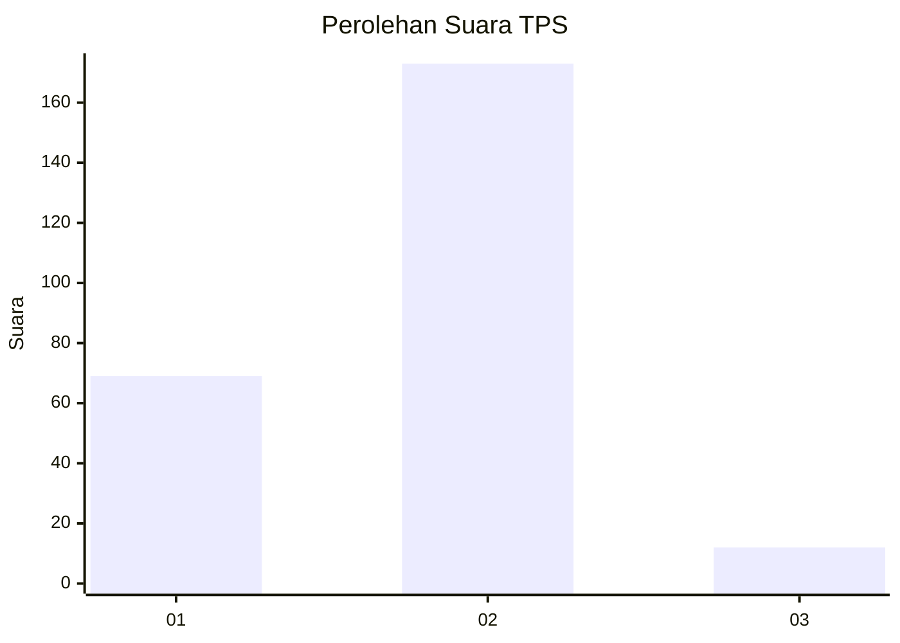
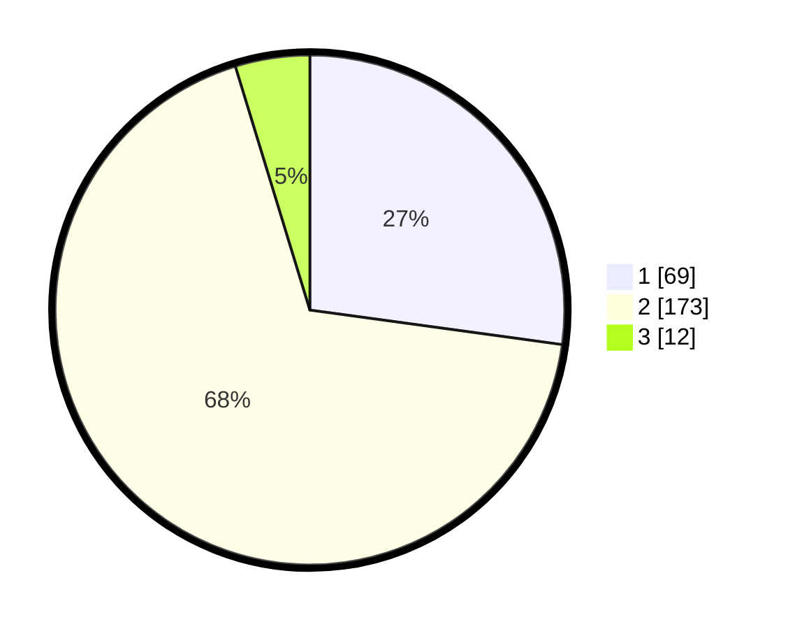

# Hasil

## Grafik

## Tabel

| No. | Nama Paslon    | Suara | Suara (raw) | Persentase |
|:--- |:-------------- | -----:| -----------:| ----------:|
| 1   | ANIES MUHAIMIN | 69    | [69][p-1]   | 27,17      |
| 2   | PRABOWO GIBRAN | 173   | [173][p-2]  | 68,11      |
| 3   | GANJAR MAHFUD  | 12    | [12][p-3]   | 4,72       |

[p-1]: https://github.com/gigit-pemilu/pemilu-2024-35-jawa-timur/blob/main/pilpres/hitung-suara/sub/35-jawa-timur/sub/28-pamekasan/sub/04-pamekasan/sub/2010-nyalabu-daya/sub/006-tps/sub/paslon-1.txt
[p-2]: https://github.com/gigit-pemilu/pemilu-2024-35-jawa-timur/blob/main/pilpres/hitung-suara/sub/35-jawa-timur/sub/28-pamekasan/sub/04-pamekasan/sub/2010-nyalabu-daya/sub/006-tps/sub/paslon-2.txt
[p-3]: https://github.com/gigit-pemilu/pemilu-2024-35-jawa-timur/blob/main/pilpres/hitung-suara/sub/35-jawa-timur/sub/28-pamekasan/sub/04-pamekasan/sub/2010-nyalabu-daya/sub/006-tps/sub/paslon-3.txt

## Foto C Plano

https://sirekap-obj-formc.kpu.go.id/18c5/pemilu/ppwp/35/28/04/20/10/3528042010006-20240214-213411--37d37185-f2ef-4d60-870c-6d0fe364a1f3.jpg

https://sirekap-obj-formc.kpu.go.id/18c5/pemilu/ppwp/35/28/04/20/10/3528042010006-20240214-213505--f6743a9e-c705-480a-9e9a-0e6c3930d8f8.jpg

https://sirekap-obj-formc.kpu.go.id/18c5/pemilu/ppwp/35/28/04/20/10/3528042010006-20240214-213707--bc804cea-d68a-4f11-b604-e4fd26fd65bb.jpg

## Metadata

| Key        | Value               |
| ---------- | ------------------- |
| Time Stamp | 2024-02-15 18:00:26 |

